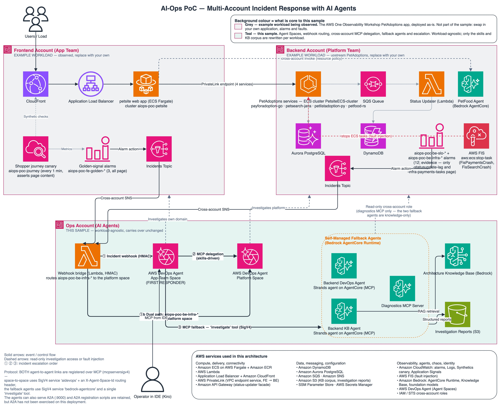

# Multi-Account Agentic Incident Response on AWS — agents as first responders

Proof of concept: **AIOps automation that cuts MTTI and MTTR by putting AI
agents first in the escalation path.** When a customer-facing alarm fires, the
first responder is not a human on call — it is an **AWS DevOps Agent** Agent
Space that triages the incident, investigates its own domain, escalates across
account boundaries over **MCP**, consults **self-managed Strands agents on
Amazon Bedrock AgentCore** for documented knowledge, and hands humans a
completed root-cause analysis instead of a raw alarm. Humans enter the loop to
act on findings, not to gather them.

The repo measures the claim rather than asserting it. Same fault, same wiring,
before and after the agents' custom skill catalog:

| What moved | Measured |
|---|---|
| **Time to investigate (MTTI)** — investigation opened → root cause written | `ddb-throttle` 19 min 43 s → **11 min 57 s**; `search-crash` 20 min 33 s → **10 min 39 s** — roughly halved, with no human in the loop |
| **Investigation quality** | `payments-crash` goes from an app-team investigation that **FAILED with an empty root cause** to one that **COMPLETED naming the fault-injection experiment** |
| **Time to detect (MTTD)** | 1 min 00 s – 1 min 45 s for hard failures, 4 min 23 s – 4 min 42 s for the grey failure — driven by a one-minute synthetic customer journey, not by infrastructure metrics |
| **Cross-account escalation** | 0 delegation calls in every skills-OFF run → fires on all three faults with skills ON |

Full measurements: [docs/skills-results.md](docs/skills-results.md). MTTR in
this PoC is dominated by its investigation segment: detection and root-cause
identification are fully automated, remediation is a documented restore the
operator runs once the RCA names the cause.



*Three accounts, two Agent Spaces, the self-managed fallback estate, and the
alarm tiers that page them. **Background colour marks what is core to this
sample**: the grey accounts (top) are the *example workload being observed* —
the upstream PetAdoptions app, swappable for your own — while the teal ops
account is the sample itself, workload-agnostic apart from the skills and KB
corpus ([what to rewrite](#adapting-this-to-your-own-workload)). Editable
source: [`architecture-overview.drawio`](docs/diagrams/architecture-overview.drawio);
vector export: [`architecture-overview.svg`](docs/diagrams/architecture-overview.svg).*

New here? [Get started](#get-started) points at the deployment runbook;
[Run the demo](docs/deployment.md#run-the-demo) is the presenter's guide;
[docs/scenarios.md](docs/scenarios.md) is the catalog of what you can break and
what each break teaches.

## Table of contents

1. [The escalation path](#the-escalation-path)
2. [What the demo demonstrates](#what-the-demo-demonstrates)
3. [The story](#the-story) — the workload and the three faults to demo
4. [Repository map](#repository-map)
5. [Get started](#get-started) — prerequisites, deployment, [adapting it to your own workload](#adapting-this-to-your-own-workload), [cost](#cost), [cleanup](#cleanup)
6. [Documentation](#documentation)
7. [Tech stack and lineage](#tech-stack-and-lineage)
8. [License](#license) — [security reporting](#security), [third-party attribution](THIRD_PARTY_LICENSES.md)
9. [Notices](#notices)

## The escalation path

Every incident walks the same ladder, and every rung is automated until a human
is genuinely needed:

1. **Detect on customer impact, not infrastructure noise.** 15 CloudWatch
   alarms in three tiers: `aiops-poc-fe-golden-*` (a one-minute synthetic
   shopper journey asserting on page content, not just HTTP status),
   `aiops-poc-be-slo-*` (per-service business SLOs), and `aiops-poc-be-infra-*`
   (raw infrastructure). Only 5 of the 15 page an agent, and they are the
   customer-facing ones — the other ten are evidence the agents correlate
   during an investigation.
2. **Page an agent, not a person.** The paging alarm reaches the **App-Team
   DevOps Agent** — the first responder, an Agent Space scoped to the frontend
   account — over CloudWatch → SNS → a webhook bridge. (The same webhook
   pattern accepts triggers from sources such as ServiceNow or Jira; this demo
   triggers on alarms.) On backend infrastructure symptoms a second path pages
   the **Platform DevOps Agent** directly, so one fault can mobilize both
   spaces in parallel.
3. **Triage locally, then escalate across the account boundary.** The first
   responder investigates the frontend it can see. When the evidence points
   backend, it delegates over **MCP** to the Platform Agent Space — scoped to
   the backend account — running a duplicate-investigation check first, then
   opening a platform investigation or joining one already running, and adopting
   its RCA. Neither space can enumerate the other's estate; every delegation
   crosses a real account boundary.
4. **Consult documented knowledge in parallel.** Two **self-managed Strands
   agents on Bedrock AgentCore** answer as fallbacks — one runbook-driven, one
   grounded in an Amazon Bedrock Knowledge Base of architecture docs. They
   answer from documentation, so the responder weighs them against live
   telemetry rather than adopting them outright.
5. **Escalate to humans with findings attached.** The KB agent's
   `escalate_to_owner_team` tool publishes the investigation summary to an SNS
   topic that emails the owning team — its only write permission. The on-call
   engineer's starting point is a written RCA, not a red dashboard.

Three AWS accounts, two per-domain Agent Spaces, a fallback estate, and a human
step that begins after identification is done — that is the MTTR story.

## What the demo demonstrates

### Custom Agent Skills, measured

Skills are what turn a general-purpose agent into a specialist for *this*
architecture — runbooks, escalation rules, and delegation criteria encoded in
the [Agent Skills format](https://agentskills.io), one format for both the
managed and the self-managed estate. The demo isolates their effect with a
single variable: the per-skill Active/Inactive toggle in the Agent Space
console. With the catalog ON, investigations get faster *and* land a tier
deeper — root causes confirmed from backend telemetry instead of hypothesized
from frontend symptoms — and cross-space delegation moves from **0 calls in
every skills-OFF run** to firing on all three faults.
[The measurements](docs/skills-results.md); how the skills are written:
[docs/skills.md](docs/skills.md). Being specialists is also what makes them
non-portable: the catalog and the Knowledge Base corpus name this workload's
services and alarms, so reusing them on your own project means rewriting them
first — see
[Adapting this to your own workload](#adapting-this-to-your-own-workload).

### Business and golden-signal metrics catch what infrastructure metrics miss

Grey failures are the argument: on `ddb-throttle` the synthetic customer
journey breaches while **every backend infrastructure alarm stays green** —
CPU normal, memory normal, all tasks running, and shoppers cannot search. The
one-minute canary is the only detector, and only because it asserts on page
content: the frontend renders a broken backend as a fast HTTP 200. Detection
frames the incident around customer impact, and the ten non-paging
infrastructure alarms become correlating evidence instead of pager noise.

### The full axis list

| Axis | What it shows |
|---|---|
| **MTTI, before/after** | Same fault twice, skill catalog the only variable: RCA time roughly halved and delegation firing where it never fired OFF ([results](docs/skills-results.md)) |
| **Grey failure caught by the customer signal** | `ddb-throttle` degrades search while every backend infrastructure alarm stays green |
| **Three alarm tiers, five pagers** | Golden signals and business SLOs page an agent; raw infrastructure alarms are actionless evidence |
| First responder + MCP delegation | The AWS reference pattern: per-domain Agent Spaces talking directly over MCP, exercised across a real account boundary |
| Dual-path incident routing | On `payments-crash` the golden signal pages app-team while the backend task-count alarm pages platform — two spaces, one incident, each from its own side |
| Managed ↔ custom interop | Self-managed Strands agents on Bedrock AgentCore registered as MCP capability providers of a managed DevOps Agent deployment |
| DevOps fallback vs KB fallback | Two ways to give an agent domain knowledge: runbooks vs RAG over architecture docs |
| Escalation to humans | The KB agent's SNS escalation delivers a written summary to the owning team's mailbox — the human rung of the ladder |
| Local vs delegated | The responder triages its own domain first and escalates only when the evidence points backend, on the rules its skills prescribe |
| Operator in the IDE | The DevOps Agent IDE integration plus a local MCP bridge for the custom agents |

## The story

The workload is the AWS One Observability Workshop
[PetAdoptions](https://github.com/aws-samples/one-observability-demo)
application, split across **two workload accounts so each team's domain is a
real account boundary**: the full upstream app (unforked) in a backend account;
petsite (built from unmodified upstream source) in a frontend account. Both
Agent Spaces live in a third ops account and reach their domain through a
cross-account association, so neither can enumerate the other's estate.

Faults keep the **B1–B5** numbering, one number per business symptom a customer
would notice, and every active fault runs on AWS-native mechanisms — two AWS
FIS task-stop experiments and a DynamoDB capacity change — so they work against
the unforked upstream as deployed. Three faults have complete before/after
results behind them, and they are the three to demo.

### `payments-crash` — adoptions fail at checkout

A hard outage: FIS stops every task of the payments service, so shoppers reach
checkout and it fails, and the service emits nothing at all — absence of signal
*is* the signal. This is the one fault where a backend infrastructure alarm also
pages the platform space, so both spaces investigate the same incident from
their own side: dual-path routing. Run
`./chaos/scripts/inject.sh payments-crash --confirm` — the once-a-minute canary
detects it without extra load — then `./chaos/scripts/restore.sh payments-crash`.

### `ddb-throttle` — adoptions search degrades

The grey-failure showcase: the adoptions table is cut to 1 RCU / 1 WCU, so
search reads stall while the search service itself stays perfectly healthy and
every backend infrastructure alarm stays green. The customer journey is the only
detector, which is the whole argument for golden signals in one fault. Inject
first, then drive search traffic:

```bash
./chaos/scripts/inject.sh ddb-throttle --confirm
./loadgen/run.sh --paths search --duration 1500   # ~12 req/s; long enough to outlast the table's burst-credit bank
```

### `search-crash` — search stops returning pets

FIS stops the search service outright. No backend alarm pages the platform space
for this fault, so the app-team responder calling the platform space is the only
route to the cause — the cleanest delegation case in the demo, and the one where
skills-ON named the stopped tasks rather than the 503 they produced. Run
`./chaos/scripts/inject.sh search-crash --confirm` with
`./loadgen/run.sh --paths search --duration 900`.

Full catalog, restore notes and per-fault detail:
[docs/scenarios.md](docs/scenarios.md). Faults and variants still ahead:
[docs/roadmap.md](docs/roadmap.md).

## Repository map

| Path | Account | Purpose |
|---|---|---|
| [`workload/`](workload/) | BE + FE | `backend/deploy` (upstream, unforked) + `backend/overlay` (alarms, roles, SSM, FIS) + `frontend/` (petsite from upstream source, canary, alarms). |
| [`agent-spaces/`](agent-spaces/) | OPS | AWS DevOps Agent setup: both Agent Spaces and their account associations (webhooks and capability providers are registered by `scripts/`). |
| [`agents/`](agents/) | OPS | Self-managed fallback estate: two Strands agents on AgentCore, skill catalog, KB corpus, platform CDK app. |
| [`mcp-servers/`](mcp-servers/) | OPS / local | `backend-diagnostics` (deterministic MCP tools) and `operator-bridge` (local stdio MCP server for IDE access to custom agents). |
| [`chaos/`](chaos/) | BE + FE | Fault injection and restore: FIS experiments, a DynamoDB capacity change, config toggles, plus a deterministic alarm trigger for rehearsals. |
| [`loadgen/`](loadgen/) | FE | Burst traffic on top of the upstream traffic generator baseline. |
| [`scripts/`](scripts/) | — | CDK bootstrap, ordered deploy, cross-account output sync, KB ingestion, skill packaging, webhook + capability-provider registration, smoke test, teardown. |
| [`docs/`](docs/) | — | Architecture, diagrams, connectivity patterns, scenarios, skills, deployment. |

## Get started

Replicating this in your own three AWS accounts takes 2–3 hours, most of it
waiting on the upstream workload. The runbook is
[docs/deployment.md](docs/deployment.md) — start with its
[prerequisites](docs/deployment.md#accounts-and-prerequisites) (three AWS CLI
profiles, CDK v2 bootstrap in all three accounts, Docker, Bedrock model access,
and an
[AWS CLI that resolves `aws devops-agent`](docs/deployment.md#the-aws-devops-agent-cli-namespace)),
then work through
[Reproduce this demo from scratch](docs/deployment.md#reproduce-this-demo-from-scratch).

`config/accounts.json` is **the only file you edit** — it is git-ignored, and no
account ID, region, profile name or email belongs anywhere else in the tree.
`scripts/setup-config.sh` writes it: it prompts for the required inputs,
validates as it goes and leaves every other field at its default. Editing a copy
of `config/accounts.json.template` by hand is equally supported.

```bash
scripts/setup-config.sh                                # writes config/accounts.json
for d in workload/backend/overlay workload/frontend agents/infra agent-spaces; do
  (cd "$d" && npm ci)                                  # node_modules are not committed
done
scripts/preflight.sh                                   # read-only gate, makes no AWS calls

# Console step — do it NOW, before deploying: request Bedrock model access in
# OPS (Claude Sonnet 4.5 + Titan Text Embeddings V2) and BE (Claude). Without it
# KB ingestion and the fallback agents fail late in the deploy:
# docs/deployment.md#accounts-and-prerequisites

scripts/bootstrap.sh                                   # CDK bootstrap, all three accounts
scripts/deploy-all.sh                                  # ordered deploy, stops on first error

# Then the steps deploy-all.sh leaves to you — without these no alarm reaches an agent:
scripts/register-webhook.sh --space app-team           # both spaces are required
scripts/register-webhook.sh --space platform           # dual-path: be-infra-* alarms land here
scripts/register-platform-space-mcp.sh                 # space-to-space MCP provider
scripts/register-fallback-agents-mcp.sh --peer both    # knowledge-only fallback agents
scripts/upload-skills.sh                               # catalogs packaged by deploy-all step 9
                                                       #   (scripts/package-skills.sh re-creates them)
scripts/smoke-test.sh                                  # webhook → investigation, end to end
```

The runbook has the rest:

- [Manual steps checklist](docs/deployment.md#5-manual-steps-checklist-not-scripted) — Bedrock model access, the per-space operator federation identifier, the escalation-email confirmation, and the per-skill Active/Inactive toggle that drives the before/after axis
- [Run the demo](docs/deployment.md#run-the-demo) — running order, exact commands, what to show in the web app, expected timings, and the pre-flight gotchas that ruin a live run
- [Teardown](docs/deployment.md#teardown) — `scripts/destroy-all.sh --confirm`, wave-based across all three accounts, 1–2 hours

### Adapting this to your own workload

**Adaptation to your own project requires agentic adaptation of the skills and
the service usage.** The commands above reproduce *this* demo — they do not
re-target it. `config/accounts.json` carries accounts, regions and profiles;
nothing in it re-points the agents' domain knowledge, which is deliberately
coupled to the PetAdoptions workload:

- **Agent Skills** (`agents/skills/*/SKILL.md`) name concrete services,
  CloudWatch alarms (`aiops-poc-fe-golden-*`, `aiops-poc-be-slo-*`), tables and
  delegation criteria. The four platform runbooks are per-service procedures for
  *these* services; `frontend-triage` encodes when to delegate for *this*
  topology. Which space receives which skill is declared in
  `agents/skills/manifest.json`.
- **Knowledge Base corpus** (`agents/kb-corpus/*.md`) is architecture and
  scenario documentation for PetAdoptions. Replace the files and re-run
  `scripts/sync-kb.sh` to re-ingest.
- **Alarms and faults**: the three alarm tiers live in
  `workload/backend/overlay` and `workload/frontend`, and the fault catalog in
  `chaos/` targets upstream resources by name.

So plan on rewriting the skills and the corpus for your own services, alarm
names and runbooks before the investigations mean anything — the surrounding
machinery (webhooks, cross-account MCP delegation, capability providers,
escalation) is workload-agnostic and carries over unchanged. Rewriting them is
itself a good task to hand to a coding agent: the format is documented in
[docs/skills.md](docs/skills.md), and
[AGENTS.md](AGENTS.md) is the contract that lets an agent work in this repo
safely.

### Cost

You are responsible for the cost of the AWS services used while running this
PoC. The estate is **not free while idle**: the upstream PetAdoptions workload
alone runs an Aurora PostgreSQL cluster, ECS Fargate services, NAT gateways and
an EKS cluster, plus the canary, the two AgentCore runtimes and Bedrock
model invocations during investigations. Deploy it for a demo window, then
[tear it down](#cleanup) — and consider an
[AWS Budget](https://docs.aws.amazon.com/cost-management/latest/userguide/budgets-managing-costs.html)
on all three accounts. Prices vary by region and usage; refer to the pricing
pages of the services involved.

### Cleanup

`scripts/destroy-all.sh --confirm` tears down all three accounts in dependency
order (1–2 hours). What can survive a teardown and how to remove it —
account-level DevOps Agent registrations, Secrets Manager recovery windows,
CloudWatch log groups — is documented in
[Teardown](docs/deployment.md#teardown).

## Documentation

Cross-account topology (PrivateLink, Waggle agent invoke, seeding) is in
[docs/architecture.md](docs/architecture.md); the SSM parameter ownership
contract is in [docs/parameters.md](docs/parameters.md).

- [AGENTS.md](AGENTS.md) — ground rules for working on this repo with an AI coding agent (canonical path, exit codes, console-only steps, danger zone)
- [Architecture and diagrams](docs/architecture.md)
- [SSM parameter ownership contract](docs/parameters.md)
- [AWS DevOps Agent setup — Agent Spaces, delegation, fallback](docs/aws-devops-agent-integration.md)
- [A2A and MCP — connectivity patterns](docs/a2a-vs-mcp.md)
- [Incident scenarios, how to run them, and tested status](docs/scenarios.md)
- [Agent Skills — encoding runbooks, before/after](docs/skills.md)
- [Skills before/after — results](docs/skills-results.md)
- [Roadmap — what comes next](docs/roadmap.md)
- [Multi-account deployment guide](docs/deployment.md) — prerequisites, replication path, [Run the demo](docs/deployment.md#run-the-demo), [alarm inventory](docs/deployment.md#alarm-inventory), dated [run-logs](docs/deployment.md#run-log)

## Tech stack and lineage

- **Workload**: [`aws-samples/one-observability-demo`](https://github.com/aws-samples/one-observability-demo), unforked
- **Managed agents**: [AWS DevOps Agent](https://docs.aws.amazon.com/devopsagent/latest/userguide/what-is.html) — Agent Spaces, Skills, generic webhooks, remote MCP endpoints, capability providers
- **Custom agents**: [Strands Agents SDK](https://strandsagents.com) (Python) on Amazon Bedrock AgentCore Runtime (MCP :8000/`mcp`, SigV4)
- **Knowledge Base**: Amazon Bedrock Knowledge Base (S3 data source, S3 Vectors)
- **Skills**: [Agent Skills spec](https://agentskills.io) — one format for both estates
- **Infrastructure**: AWS CDK (TypeScript); **fault injection**: AWS FIS and a DynamoDB capacity change

Full lineage table in [docs/architecture.md](docs/architecture.md#8-open-source-and-product-lineage-nothing-reinvented).

## Security

If you discover a potential security issue in this project, please notify
AWS/Amazon Security via our
[vulnerability reporting page](http://aws.amazon.com/security/vulnerability-reporting/)
rather than opening a public issue.

## License

This sample is licensed under the MIT No Attribution license (MIT-0). See
[LICENSE](LICENSE) and [NOTICE](NOTICE).

Third-party attribution — including the unforked upstream PetAdoptions workload,
the Strands and MCP SDKs, and the container base images — is recorded in
[THIRD_PARTY_LICENSES.md](THIRD_PARTY_LICENSES.md). Nothing third-party is
bundled or redistributed by this repository: dependencies resolve at build time
and the upstream workload is fetched at deploy time.

Contributions are welcome — see [CONTRIBUTING.md](CONTRIBUTING.md) and the
[Code of Conduct](CODE_OF_CONDUCT.md).

## Notices

This proof of concept is provided for demonstration purposes. Customers are
responsible for making their own independent assessment of the information it
contains and any use of AWS services, each of which is provided "as is" without
warranty of any kind, whether express or implied. Measured timings in this
README come from the dated run-logs in
[docs/deployment.md](docs/deployment.md#run-log) and will vary with region,
model versions and workload state. The fault-injection scripts create real,
customer-visible failures in the accounts you deploy to — run them only in
accounts dedicated to this PoC (see
[chaos/README.md](chaos/README.md) for the AWS testing-policy references).

This sample uses generative AI. Investigations are performed by AWS DevOps Agent
Agent Spaces and by self-managed Strands agents on Amazon Bedrock AgentCore
Runtime, which invoke Amazon Bedrock foundation models and query an Amazon
Bedrock Knowledge Base. No model weights are bundled or redistributed; model
access is requested by the deploying account owner. Agent output is
non-deterministic and is intended to inform a human operator, not to act
autonomously on infrastructure — the deployment is investigation-only and no
AWS DevOps Agent Actions role is configured, so the agents read telemetry and
never modify workload resources.
