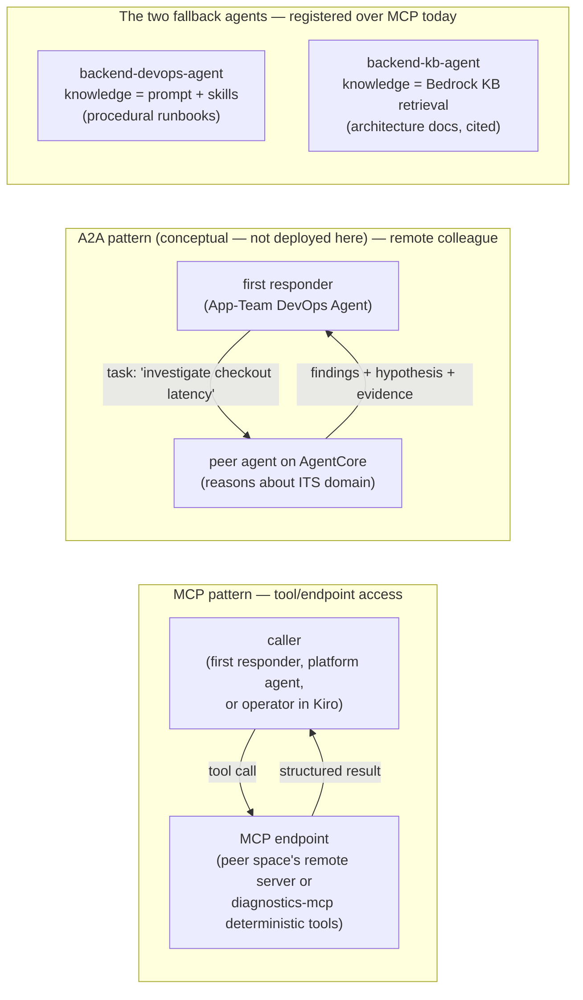

# A2A and MCP — connectivity patterns, demonstrated side by side

**Goal of this PoC: demonstrate agent connectivity and the different ways to
achieve it — not to crown a winner.** A2A and MCP solve different problems and
real systems will use both. We run the same incident through the connectivity
patterns we wired so the capability differences become observable, and we
document them as findings.

**Read this first if you are replicating the demo:** every agent-to-agent link
in the deployed PoC is **MCP**, including the fallback to the custom agents.
A2A is documented here as a pattern and the registration scripts are retained,
but A2A was never exercised. The comparison table further down is a conceptual
protocol comparison, not a measured A2A-vs-MCP result.

The patterns demonstrated in one incident flow
([setup](aws-devops-agent-integration.md)):

1. **MCP, managed → managed** — the first-responder DevOps Agent delegates to
   the Platform DevOps Agent through its remote MCP endpoint (the reference
   "first responder with MCP delegation" pattern)
2. **MCP, managed → custom (fallback)** — the first responder falls back to
   self-managed Strands agents on AgentCore, which are **also registered over
   MCP** (two flavors: runbook-driven and KB-grounded). Registering them as
   remote A2A agents instead is possible and the script is retained, but that
   path has never been exercised in this PoC.
3. **MCP, managed → custom tools** — the Platform DevOps Agent consumes the
   deterministic `diagnostics-mcp` toolbox as a capability provider
4. **MCP, human → managed** — the operator works with the first responder
   from Kiro via the official DevOps Agent power

## What is actually wired in the deployed PoC: MCP everywhere

Both agent-to-agent links are MCP registrations today. Neither is A2A.

| Link | Registration type | SigV4 service | Notes |
|---|---|---|---|
| Space → space (App-Team DevOps Agent → Platform DevOps Agent) | `mcpserversigv4` | `aidevops` | Custom header `X-Agent-Space-Id` routes the call to the platform space; `scripts/register-platform-space-mcp.sh` |
| Managed → custom fallback agents (`backend-devops-agent`, `backend-kb-agent`) | `mcpserversigv4` | `bedrock-agentcore` | Each runtime exposes a single `investigate` tool; `scripts/register-fallback-agents-mcp.sh` |

A2A registration is a supported alternative and the scripts are kept in the
repo — `scripts/register-platform-space-agent.sh` and
`scripts/register-fallback-agents.sh` — but **A2A has never been tested in
this PoC**. Treat it as "available to try", not as a demonstrated result. The
custom agents do run an A2A server alongside their MCP server, so trying it is
mostly a registration exercise.

### Honesty note: two spaces investigating is not by itself delegation

Space-to-space MCP delegation **is** exercised — but only with the app-team skill
catalog loaded, and it is not what makes two investigations appear. Keep the two
mechanisms apart when you present this:

- **Dual-path alarm fan-out** is why two spaces investigate the same incident in
  parallel. Business / golden-signal alarms page the **app-team space**, and
  `aiops-poc-be-infra-*` alarms page the **platform space** through the webhook
  bridge. Two independent notifications, no delegation involved. This happens with
  skills OFF, where the app-team space made **0** MCP delegation calls across five
  recorded `payments-crash` runs.
- **Delegation** is the app-team responder calling the platform space's provider
  itself: `investigate` to open a platform investigation where none is running, or
  the read tools (`list_tasks`, `get_task`, `list_journal_records`) to join the one
  the dual path already opened. Recorded on the skills-ON runs of `search-crash`,
  `ddb-throttle` and `payments-crash`.

So do not infer delegation from two reports existing — the fan-out produces those on
its own. **Verify it in the traces**, in the investigation's own utilization record.
`search-crash` is the cleanest demo of the hop, because no BE alarm pages the
platform space for it, so delegation is the only route in. Details in
[skills-results.md](skills-results.md) and
[aws-devops-agent-integration.md](aws-devops-agent-integration.md#delegation-status-what-the-runs-show).

## The one-line distinction

- **MCP** connects an agent to **tools** (agent → tool). The caller gets raw
  capabilities and data; reasoning stays with the caller.
- **A2A** connects an agent to **another agent** (agent → agent). The caller
  delegates a goal; reasoning happens on both sides and what comes back is an
  opinion with evidence.

*MCP mode (remote toolbox) vs A2A mode (remote colleague).*

## Main capability differences — conceptual comparison

This table compares the two protocols **as patterns**. Only the MCP column
describes something this PoC actually runs; the A2A column is the protocol's
design intent, not an observation from a deployed run here.

| Dimension | MCP pattern | A2A pattern (conceptual) |
|---|---|---|
| What crosses the boundary | Raw metrics/log data | Task description + reasoned findings |
| Where reasoning happens | Entirely in the caller | Distributed: each agent reasons over its own domain |
| Knowledge required by caller | Must understand the remote architecture to know what to query | Only the peer's agent card ("investigates backend incidents") |
| Discovery | `tools/list` — enumerates functions | Agent card — skills described in natural language |
| Contract style | Function signatures (JSON schema) | Goals and free-form task messages (JSON-RPC / HTTP+JSON tasks) |
| Long-running work | Request/response per tool call | Task lifecycle (submitted/working/completed), streaming, subscriptions |
| Token/cost profile | Caller burns tokens digesting raw data | Peer's LLM digests locally; caller receives a summary |
| Data exposure | Remote side exposes raw operational data | Remote side controls disclosure; can return conclusions only |
| Team-topology analogy | "Give me read access to your dashboards" | "Please investigate and tell me what you find" |
| Watch out for | Caller can misread unfamiliar signals | Caller must trust the peer's conclusions |

## The knowledge axis: where the fallback agent's expertise comes from

The fallback has two knowledge-only flavors (telemetry descoped 2026-07 —
the DevOps Agent is the live-telemetry layer; the fallbacks consult
documented knowledge only):

| | backend-devops-agent | backend-kb-agent |
|---|---|---|
| Backend knowledge | System prompt + Agent Skills (procedural runbooks) | Bedrock Knowledge Base retrieval (declarative architecture docs) |
| Investigation style | Follows encoded step-by-step procedures | Builds a plan from retrieved architecture facts, cites them |
| Improves by | Authoring better runbooks (skills before/after demo) | Enriching the KB corpus |
| Analogy | The experienced on-call engineer with runbooks | The new hire with excellent documentation |

Both investigate with **CloudWatch only** — no third-party telemetry provider
is involved anywhere in the PoC.

## The switches

- **Delegation vs fallback**: structural — MCP delegation to the platform
  space is always primary; the custom-agent fallback (also over MCP) fires
  when the managed chain is inconclusive (forceable for demos by deactivating the platform space's
  relevant skill or prompting the first responder to consult remote agents)
- **Which fallback agents are registered**: `/aiops-poc/peer` = `devops` |
  `kb` | `both`
- **Skills before/after**: native Active/Inactive toggle per skill in each
  Agent Space; `/aiops-poc/skills-enabled` for the custom agents

Custom-agent reports record trigger, skills flag, timings, token usage, and
the evidence chain — so runs over the same injected fault can be laid side by
side with the managed agents' findings.

## Protocol facts used by this PoC

| | MCP server (AgentCore) | A2A server (AgentCore) | DevOps Agent remote endpoints |
|---|---|---|---|
| Port / path | 8000, `/mcp` | 9000, `/` | `connect.aidevops.{region}.api.aws` — `/mcp`, `/a2a/*` |
| Discovery | `tools/list` | `/.well-known/agent-card.json` | same, per protocol |
| Transport | Streamable HTTP | Streamable HTTP (JSON-RPC) | Streamable HTTP / A2A v1.0 HTTP+JSON |
| Auth | SigV4 or OAuth via `InvokeAgentRuntime` | SigV4 or OAuth via `InvokeAgentRuntime` | Bearer access token or SigV4 |
| Health check | — | `GET /ping` | — |
