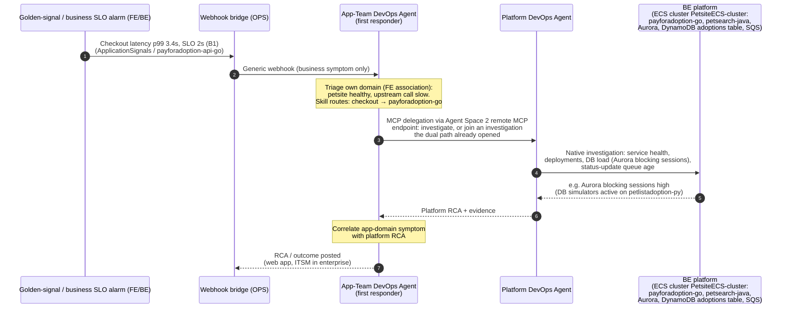
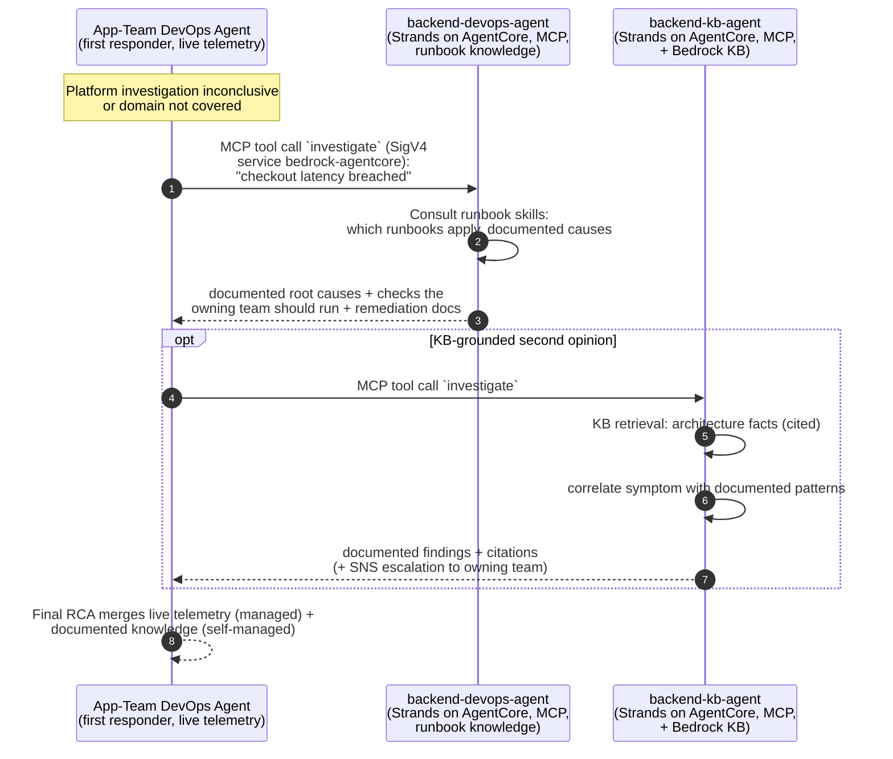
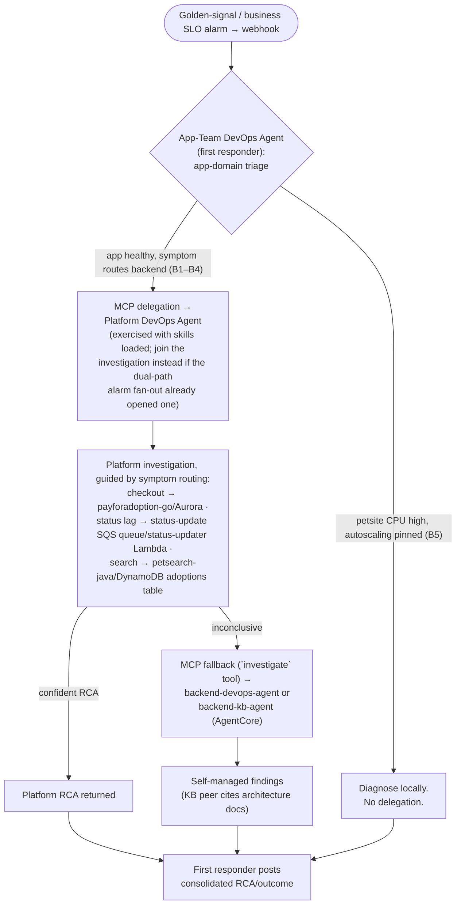
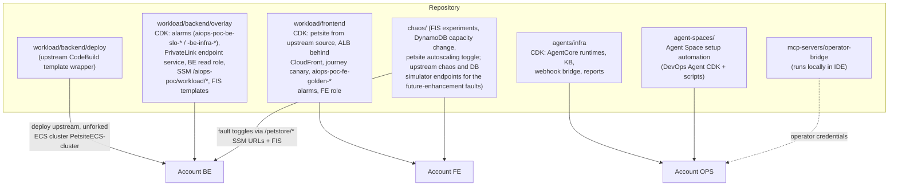

# Architecture

This document is for anyone rebuilding or presenting this PoC in their own AWS
accounts: it describes the deployed topology (three accounts, the PetAdoptions
workload, the agent estate), how incidents are detected and routed, how the
agents connect to each other, and which parts of the design are validated
versus retained-but-unexercised. Deployment steps live in
[deployment.md](deployment.md); the fault catalog lives in
[scenarios.md](scenarios.md).

## 1. High-level overview

The agent architecture follows the **AWS DevOps Agent first-responder pattern
with delegation** (per AWS guidance): each team/domain has its own dedicated
DevOps Agent Agent Space, a first responder owns every incident, and it
collects information by talking to other domains' agents.

**Both agent-to-agent links on this deployment are registered over MCP**: the
space-to-space link (app-team → platform) and the fallback link (app-team → the
two self-managed Strands agents on AgentCore). The agents are dual-protocol —
they can serve A2A on port 9000 and MCP on 8000/`mcp` — and A2A registration
scripts are retained, but **A2A has not been exercised on this deployment**.
MCP was chosen because it is the path with a documented account-unblock
process.

Three AWS accounts:

- **Frontend workload account (FE)** — petsite (built from unmodified upstream
  PetAdoptions source) on ECS cluster `aiops-poc-petsite`, an ALB fronted by
  CloudFront (the ALB only accepts CloudFront origin-facing traffic, so it is
  not directly reachable from the internet), and the shopper-journey Synthetics
  canary. Owned by the app team.
- **Backend workload account (BE)** — the full upstream PetAdoptions
  deployment, unforked (petsearch, payforadoption, petlistadoptions, the status
  updater, DynamoDB, Aurora, SQS, traffic generator). Owned by the
  platform/backend team. The upstream deployment also brings its own copy of
  petsite, which runs on the upstream **EKS** cluster `PetsiteEKS-cluster` and
  simply keeps running, unused by the demo — the construct that was going to
  disable it was omitted (it is an EKS Deployment, not an ECS service, so
  scaling it from CDK was out of scope). The petsite the demo drives is the FE
  one.
- **Ops account (OPS)** — hosts both DevOps Agent **Agent Spaces** (created
  centrally, scoped by cross-account association) and the self-managed agent
  estate on AgentCore Runtime.

The agents:

| Agent | Type | Domain / scope | Role in the flow |
|---|---|---|---|
| **App-Team DevOps Agent** | AWS DevOps Agent (Agent Space 1) | FE account association | **First responder** — picks up the incident, triages the app domain, owns the investigation end to end, posts the RCA/outcome |
| **Platform DevOps Agent** | AWS DevOps Agent (Agent Space 2) | BE account association | **Dependent-service agent** — investigates the platform (ECS services, Aurora, DynamoDB, SQS; same pattern applies to EKS via kubectl/EKS MCP) and returns platform RCA. Its remote MCP endpoint is registered in Agent Space 1 as a capability provider, and the **delegation hop is exercised** with the skill catalog loaded — see [the delegation status](#delegation-status-what-is-and-is-not-exercised). It is also reached independently by the dual-path alarm fan-out |
| **backend-devops-agent** | Self-managed Strands on AgentCore, served over **MCP** (A2A serving mode retained, untested here) | Knowledge-only (Agent Skills) | **Fallback runbook checker** — registered as an MCP capability provider (single `investigate` tool) in Agent Space 1; consults documented runbooks/playbooks and returns documented causes + checks. No live telemetry — the DevOps Agent is the live-telemetry layer |
| **backend-kb-agent** | Self-managed Strands on AgentCore, served over **MCP** + Bedrock KB (A2A serving mode retained, untested here) | Knowledge-only (Bedrock KB) | Second fallback flavor — KB retrieval with citations + SNS escalation to the owning team. No live telemetry |
| **diagnostics-mcp** | Self-managed MCP server on AgentCore | BE read role | **Optional / descoped from the demo** — deterministic toolbox kept deployed as an alternate; its platform-space association was removed (re-creatable via `scripts/register-diagnostics-mcp.sh`) |


> The `.svg`/`.jpg` in `diagrams/` are CLI-rendered exports of
> `diagrams/architecture-overview.drawio`. Edit the `.drawio` source, then
> regenerate both renders:
>
> ```bash
> "/Applications/draw.io.app/Contents/MacOS/draw.io" --no-sandbox --disable-gpu \
>   -x -f svg -o docs/diagrams/architecture-overview.svg docs/diagrams/architecture-overview.drawio
> "/Applications/draw.io.app/Contents/MacOS/draw.io" --no-sandbox --disable-gpu \
>   -x -f jpg -s 2 -o docs/diagrams/architecture-overview.jpg docs/diagrams/architecture-overview.drawio
> ```
>
> Never hand-edit the renders. The `.drawio` file is the single source for the
> architecture overview.

Account background colour separates the sample from what it observes. **Grey**
(Frontend and Backend accounts) is the *example workload being observed* — the
upstream PetAdoptions app, deployed as-is and swappable for your own
application, alarms and faults. **Teal** (Ops account) is the sample itself:
Agent Spaces, webhook routing, cross-account MCP delegation, the fallback
estate and escalation, all workload-agnostic apart from the skill catalog and
the KB corpus. The diagram carries the same key on-canvas; the practical
consequences of the split are in
[README → Adapting this to your own workload](../README.md#adapting-this-to-your-own-workload).

Orange = DevOps Agent → DevOps Agent (the designed primary path). It is
registered as **MCP delegation**: the platform space's remote MCP endpoint
(`https://connect.aidevops.{region}.api.aws/mcp`, tokenless SigV4 +
`X-Agent-Space-Id` routing header) registered in `app-team` as an MCP
capability provider (see `scripts/register-platform-space-mcp.sh` and
`agent-spaces/README.md`). Registration and endpoint verification succeeded, and
the app-team responder does call it once the skill catalog is loaded (see below).

Blue/gold = DevOps Agent → self-managed AgentCore agents (**MCP fallback** —
the managed↔custom hop the recorded runs actually take): each fallback agent
serves the AgentCore MCP contract (streamable HTTP on 8000 at `/mcp`) exposing
a single `investigate` tool, registered via
`scripts/register-fallback-agents-mcp.sh` (`mcpserversigv4`, SigV4 service
`bedrock-agentcore`).

The A2A variants of both links exist as scripts —
`scripts/register-platform-space-agent.sh` (space-to-space) and
`scripts/register-fallback-agents.sh` (fallback agents, whose containers switch
protocol via `SERVE_PROTOCOL`) — and both are **untested on this deployment**.
Treat them as a documented alternate, not a second working path. The A2A
registration type is account-gated with no known unblock process; the MCP path
was chosen because its gate does have one.

### Delegation status: what is and is not exercised

Present this precisely, because the diagrams show the designed shape and the
exercised one differs from it in detail:

- **Exercised**: alarm → SNS → webhook bridge → investigation in both spaces; the
  app-team responder calling the fallback agents' MCP `investigate` tool; and
  app-team → platform **space-to-space** MCP delegation.
- **Exercised, but only with the skill catalog loaded.** The delegation hop is the
  one axis where the two halves of the skills before/after differ qualitatively
  rather than by a number: every skills-OFF run made **0** invocations of the
  platform-space MCP provider, and the two-space behaviour came from the
  **dual-path alarm fan-out** (see below) alone. With the catalog loaded and
  `agent_types: ["GENERIC"]`, the responder runs the duplicate check and then
  either opens a platform investigation or joins the one already running. Present
  the wiring as real in both halves and the hop as a skills result.
- **Not exercised**: the provider's `create_investigation` tool, which stays unused
  because the skill routes opening through `investigate` and, on the faults where
  both paths overlap, the dual path has usually opened the platform investigation
  already by the time the responder's duplicate check runs. Not a broken link —
  [the reasoning](aws-devops-agent-integration.md#why-create_investigation-never-fires-and-why-that-is-correct).
- **Not exercised**: A2A on either link. Measurements for all of the above are in
  [skills-results.md](skills-results.md) and the
  [deployment.md results table](deployment.md#results-table).

### Incident detection and routing

Detection is **15 CloudWatch alarms in three tiers**, and the alarm name says
which tier a signal came from:

| Tier | Prefix | Account | Count | Pages? |
|---|---|---|---|---|
| Customer-facing golden signals | `aiops-poc-fe-golden-*` | FE | 3 | all 3 → app-team space |
| Per-service business SLOs | `aiops-poc-be-slo-*` | BE | 6 | only `-statusupdate-lag` → app-team space |
| Raw infrastructure evidence | `aiops-poc-be-infra-*` | BE | 6 | only `-payments-tasks` → **platform** space |

**5 of 15 page**; the other 10 are actionless evidence the agents correlate
during an investigation. This is deliberate: an earlier build let BE SLO alarms
open incidents, and on a measured run a backend alarm fired 13 minutes before
the customer-facing one and hijacked the incident framing. Only
customer-impact signals frame an incident now.

The **dual path** is the working two-space payoff: a single fault
(`payments-crash`) trips the FE golden signal, which pages the app-team space,
and about a minute later trips `aiops-poc-be-infra-payments-tasks`, which the
OPS webhook bridge routes to the **platform** space by matching the
`aiops-poc-be-infra-*` name prefix. Two investigations open, one per space, and
only the space with backend telemetry can name the cause.
`aiops-poc-be-slo-statusupdate-lag` pages the app-team space because B2 is
asynchronous — the journey canary stays green, so no golden signal can see it.

The FE golden tier rests on the journey canary `aiops-poc-journey`, which runs
**every minute** and asserts on page **content** as well as HTTP status (step 2
search results, step 4a housekeeping/cleanup). petsite renders a broken backend
as a fast HTTP 200 error page, so a status-only check sails past a real outage.
Full names, thresholds and routing are in the
[alarm inventory](deployment.md#alarm-inventory).

Domain scoping is real on both estates: Agent Space 1 is associated only with
FE, Agent Space 2 only with BE; the self-managed agents' read role exists only
in BE. Nobody can enumerate a foreign account.

In an enterprise, the trigger would be an ITSM ticket (DevOps Agent has a
native ServiceNow integration); the PoC replaces that hop with CloudWatch
alarms → SNS → DevOps Agent generic webhook. A **General Intake Agent Space**
(fallback for teams not yet enabled) is part of the reference pattern but out
of PoC scope.

## 2. PetAdoptions service topology (verified inventory)

The upstream PetAdoptions application runs in a single ECS cluster
`PetsiteECS-cluster` (Account BE) with Fargate and EC2 capacity providers.
All services are instrumented via ADOT/OpenTelemetry to the
`ApplicationSignals` CloudWatch namespace.

### ECS services in cluster `PetsiteECS-cluster` (Account BE)

| ECS Service | Language | Port | SSM URL parameter |
|---|---|---|---|
| `payforadoption-go` | Go | 80 | `/petstore/paymentapiurl` (checkout), `/petstore/cleanupadoptionsurl` (housekeeping) |
| `petsearch-java` | Java (Spring Boot) | 80 | `/petstore/searchapiurl` |
| `petlistadoption-py` | Python (FastAPI) | 80 | `/petstore/petlistadoptionsurl` |
| `petfood-rs` | Rust | 80 | `/petstore/petfoodapiurl`, `/petstore/petfoodcarturl` |

The petsite the demo drives is the **FE** one (cluster `aiops-poc-petsite`,
service `petsite`, URL `/petstore/petsiteurl`, ALB behind CloudFront). It is
**not** a service in `PetsiteECS-cluster`: the upstream's own petsite copy runs
on the upstream **EKS** cluster `PetsiteEKS-cluster` in BE and keeps running,
unused. Disabling it would need kubectl/EKS access and is out of scope, so
expect it to be there and idle.

`PetFoodAgent` (Waggle AI chat) is **not** an ECS service — it runs on Bedrock
AgentCore Runtime in BE and publishes `/petstore/petfoodagent-runtime-arn`
(see [Cross-account connectivity](#cross-account-connectivity-fe--be) below).

### Supporting resources (Account BE)

| Resource | Name/ID | Details |
|---|---|---|
| DynamoDB table (adoptions) | CloudFormation-generated; discover via SSM `/petstore/dynamodbtablename` (example shape: `DevStorageStack-DynamoDbddbPetadoption…`) | Provisioned capacity, Contributor Insights enabled |
| SQS queue (status updates) | CloudFormation-generated; discover via SSM `/petstore/queueurl` (example shape: `DevCoreStack-QueueResourcessqspetadoption…`) | payforadoption-go → status-updater Lambda |
| Aurora cluster | CloudFormation-generated; endpoints via SSM `/petstore/rds-writer-endpoint` and `/petstore/rds-reader-endpoint` | PostgreSQL, database `adoptions` (also published as `/petstore/rds-database-name`) |
| Lambda (status updater) | No SSM parameter publishes it; identify it as the function whose event source mapping consumes the queue above | SQS trigger → DynamoDB updates |
| Canaries (upstream) | `petsite-canary`, `housekeeping-canary` — explicitly named by the upstream, so fixed by the pinned ref | rate(5 min), namespace `CloudWatchSynthetics` |
| API Gateway | upstream logical name `PetAdoptionsStatusUpdater`; URL via SSM `/petstore/updateadoptionstatusurl` | HTTP facade for the status-updater Lambda |
| FIS experiment templates | `FisPaymentsCrash`, `FisSearchCrash` (tags `Name=payments-crash` / `search-crash`) | `aws:ecs:stop-task`, `selectionMode: ALL`, targeting the `payforadoption-go` and `petsearch-java` services in `PetsiteECS-cluster` |

Anything CloudFormation-generated above is deployment-specific: resolve it from
the SSM parameter, never from a name copied out of this doc. The diagnostics MCP
server does exactly that at runtime —
[`mcp-servers/backend-diagnostics/src/resource_resolver.py`](../mcp-servers/backend-diagnostics/src/resource_resolver.py)
reads the parameters above (and, for the status-updater, the queue's event source
mapping), caches each value for the process, and fails with the parameter name
rather than falling back to a literal. The chaos scripts resolve the same values
the same way. No file in this repository holds a generated name.

### SSM parameter discovery (`/petstore/` prefix)

All inter-service URLs are stored under `/petstore/` in Parameter Store;
petsite reads them from **its own account** at startup. Key parameters:
`searchapiurl`, `paymentapiurl`, `petlistadoptionsurl`, `petfoodapiurl`,
`petfoodcarturl`, `cleanupadoptionsurl`, `updateadoptionstatusurl`,
`petsiteurl`, `petfoodagent-runtime-arn`, `queueurl`, `dynamodbtablename`,
`foods_table_name`, `carts_table_name`, `rdssecretarn`,
`rds-writer-endpoint`, `rds-reader-endpoint`, `rds-database-name`.
(There is no cluster-name parameter; older `payforadoptionurl` /
`sqsqueueurl` / `rdsendpoint` names are gone from the current upstream.)

The full **parameter ownership contract** — who produces each `/petstore/*`
and `/aiops-poc/*` parameter, who consumes it, and how `sync-outputs.sh`
treats it — lives in [parameters.md](parameters.md). Read it before any
clean redeploy.

### Request paths (what can break where)

- **Checkout (sync)**: `petsite (FE) → payforadoption-go (BE) → Aurora` —
  incidents B1 (slow checkout) and B3 (adoption/payment failures)
- **Status update (async)**: `payforadoption-go → SQS (status-update queue, /petstore/queueurl) → status-updater Lambda →
  DynamoDB (adoptions table, /petstore/dynamodbtablename)` (all BE) — incident B2 (status stuck); queue age is the business lag
- **Search**: `petsite (FE) → petsearch-java (BE) → DynamoDB (adoptions table)` — incident B4
- **UI**: `petsite ECS (cluster aiops-poc-petsite) + ALB + autoscaling` (FE) — incident B5 (must be
  diagnosed by the first responder alone, no delegation)

### Fault injection mechanisms

The **active** faults are all AWS-native, so they work on the unforked upstream
as deployed:

| Mechanism | Fault(s) | What it does |
|---|---|---|
| AWS FIS `aws:ecs:stop-task` (`FisPaymentsCrash`, `FisSearchCrash`) | `payments-crash` (B3), `search-crash` (B4) | Stops all tasks of `payforadoption-go` / `petsearch-java` in `PetsiteECS-cluster`. A crashed service publishes nothing — absence of signal is the signal |
| DynamoDB `UpdateTable` | `ddb-throttle` (B4) | Drops the adoptions table to 1 RCU / 1 WCU so search reads stall while every infra metric stays green (the grey-failure case) |
| ECS autoscaling ceiling pinned | `ui-no-scale` (B5) | Pins petsite's max capacity in FE so it saturates under load; the only fault that targets the frontend |

The upstream app also ships in-process chaos endpoints —
`POST /chaos/{enable|disable}` and `POST /degradation/{enable|disable}` on
payforadoption-go, `POST /simulate/{slowquery|lockblocking|deadlock}` on
petlistadoption-py. **They are not in the deployed images**, which is why the
faults that depend on them (`payments-error`, `checkout-degraded`,
`db-overload`) are future enhancements. See
[scenarios.md](scenarios.md#future-enhancements).

The sync/async split and the symptom→owner routing ("payments declined →
payforadoption-go") are encoded as DevOps Agent **Skills** (uploaded to both
Agent Spaces) and mirrored in the custom agents. See [skills.md](skills.md).

### Cross-account connectivity (FE ↔ BE)

Splitting the upstream across two accounts means petsite (FE) must reach
services the upstream assumes are VPC-local (BE). Three mechanisms make this
work; all of them are overlay/wrapper additions — no upstream code changes.

#### PrivateLink for the internal ALBs

Both VPCs are created by the same upstream CDK with the same default CIDR
(`10.0.0.0/16`), so **VPC peering is impossible** (overlapping CIDRs) and
re-CIDRing would mean forking the upstream. PrivateLink is CIDR-agnostic:
the BE overlay puts an internal NLB in front of the upstream's internal ALBs
and exposes it as a VPC Endpoint Service; the FE stack creates an interface
endpoint to it and points petsite's `/petstore/*` URL parameters at the
endpoint DNS, mirroring the exact BE path shapes with only host:port swapped.

| Endpoint port | Upstream internal ALB | Serves | FE-owned parameter(s) |
|---|---|---|---|
| `:80` | LB-petsearch-java | search | `/petstore/searchapiurl` (`/api/search?`) |
| `:8080` | LB-petlistadoption-py | adoption list | `/petstore/petlistadoptionsurl` (`/api/adoptionlist/`) |
| `:8081` | LB-petfood-rs | food + cart pages | `/petstore/petfoodapiurl` (`/api/foods`), `/petstore/petfoodcarturl` (`/api/cart`) |
| `:8082` | LB-payforadoption-go | checkout + housekeeping | `/petstore/paymentapiurl` (`/api/completeadoption`), `/petstore/cleanupadoptionsurl` (`/api/cleanupadoptions`) |

The BE overlay publishes the endpoint service name to
`/aiops-poc/workload/petsite-privatelink-service-name`; it must be synced to
FE **before** the FE stack deploys (its `valueFromLookup` resolves at synth).
`deploy-all.sh` step 3 handles the ordering. Trailing characters in the URL
values matter — petsite string-concatenates onto them.

#### Waggle / PetFood agent cross-account invoke

The Waggle chat tab talks to the PetFood agent, a Strands agent on **Bedrock
AgentCore Runtime in BE** (enabled via `ENABLE_PET_FOOD_AGENT=true` in the
CodeBuild wrapper, with `AVAILABILITY_ZONES` derived from the existing
workshop VPC — AgentCore VPC mode is AZ-restricted). petsite calls
`bedrock-agentcore:InvokeAgentRuntime` from FE, which needs three pieces:

1. **ARN discovery**: `/petstore/petfoodagent-runtime-arn` (written by the
   upstream in BE) is synced verbatim to FE by `sync-outputs.sh`.
2. **Resource policies in BE** (`BackendOverlayStack`): AgentCore evaluates
   authorization **hierarchically** — an explicit allow is required on BOTH
   the agent runtime AND its `<runtime-arn>/runtime-endpoint/DEFAULT`
   endpoint. Principal is the FE account root.
3. **Identity policy in FE** (`FrontendStack`): the petsite task role gets
   `InvokeAgentRuntime` on `runtime/PetFoodAgent*` in BE, scoping the
   account-root resource policy down to one role.

The agent invokes `us.anthropic.claude-sonnet-4-6` (cross-region inference
profile), so the **BE account needs Anthropic model access enabled in
Bedrock**. If the agent isn't deployed, the ARN never reaches FE and petsite
degrades gracefully (friendly error in chat, no timeout).

#### Database seeding

The upstream expects post-deploy seeding, which `deploy-upstream.sh` runs as
first-class pipeline steps (also available standalone via `--seed-only`):

- **Aurora**: invoke the upstream's `rds-seeder` Lambda.
- **DynamoDB**: pets + petfoods tables via the upstream `seed-dynamodb.sh`
  and seed data at the pinned ref (table names discovered from
  `/petstore/dynamodbtablename` and `/petstore/foods_table_name`).

Seeding is idempotent, retried, and verified by scan count. Without it,
search returns nothing and the food pages are empty.

## 3. Incident flow — primary path (DevOps Agent → DevOps Agent)

> **Status:** the wiring is real and the hop is exercised **with the skill catalog
> loaded**. The platform space's remote **MCP** endpoint is registered in `app-team`
> as a capability provider (tokenless SigV4 + `X-Agent-Space-Id` header), endpoint
> verification passed, and the skills-ON runs show the responder calling it — opening
> a platform investigation where none is running, or joining the one the dual path
> already opened. Skills-OFF it invoked the provider **0** times and consulted the
> fallback agents instead. Two details the sequence below simplifies: the opener is
> the provider's `investigate` tool rather than `create_investigation`, and the
> responder must poll the delegated task's `status` to a terminal value before
> writing its own root cause. The A2A variant of the same hop is an untested
> alternate. See [agent-spaces/README.md](../agent-spaces/README.md),
> [skills-results.md](skills-results.md) and the
> [results table](deployment.md#results-table).

*Incident flow — first responder with space-to-space delegation (designed
path).*



## 4. Incident flow — fallback path (DevOps Agent → AgentCore MCP)

When the managed chain is inconclusive (or the domain has no enabled Agent
Space), the first responder delegates to the **self-managed Strands agents**
registered as MCP capability providers (`mcpserversigv4`) — each exposing a
single `investigate` tool over the AgentCore MCP contract (streamable HTTP
on 8000 at `/mcp`, stateless).

**The fallback agents are knowledge-only** (descoped 2026-07): the DevOps
Agent is the live-telemetry layer; the fallbacks are knowledge checkers
with no live AWS access. The **backend-devops-agent** consults the
documented runbooks/playbooks (Agent Skills) and returns which runbooks
apply, documented likely root causes, the verification checks the owning
team should run, and documented remediation guidance. The
**backend-kb-agent** does the same grounded in Bedrock Knowledge Base
retrieval with citations, and additionally escalates a summary to the
owning team via SNS. Both state their findings as documented knowledge,
never observed fact.

This is the managed↔custom hop the recorded runs actually take: investigation
journals show `aiops-poc-backend-devops-agent-mcp_investigate` and
`aiops-poc-backend-kb-agent-mcp_investigate` tool calls.

The A2A serving mode (remote A2A agents, agent card skills routing) is an
**untested alternate**: the containers are dual-protocol via `SERVE_PROTOCOL`
and `scripts/register-fallback-agents.sh` registers that variant, but it has
not been exercised here (primary:
`scripts/register-fallback-agents-mcp.sh`).

*Incident flow — fallback to the self-managed agents (the exercised hop).*



Both fallback agents return the same structured report; the KB agent must cite
retrieved architecture facts. Neither holds the cross-account BE read role
anymore — only the (optional, descoped) diagnostics MCP runtime keeps it.
Reports from the custom estate also land in the S3 report store for
side-by-side comparison.

**Escalation path (KB agent only).** The two fallback flavors differ in one
more way: the KB agent can escalate its findings to humans. Its
`escalate_to_owner_team` tool publishes the investigation summary to the
`aiops-poc-escalations` SNS topic (OPS), which delivers an email to the
owning-team address configured in `config/accounts.json`
(`ops.escalationEmail`, git-ignored — placeholder in the template). This is
the single deliberate write-scope exception to the otherwise read-only
fallback agents: `sns:Publish` scoped to only that topic ARN —
human-notification only, no workload mutation possible. The
`ESCALATION_MODE` env var on the runtime is the demo knob: `always`
(default, demo-eager — the agent escalates every investigation so the email
reliably arrives) or `auto` (escalate on probable root cause or low
confidence). The email subscription requires a one-time manual confirmation
after deploy.

### Expected agent behavior by incident type

Which path the first responder should take depends on where the symptom points
— local diagnosis for the frontend fault, delegation for the backend ones, and
the knowledge-only fallback when the platform investigation is inconclusive.



## 5. Operator access from the IDE

- **Primary**: the official **AWS DevOps Agent Kiro power** connects Kiro to
  the first responder's Agent Space over its remote MCP endpoint — investigate,
  chat, fetch findings from the IDE.
- **Custom estate**: the local MCP bridge (`mcp-servers/operator-bridge`)
  exposes `start_investigation`, `ask_agent`, `get_incident_report`, etc.
  against the AgentCore agents with the operator's AWS credentials.

### Agent access role model (IAM)

Three role shapes make the managed estate work, all aligned with the DevOps
Agent console guidance (verified against a console-created reference space):

| Role | Account | Trust | Policies |
|---|---|---|---|
| `DevOpsAgentRole-AppTeam` (cloud source) | FE | `aidevops.amazonaws.com`, `StringEquals` on `aws:SourceAccount` (OPS) **and** `aws:SourceArn` (app-team space ARN) | AWS managed `AIDevOpsAgentAccessPolicy` + inline `iam:CreateServiceLinkedRole` on the Resource Explorer SLR (verbatim console guidance — no hand-rolled read policies) |
| `DevOpsAgentRole-Platform` (cloud source) | BE | same shape, scoped to the platform space ARN | same |
| `aiops-poc-devops-agent-monitor` (operator web app) | OPS | `aidevops.amazonaws.com`, `sts:AssumeRole` + `sts:TagSession`, scoped to OPS + `agentspace/*` (one role serves both spaces) | AWS managed `AIDevOpsOperatorAppAccessPolicy` (scopes by session tag `AgentSpaceId`, hence `TagSession`) + `AIDevOpsAgentAccessPolicy` + an inline tag-independent aidevops read/interact policy scoped to the two space ARNs |

Deliberate posture notes:

- **Actions role intentionally not configured** — the Capabilities tab shows
  "Actions role not configured". This is by design: the PoC is
  investigation-only; agents read, never remediate.
- **Operator Web App federation identifier** — cannot be set via API or
  CloudFormation (verified against the service model and
  `AWS::DevOpsAgent::AgentSpace`). It is a one-time manual console step per
  space (Operator Access tab); the value lives in
  `config/accounts.json → operator.federationIdentifier` and deploys never
  overwrite what was set in the console. See
  [agent-spaces/README.md](../agent-spaces/README.md).

## 6. Deployment topology

*Repository → account deployment mapping.*



## 7. Key design decisions

| Decision | Choice | Why |
|---|---|---|
| Agent pattern | AWS DevOps Agent first responder + per-domain Agent Spaces + space-to-space MCP capability provider (registered, delegation hop exercised with the skill catalog loaded), MCP fallback to self-managed agents (exercised). A2A variants of both links retained as untested alternates | Matches the AWS-recommended reference pattern; demonstrates managed↔managed and managed↔custom connectivity in one incident |
| First responder | App-Team DevOps Agent (managed service) | The incident owner is the product, not custom code; custom agents show extension, not replacement |
| DevOps→DevOps link | Agent Space 2's remote MCP endpoint (`/mcp`) registered as a custom MCP capability provider in Agent Space 1 — `mcpserversigv4`, SigV4 service `aidevops`, tokenless SigV4 + `X-Agent-Space-Id` customHeader. Registered and verified, and **the responder invokes it once the skill catalog is loaded** — `investigate` to open, or the read tools to join an investigation the dual path already opened; `create_investigation` stays unused by design | The documented way spaces talk directly; registration mechanics verified live (2026-07); tokenless beats bearer (no 60-day expiry), and the MCP gate has a known unblock process while the A2A gate does not |
| Fallback link | Backend Strands agents served over **MCP** (AgentCore MCP contract, single `investigate` tool) and registered as MCP capability providers — `mcpserversigv4`, SigV4 service `bedrock-agentcore`. This link **is** exercised; the A2A remote-agent variant is an untested alternate (dual-protocol containers, `SERVE_PROTOCOL`) | Same gate asymmetry as the space-to-space link: the MCP gate has a known unblock process, the A2A gate does not; investigation-only guardrail unchanged |
| Fallback agent scope | **Knowledge-only** (descoped 2026-07): runbook consultation (Agent Skills) and KB retrieval with citations + SNS escalation — no live telemetry tools, no cross-account read role | The DevOps Agent is the live-telemetry layer; the fallbacks add documented knowledge, avoiding duplicated telemetry and shrinking the custom agents' access footprint |
| Diagnostics MCP | Runtime + registration script kept as **optional alternate**; the platform-space association is descoped from the demo | No demo value (the Platform DevOps Agent's account association covers live telemetry); the association is re-creatable via `scripts/register-diagnostics-mcp.sh`. Future design: caller-passed resource names instead of baked-in inventory |
| Workload split | Full upstream PetAdoptions in BE (unforked); petsite in FE from unmodified upstream source | Real account boundaries per team; fidelity to the public sample |
| Platform flavor | ECS-based (current upstream) | Fidelity first; the delegation pattern is identical for EKS (kubectl/EKS MCP) — optional EKS variant noted in the spec |
| Incident triggers | 15 alarms in three tiers; only the 3 FE golden signals + `aiops-poc-be-slo-statusupdate-lag` page the app-team space, and `aiops-poc-be-infra-payments-tasks` pages the platform space (dual path). SNS → DevOps Agent generic webhook | Customer-impact framing first; the dual path lights up both spaces from one fault; ServiceNow is the documented enterprise swap-in |
| Fault injection | AWS FIS (`aws:ecs:stop-task`) for the two crash faults, a DynamoDB capacity change for the grey failure, an autoscaling ceiling for the FE saturation fault | AWS-native, so the faults run on the unforked upstream as deployed — the app's own chaos endpoints are absent from the deployed images |
| Skills | Same SKILL.md catalog uploaded to both Agent Spaces (native Active/Inactive toggle) and loaded by custom agents | One authoring format, before/after measurable on both estates |
| Telemetry provider | CloudWatch only | No 3P telemetry in scope |
| Agent access | Account associations (managed) and read-only cross-account roles (custom), domain-scoped | Investigation without remediation; genuine knowledge boundaries |

## 8. Open-source and product lineage (nothing reinvented)

| Project | What we take |
|---|---|
| [aws-samples/one-observability-demo](https://github.com/aws-samples/one-observability-demo) (PetAdoptions) | The entire workload: BE unforked (ECS cluster `PetsiteECS-cluster`: payforadoption-go, petsearch-java, petlistadoption-py, petfood-rs, plus the status-updater Lambda; DynamoDB adoptions table; Aurora; SQS); FE petsite from unmodified upstream source. Chaos endpoints (`/chaos/*`, `/degradation/*`) and DB load simulators (`/simulate/*`) — absent from the deployed images, so only the future-enhancement faults need them — plus the dynamo-capacity mechanism and the two canaries (`petsite-canary`, which also generates the baseline traffic, and `housekeeping-canary`). |
| [AWS DevOps Agent](https://docs.aws.amazon.com/devopsagent/latest/userguide/what-is.html) | First responder + platform Agent Spaces, Skills, generic webhooks, remote MCP/A2A endpoints, capability providers, Kiro power. |
| [Strands Agents SDK](https://strandsagents.com) | Fallback agents: agent loop, MCP serving mode (used here), A2A server (untested alternate), MCP client. |
| [A2A protocol](https://a2a-protocol.org) (Linux Foundation) | Agent cards, task lifecycle — the untested alternate for both the managed↔custom contract and the space-to-space delegation link. |
| [Model Context Protocol](https://modelcontextprotocol.io) | Both agent-to-agent links (space-to-space and fallback), the diagnostics server, and IDE access. |
| [Agent Skills spec](https://agentskills.io) | SKILL.md runbook format shared across managed and custom agents. |


## 9. Diagram sources

`docs/diagrams/` holds exactly three files, all for the one AWS-icon overview:

- `architecture-overview.drawio` — mxGraph source: account boundaries, AWS FIS
  acting on the BE ECS services, and an "AWS services used" panel. This is the
  single source for the architecture overview.
- `architecture-overview.svg` and `architecture-overview.jpg` — CLI-rendered
  exports of that source. Regenerate them with the draw.io CLI commands in
  [the note under the overview image](#1-high-level-overview) after any change
  to the `.drawio`, and never hand-edit them.

Every other diagram is a process or mapping diagram and lives **inline** as a
fenced `mermaid` block in the markdown that discusses it — this document,
[scenarios.md](scenarios.md), [deployment.md](deployment.md) and
[a2a-vs-mcp.md](a2a-vs-mcp.md) — which GitLab renders natively, so there are no
`.mmd` sources and no mermaid `.svg` renders to keep in step. Edit the mermaid
where you read it.
