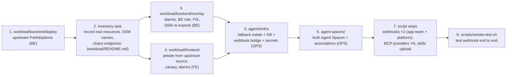

# Multi-account deployment guide

This is the runbook for standing the demo up in **your own three AWS accounts**
and then running it in front of a customer. Two paths through this document:

- **Deploying it**: [Prerequisites](#accounts-and-prerequisites) →
  [Reproduce this demo from scratch](#reproduce-this-demo-from-scratch)
- **Presenting it**: [Run the demo](#run-the-demo) (live order, exact commands,
  what to show, timings, gotchas)

Everything account-specific is resolved at runtime from
`config/accounts.json`, SSM parameters, or CDK lookups. No account IDs, ARNs,
or generated resource names are hardcoded in the IaC or scripts, and none need
to be typed by hand.

## Accounts and prerequisites

Three accounts, one AWS CLI profile each. The profile names below are the
defaults the scripts assume; you can use any names, as long as they match
`config/accounts.json`.

| Account | Role | Profile (default) |
|---|---|---|
| BE — backend workload | Full upstream PetAdoptions (unforked) + overlay | `backend-app` |
| FE — frontend workload | petsite (upstream source) + ALB + canary | `frontend-app` |
| OPS — ops | Agent platform (AgentCore, KB, webhook, reports) | `monitoring` |

**Credentials.** You need three working AWS CLI profiles with administrative
rights in their own account, one per account above, valid for the length of a
deploy (the upstream stack alone takes 45–90 minutes). Any credential source
works — IAM Identity Center (`aws sso login`), assumed roles, or static keys.
Verify with `aws sts get-caller-identity --profile <name>` before starting.

**Local tooling** (a fresh machine needs all of these):

| Tool | Why | Install hint |
|---|---|---|
| AWS CLI v2 | every script — and **2.34.64 or newer** for the skills axis, see [The `aws devops-agent` CLI namespace](#the-aws-devops-agent-cli-namespace) | [installer](https://docs.aws.amazon.com/cli/latest/userguide/getting-started-install.html) |
| Node.js 20+ and npm | all four CDK apps are TypeScript; `deploy-all.sh` invokes `npx cdk` | nodejs.org or nvm |
| AWS CDK v2 CLI | `scripts/bootstrap.sh` calls `cdk` directly | `npm i -g aws-cdk` |
| Docker (running) | CDK builds the agent container images locally — `deploy-all.sh` step 3 (petsite) and step 4 (the two agent runtimes). **Start it before deploying**: a stopped daemon is only discovered at step 3, after step 1's 45–90 minute upstream deploy. `preflight.sh` check P7 catches it in a second | Docker Desktop / colima |
| `jq` | config parsing in nearly every script | `brew install jq` |
| `python3` | SigV4 request signing in the MCP registration scripts | preinstalled on macOS/Linux |
| `hey` | load generator's preferred driver | `brew install hey` or `go install github.com/rakyll/hey@v0.1.5` |
| `curl` | loadgen fallback if `hey` is absent (lower precision, still works) | preinstalled |

Install the CDK app dependencies once (node_modules are not committed):

```bash
for d in workload/backend/overlay workload/frontend agents/infra agent-spaces; do
  (cd "$d" && npm ci)
done
```

### The `aws devops-agent` CLI namespace

Every post-deploy script step talks to AWS DevOps Agent through the CLI
namespace **`aws devops-agent`** — one word, with the hyphen. None of the CDK
stacks need it; all of these do:

| Script | Operations it calls | Without the namespace |
|---|---|---|
| `register-webhook.sh` | `list-services`, `register-service`, `associate-service`, `list-webhooks` | no alarm can reach an agent |
| `register-platform-space-mcp.sh`, `register-fallback-agents-mcp.sh`, `register-diagnostics-mcp.sh` (and the A2A alternates `register-platform-space-agent.sh`, `register-fallback-agents.sh`) | `list-services`, `register-service`, `list-associations`, `associate-service` | no delegation, no fallback |
| `smoke-test.sh` | `list-backlog-tasks` | cannot confirm an investigation started |
| `upload-skills.sh` | `create-asset`, `update-asset`, `list-assets`, `list-asset-types` | **the whole skills before/after axis** |

The last row is the one that catches people out: the asset operations arrived in
the CLI **later than the rest of the service**, so a CLI can resolve
`aws devops-agent` perfectly and still fail `upload-skills.sh` with
`Found invalid choice 'create-asset'` (exit 252).

**Verify in one command** (offline — `--generate-cli-skeleton` reads the local
service model and calls nothing, so no credentials, region or profile are
needed):

```bash
aws devops-agent list-agent-spaces --generate-cli-skeleton > /dev/null \
  && aws devops-agent create-asset --generate-cli-skeleton > /dev/null \
  && echo "OK — devops-agent namespace + asset (skill) operations resolve"
```

Expected output is exactly that one line, `OK — …`. Anything else means one of
the two probes exited 252 with `Found invalid choice`. `scripts/preflight.sh`
runs both probes for you as check **P6**, and prints
`P6 devops-agent CLI model resolves    PASS (aws-cli/<version>, asset/skill
operations present)` when they resolve.

P6 reports the CLI version but does not say *where* the model came from, so a
**PASS on a CLI below 2.34.64 means a local model under `~/.aws/models/devops-agent/`
is supplying the operations** — the fallback path below, which keeps working but
also keeps shadowing the bundled model after you upgrade. Check with
`ls ~/.aws/models/devops-agent/` if the version and the verdict look
inconsistent.

**Where the namespace comes from.** Two sources, in this order:

1. **The AWS CLI itself** — the primary path. AWS DevOps Agent is
   [generally available](https://aws.amazon.com/about-aws/whats-new/2026/03/aws-devops-agent-generally-available/)
   and its API, including the asset operations, is public: see the
   [DevOps Agent API reference](https://docs.aws.amazon.com/devopsagent/latest/APIReference/API_ListAssets.html)
   and [Managing assets](https://docs.aws.amazon.com/devopsagent/latest/userguide/about-aws-devops-agent-managing-assets.html)
   (which documents `aws devops-agent create-asset` for skills). From the
   [AWS CLI v2 changelog](https://github.com/aws/aws-cli/blob/v2/CHANGELOG.rst):
   the `devops-agent` namespace shipped in **2.34.20/2.34.21** (the GA release
   entries), and **2.34.64** added *"Asset APIs for managing versioned assets and
   asset files"* — the operations the skills axis needs. So: run
   `aws --version`, and if you are below 2.34.64, upgrade. That is the whole fix
   on a fresh machine.
2. **A locally installed service model** — the fallback, for a machine that
   cannot upgrade. `aws configure add-model` copies a `service-2.json` into
   `~/.aws/models/<service-name>/<apiVersion>/`, and the CLI prefers what it
   finds there over its own bundled models:

   ```bash
   aws configure add-model \
     --service-model file:///absolute/path/to/service-2.json \
     --service-name devops-agent
   # installs ~/.aws/models/devops-agent/<apiVersion>/service-2.json
   # (apiVersion comes from the model's own metadata, e.g. 2026-01-01)
   ```

   Two cautions. `file://` needs an **absolute** path. And because a local model
   *shadows* the bundled one, a model installed today keeps being used after you
   upgrade the CLI — delete `~/.aws/models/devops-agent/` once the CLI carries
   the operations you need, or you will be pinned to whatever that file says.

**Honestly, on obtaining `service-2.json`.** There is no public download URL for
the standalone model file, and this guide will not invent one. If you need the
fallback path, the file has to come from somewhere you already have it:

- a machine with an AWS CLI v2 at 2.34.64 or newer ships it inside the CLI's own
  data directory — `…/awscli/botocore/data/devops-agent/<apiVersion>/service-2.json`
  (on a macOS pkg install, `/usr/local/aws-cli/awscli/botocore/data/…`); copying
  that file to the older machine and running `add-model` is a legitimate route,
- otherwise, ask your AWS contact or the service team for the model.

If neither is available, the practical consequence is bounded: **the skills axis
cannot run** (`scripts/upload-skills.sh` has no `create-asset` to call, and the
skills before/after comparison is off the table — the Operator Web App's
Knowledge → Skills upload remains a manual fallback, see
[skills.md](skills.md)). If the CLI resolves no `devops-agent` at all, the
webhook and capability-provider registrations go with it, and there is no manual
substitute for those beyond the console.

**Two CLI quirks worth knowing before you debug the wrong thing:**

- it is `aws devops-agent`, hyphenated — not `aws devopsagent` and not
  `aws aidevops` (`aidevops` is the *signing name and endpoint prefix*, which is
  what you will see in IAM policies and error messages),
- `aws devops-agent help` exits **255** with `list index out of range`, even when
  the namespace is installed and working. It is a help-renderer failure, not a
  diagnosis. Use `aws devops-agent <operation> --generate-cli-skeleton` or the
  API reference instead.

**Account-side prerequisites:**

- **CDK v2 bootstrap in all three accounts** — `scripts/bootstrap.sh` does all
  three from `config/accounts.json` (`--account be|fe|ops` for one at a time).
- **Bedrock model access** must be requested per account, in the region you
  deploy to (`us-east-1` by default). This is a console step and it is easy to
  miss:
  - **OPS** — Anthropic **Claude Sonnet 4.5** (the fallback agents invoke the
    cross-region inference profile `us.anthropic.claude-sonnet-4-5-20250929-v1:0`)
    **and Amazon Titan Text Embeddings V2** (`amazon.titan-embed-text-v2:0`,
    used to embed the Knowledge Base corpus).
  - **BE** — Anthropic **Claude** for the upstream PetFood chat agent that the
    workshop app deploys on AgentCore in the backend account (it invokes the
    `us.anthropic.claude-sonnet-4-6` cross-region profile; see
    [architecture.md](architecture.md)). Without access, petsite's pet-food chat
    degrades gracefully — everything else still works.
  - Nothing is needed in FE.
- **Upstream PetAdoptions prerequisites** per its own README — the upstream is
  deployed by a CodeBuild project, so the BE account needs the CodeBuild and
  service-linked-role permissions the workshop expects.
- **Region.** Everything defaults to `us-east-1`, read from
  `config/accounts.json`. Use one region for all three accounts; the demo has
  not been validated split across regions.

## Deployment order



The whole sequence below is orchestrated by **`scripts/deploy-all.sh`** (steps
1–10, resumable with `--start-from N`). **`deploy-all.sh` is the tested path** —
the manual commands below are the same steps for reference and debugging, and
they skip some ordering fixups the script handles (resetting stale CDK context
lookups, and syncing the PrivateLink service name BE → FE before the FE deploy).
See [Reproduce this demo from scratch](#reproduce-this-demo-from-scratch)
for the end-to-end checklist including the manual console steps.

```bash
# 0. One-time: CDK bootstrap all three accounts
scripts/bootstrap.sh

# One command for the whole pipeline (BE → FE → OPS → spaces → petsite restart):
./scripts/deploy-all.sh                 # or --skip-upstream / --start-from N

# ─── …or step by step ───────────────────────────────────────────────────────
# 1. Upstream workload (Account BE) — unforked, via CodeBuild CDK template
./workload/backend/deploy/deploy-upstream.sh --wait

# 2. Inventory (one-time, semi-manual): verify petsite SSM URL parameters,
#    resource names, metric names, chaos endpoints → workload/README.md

# 3. Backend overlay (Account BE) — SLO + infra alarms, SNS, read role, FIS
(cd workload/backend/overlay && npx cdk deploy --profile backend-app)

# 4. Frontend workload (Account FE) — petsite pointed at BE URLs, canary, golden alarms
scripts/sync-outputs.sh --section privatelink   # must precede the FE deploy
(cd workload/frontend && npx cdk deploy --profile frontend-app)

# 5. Fallback estate + webhook bridge + webhook secrets (Account OPS)
(cd agents/infra && npx cdk deploy --profile <ops.profile>)
scripts/sync-kb.sh                              # ingest the KB corpus (CFN never does)

# 6. Agent Spaces: app-team (FE association) + platform (BE association)
#    (deploy-all.sh runs this in two phases + sync-outputs; see the script)
#    Deploying by hand: phase 1 of a FRESH deployment opts out of the source
#    associations with -c ENABLE_ASSOCIATIONS=false, because they need the agent
#    roles in FE/BE first. The cdk.json default is "true" — the steady state, so
#    every later deploy/diff matches reality. Details: agent-spaces/README.md

# 7. Non-CFN script steps (OPS): register BOTH webhooks, register MCP providers,
#    package + upload skills (both scripted). Not CloudFormation:
scripts/register-webhook.sh --space app-team      # → aiops-poc/webhook-credentials
scripts/register-webhook.sh --space platform      # → aiops-poc/platform-webhook-credentials
scripts/register-platform-space-mcp.sh            # space-to-space live investigator (PRIMARY)
scripts/register-fallback-agents-mcp.sh --peer both   # knowledge-only fallbacks (PRIMARY)
scripts/package-skills.sh                         # writes per-space zips to dist/skills/<space>/
scripts/upload-skills.sh                          # uploads them as assetType=skill, verifies with list-assets
#   (A2A variants register-platform-space-agent.sh / register-fallback-agents.sh are alternates)

# 8. Smoke test
./scripts/smoke-test.sh
```

## Cross-account wiring

| What | Direction | Mechanism |
|---|---|---|
| petsite → backend services | FE → BE | Public service URLs written into FE's SSM parameters (PetAdoptions' native config mechanism), synced by `scripts/sync-outputs.sh` |
| Paging alarms → first responder | FE, BE → OPS | Cross-account SNS subscriptions → webhook bridge Lambda → per-space generic webhook (HMAC). **Dual-path routing:** the bridge sends `aiops-poc-be-infra-*` alarms to the **platform** webhook (`aiops-poc/platform-webhook-credentials`) and everything else to the **app-team** webhook (`aiops-poc/webhook-credentials`). Alarms with SNS actions: the 3 `aiops-poc-fe-golden-*` + `aiops-poc-be-slo-statusupdate-lag` → app-team, plus `aiops-poc-be-infra-payments-tasks` → platform. All other `aiops-poc-be-slo-*` / `aiops-poc-be-infra-*` alarms are actionless evidence |
| App-Team space telemetry | OPS → FE | Agent Space account association (FE only) |
| Platform space telemetry | OPS → BE | Agent Space account association (BE only) |
| Diagnostics MCP telemetry (optional / descoped) | OPS → BE | `sts:AssumeRole` into `aiops-backend-domain-read` (exists only in BE) — used by the **diagnostics MCP task role only**. The knowledge-only fallback agents hold **no** BE read role |
| First responder → Platform space | OPS → OPS | Space-to-space **MCP**: the platform space's remote MCP endpoint registered as a capability provider (`mcpserversigv4`, tokenless SigV4 + `X-Agent-Space-Id`). A remote-A2A-agent variant is kept as the annotated alternate |
| First responder → fallback agents | OPS → OPS | **MCP** capability providers (`mcpserversigv4`, SigV4 service `bedrock-agentcore`, single `investigate` tool). Knowledge-only. The A2A serving mode is kept as the annotated alternate |
| KB-agent escalation | OPS → owning team | `sns:Publish` to the `aiops-poc-escalations` topic (OPS) → email to `ops.escalationEmail`; the KB agent's only write scope (human notification, no workload mutation) |
| Operator IDE | local → OPS | DevOps Agent Kiro power (managed) + operator bridge (custom) |

## Alarm inventory

The canonical list of the 15 CloudWatch alarms this demo deploys, their
conditions, and which ones page. This is the detailed reference behind the
plain-language detection summary in
[scenarios.md](scenarios.md#how-detection-works-the-short-version). Only **5**
of the 15 alarms have an SNS action (page a human); the other 10 are actionless
evidence the agents correlate during an investigation.

Alarms are named by tier, so an investigation title (`<name> is in ALARM`)
already tells an operator where the signal came from:

| Prefix | Tier | Account | Pages? |
|---|---|---|---|
| `aiops-poc-fe-golden-*` | customer-facing golden signal | FE | **yes — all 3 → app-team space** |
| `aiops-poc-be-slo-*` | per-service business SLO breach | BE | no, except `-statusupdate-lag` (→ app-team) |
| `aiops-poc-be-infra-*` | raw infrastructure "why" signal | BE | no, except `-payments-tasks` (→ **platform** space) |

**Tier 1 — FE golden signals (3, all page → `aiops-poc-fe-incidents` → app-team space)**

| Alarm | Condition |
|---|---|
| `aiops-poc-fe-golden-journey-success` | canary `SuccessPercent` < 90%, 1 of 2 × 60 s |
| `aiops-poc-fe-golden-journey-duration` | canary `Duration` > 10 000 ms, 1 of 2 × 60 s |
| `aiops-poc-fe-golden-checkout-error-rate` | petsite ALB 5xx rate > 2%, 2 × 60 s |

**Tier 2 — BE per-service SLOs (6, only the last one pages)**

| Alarm | Condition | Pages? |
|---|---|---|
| `aiops-poc-be-slo-checkout-latency-p99` | App Signals `Latency` p99 > 2 s, 3 × 60 s | no |
| `aiops-poc-be-slo-payments-error-rate` | ALB 5xx / requests > 2%, 2 × 60 s | no |
| `aiops-poc-be-slo-payments-availability` | ALB `HealthyHostCount` Min < 1, 2 × 60 s, missing = breaching | no |
| `aiops-poc-be-slo-search-latency-p99` | App Signals `Latency` p99 > 4 s on `GET /api/search`, 2 × 300 s | no |
| `aiops-poc-be-slo-search-error-rate` | App Signals `Fault` rate > 2%, 3 × 60 s | no |
| `aiops-poc-be-slo-statusupdate-lag` | SQS `ApproximateAgeOfOldestMessage` > 300 s, 3 × 60 s | **yes → app-team** (async B2, invisible to the FE canary) |

**Tier 3 — BE infrastructure evidence (6, only `-payments-tasks` pages)**

| Alarm | Condition | Pages? |
|---|---|---|
| `aiops-poc-be-infra-payments-cpu` / `-search-cpu` | `AWS/ECS` `CPUUtilization` > 80%, 3 × 60 s | no |
| `aiops-poc-be-infra-payments-memory` / `-search-memory` | `AWS/ECS` `MemoryUtilization` > 80%, 3 × 60 s | no |
| `aiops-poc-be-infra-payments-tasks` | `ECS/ContainerInsights` `RunningTaskCount` < 1, 2 × 60 s, missing = breaching | **yes → platform** (dual path) |
| `aiops-poc-be-infra-search-tasks` | same condition on `petsearch-java` | no |

Net: **10 BE alarms are actionless evidence** (5 × `be-slo-*` + 5 × `be-infra-*`),
and **5 alarms page** — 4 into the app-team space, 1 into the platform space.

**Telemetry notes (from the live inventory).**
- App Signals alarms must carry the **full** dimension set `[Environment, Service]`,
  and the emitted `Service` name is the OTEL service name
  (`payforadoption-api-go`, `petsearch-api-java`), **not** the ECS service name
  (`payforadoption-go`, `petsearch-java`). The ECS names remain correct for FIS
  targeting. An alarm that omits `Environment` matches no metric and sits in
  INSUFFICIENT_DATA forever.
- The shopper-journey canary is `aiops-poc-journey` (namespace
  `CloudWatchSynthetics`, metrics `SuccessPercent` / `Duration`, runs every
  minute). Its steps assert on HTTP status **and**, on the search (step 2) and
  housekeeping (step 4a) steps, on page **content** — because petsite masks a
  dead/degraded backend behind a fast HTTP 200 page, so a status-only check would
  miss `search-crash` and `payments-crash`.
- All backend services run in ECS cluster `PetsiteECS-cluster` on Fargate (BE
  account); petsite runs in the FE account (cluster `aiops-poc-petsite`, service
  `petsite`).

## Configuration

`config/accounts.json` is the only file you edit, and it is git-ignored. It
declares 18 fields, of which **five are required** — the three account IDs,
`ops.escalationEmail`, and `operator.federationIdentifier`. Everything else,
including the three CLI profile names and the three regions, has a default that
works if you follow the conventions in
[Accounts and prerequisites](#accounts-and-prerequisites).

`config/accounts.json.template` is the committed contract: its `_doc` block
carries one entry per field with the description, whether it is required, its
default, and the files that consume it. Read that block rather than this page
when you want field-level detail — this page will drift, the template cannot,
because `scripts/check-parameters.sh` fails if it does.

Two ways to produce the file:

```bash
scripts/setup-config.sh                                # prompted, validated
cp config/accounts.json.template config/accounts.json  # or edit by hand
```

The wizard prompts for each required field in template order, shows the JSON
path and the description, rejects a malformed account ID / email / enum value
on the spot, insists the three regions agree, and optionally confirms each
account with `aws sts get-caller-identity`. It writes account IDs to
`config/accounts.json` and nowhere else — no logs, no backups — then hands off
to `scripts/preflight.sh` and returns its exit status. Editing the template copy
by hand is fully supported and reaches the same place; you just do the
validation yourself.

### Wizard flags — when to reach for each

`scripts/setup-config.sh --help` is authoritative on syntax and precedence.
When to use each:

| Flag | Reach for it when |
|---|---|
| `--force` | You already have a `config/accounts.json` and are changing it (rotating an account, fixing a typo). Without it the wizard refuses to overwrite. |
| `--no-verify` | Your profiles have no valid credentials yet, or you are offline. It skips the per-account identity check; the wizard makes no other AWS call, and never a mutating one. |
| `--include-optional` | You need something outside the required five: different profile names, a different region, a different `bedrock.modelId` (see the Bedrock note in the prerequisites), `peer`, `skillsEnabled`, `escalation.mode`, or a different upstream ref. |
| `--non-interactive` with `--set <path>=<value>` | Scripting the setup. Values can also come from the canonical `AIOPS_*` environment variables; a required field with no value exits non-zero naming its JSON path. Remember that `--set` lands in your shell history. |
| `--show-ids` | You are reading the summary yourself and want full account IDs instead of the last four digits. Leave it off when screen-sharing. |

### Local state: `cdk.context.json` and fresh clones

`cdk.context.json` is git-ignored at any depth. That file caches CDK's
environmental lookups — account, AZ, VPC, subnet, prefix-list and SSM values —
and those are specific to the accounts that produced them, so sharing it across
clones is how you get a deploy that quietly targets the wrong environment.

The consequence for a fresh clone: **the first synth of each app performs live
lookups, so it needs valid credentials at synth time, not just at deploy time.**
Which app needs which:

| App | Lookup on first synth | Credentials needed |
|---|---|---|
| `workload/backend/overlay` | the upstream workshop VPC (`Vpc.fromLookup`) | BE |
| `workload/frontend` | availability zones, the CloudFront origin-facing prefix list, and the PrivateLink service name from SSM | FE |
| `agents/infra` | availability zones | OPS |
| `agent-spaces` | none | — |

Because `cdk synth` runs ahead of every `cdk deploy`, refresh all three profiles
before starting `deploy-all.sh` rather than when each step comes up — the BE and
FE synths happen in the first few minutes, and a stack whose credentials expire
mid-run fails at synth with a lookup error, not a deploy error.

To clear a stale cache, delete the file — CDK rewrites it on the next synth:

```bash
rm -f workload/frontend/cdk.context.json   # or whichever app's lookup is stale
```

Reach for that when a lookup resolves to something that no longer exists: a VPC
or subnet ID from a torn-down upstream, or a PrivateLink service name from a
previous BE overlay. `deploy-all.sh` already drops the two entries that go stale
in normal operation — the overlay's VPC lookup (step 2) and the FE's PrivateLink
SSM lookup (step 3) — so deleting the whole file is the manual-deploy remedy.

### Names that are not configurable

Two classes of name are deliberately absent from `config/accounts.json`, and
knowing which is which saves an hour of grepping.

**Fixed by the upstream sample.** The pinned upstream
(`upstream.org` / `upstream.repo` / `upstream.ref`) determines these. Changing
them would only ever be wrong, so they are hardcoded where they are consumed:

| Name | Determined by | Consumed in |
|---|---|---|
| ECS cluster `PetsiteECS-cluster` | upstream PetAdoptions CDK (`Services` stack) | `workload/backend/overlay/lib/backend-overlay-stack.ts` (alarm dimensions, FIS targets), `mcp-servers/backend-diagnostics/src/config.py`, `scripts/register-platform-space-agent.sh` |
| Services `payforadoption-go`, `petsearch-java`, `petlistadoption-py`, `petfood-rs` | upstream ECS service definitions | same three files (FIS targeting and diagnostics) |
| Internal ALBs `LB-payforadoption-go`, `LB-petsearch-java`, `LB-petlistadoption-py`, `LB-petfood-rs` | upstream load balancers | `backend-overlay-stack.ts` props defaults |
| Canaries `petsite-canary`, `housekeeping-canary` | upstream synthetics (named explicitly by the upstream, so fixed by the pinned ref) | `mcp-servers/backend-diagnostics/src/config.py` |
| `/petstore/*` parameter names | upstream service-discovery contract | `scripts/sync-outputs.sh`, both workload stacks — see [parameters.md](parameters.md) |

**Generated per deployment, so resolved at runtime.** Four backend resources
have no fixed name at all: CloudFormation generates the physical name of the SQS
status-update queue, the adoptions DynamoDB table, the Aurora cluster and the
status-updater Lambda, so no literal is ever correct in a second account. None is
committed anywhere. Every consumer resolves them at runtime from the upstream's
own `/petstore/*` contract — the diagnostics MCP through
[`mcp-servers/backend-diagnostics/src/resource_resolver.py`](../mcp-servers/backend-diagnostics/src/resource_resolver.py),
the chaos scripts through the same parameters, the overlay's `statusupdate-lag`
alarm dimension at deploy time. **A replicator has nothing to look up or paste
in for these**:

| Resource | Resolved from | Caller override |
|---|---|---|
| SQS status-update queue | `/petstore/queueurl` | `tool_get_queue_stats(queue_name=…)` — accepts the full queue URL or just its last path segment |
| Adoptions DynamoDB table | `/petstore/dynamodbtablename` | `tool_get_dynamodb_health(table_name=…)` |
| Aurora cluster | `/petstore/rds-writer-endpoint` — the identifier is the endpoint's first DNS label, since no parameter publishes the identifier itself | `tool_get_db_health(cluster_id=…)` — accepts the identifier, or a writer/reader endpoint. A custom endpoint is rejected rather than guessed at |
| Status-updater Lambda | no parameter publishes it: the queue ARN derived from `/petstore/queueurl`, then the function on its event source mapping | `tool_get_lambda_stats(function_name=…)` — a name or any substring of one, matched case-insensitively |

Resolution order is **caller-supplied argument → SSM → fail**, with no literal
fallback: a stale plausible name becomes a confident wrong answer during an
incident, which is worse than an error that names the parameter it could not
read. Values are cached for the process lifetime, failures are not. Full
reasoning is in [parameters.md](parameters.md#names-this-repository-resolves-at-runtime-instead-of-hardcoding).

(The diagnostics MCP is descoped from the main narrative for a different reason
— the platform space's own account association already gives it live BE
telemetry. See [mcp-servers/README.md](../mcp-servers/README.md).)

**Chosen by this PoC, but still not knobs.** The `/aiops-poc/*` SSM paths embed
these names, and the parameter contract in [parameters.md](parameters.md) is
what the cross-account wiring depends on, so renaming one means renaming
parameters in every consumer:

| Name | Defined in |
|---|---|
| Agent Spaces `aiops-poc-app-team`, `aiops-poc-platform` | `agent-spaces/lib/agent-spaces-stack.ts` |
| Agent runtimes `backend_devops_agent`, `backend_kb_agent`, `diagnostics_mcp` | `agents/infra/lib/agents-infra-stack.ts` |
| Webhook secrets `aiops-poc/webhook-credentials`, `aiops-poc/platform-webhook-credentials` | `agents/infra/lib/agents-infra-stack.ts` (read by `agents/infra/lambda/webhook-bridge/handler.py`, written by `agent-spaces/set-webhook-secret.sh`) |
| Reports bucket `aiops-poc-reports-<ops.accountId>`, escalation topic `aiops-poc-escalations` | `agents/infra/lib/agents-infra-stack.ts` |
| BE read role `aiops-backend-domain-read`, incident topic `aiops-poc-incidents` | `workload/backend/overlay/lib/backend-overlay-stack.ts` |
| petsite cluster/service `aiops-poc-petsite` / `petsite`, canary `aiops-poc-journey`, FE topic `aiops-poc-fe-incidents` | `workload/frontend/lib/frontend-stack.ts` |

## Reproduce this demo from scratch

A new user replicating this demo in their **own** three AWS accounts follows
these steps end to end. Work through
[Accounts and prerequisites](#accounts-and-prerequisites) first — the two
things most likely to stall a first deploy are missing CDK bootstrap and
missing Bedrock model access.

Budget **2–3 hours** for a first full deploy; the upstream workload alone takes
**over an hour** in CodeBuild — 45–90 minutes, at the slow end for a first
deploy into a cold account. The CodeBuild project's own build timeout
(`BuildTimeoutMinutes` in `workload/backend/deploy/cfn-codebuild-stack.yaml`)
defaults to **120 minutes** to stay clear of that, and CodeBuild bills only the
minutes a build consumes, so the headroom is free. If your build ends
`TIMED_OUT`, see
[the upstream deploy troubleshooting note](#troubleshooting-the-upstream-build-ended-timed_out).

### 1. Fill in `config/accounts.json`

```bash
scripts/setup-config.sh                                # or: cp the template and edit
```

Five inputs, all of which only you can know: the three account IDs,
`ops.escalationEmail` (the mailbox that receives KB-agent escalations — the
deploy fails fast on the template placeholder, and the subscription needs a
one-time email confirmation, step 5), and `operator.federationIdentifier`.

**`operator.federationIdentifier` is the one input you cannot read off something
you already have, so here is how to get it.** The value is *the session name that
the identity you will sign in to the Operator Web App with presents* — an IAM
Identity Center session name is one example of such a session name, not the
definition of the field. In the common case, where you deploy with the same
federated identity you open the web app with, it is mechanically derivable from
the credentials the deploy needs anyway:

```bash
aws sts get-caller-identity --profile <ops.profile> --query Arn --output text
# arn:aws:sts::<ops-account>:assumed-role/<role>/<THIS-IS-THE-VALUE>
```

The last slash-delimited segment is the value. `scripts/setup-config.sh` runs
that lookup for you and **offers the parsed session name as the prompt default**,
so in the common case you press Enter; it tells you where the value came from, and
when the profile has no session name to read (an IAM user, the account root, or a
`--no-verify` run) it offers nothing rather than a confident guess.

One caveat worth reading twice: **if the deploy runs under a CI or automation role
while a human operates the web app under their own identity, the deploy profile's
session name is the wrong value** — enter the human identity's session name
instead. A wrong value is accepted by config, by the deploy and by the console;
the only symptom is that Operator Web App sign-in silently does not work, which
looks identical whatever you got wrong.

`deploy-all.sh` prints the configured value, but it must still be entered by hand
once per space in the console (step 5).

Add `--include-optional` if you use different CLI profile names, a different
region, or want to change `peer` / `skillsEnabled` / `bedrock.modelId` /
`escalation.mode`. See [Configuration](#configuration) for the flags and the
template's `_doc` block for what each field does.

`config/accounts.json` is git-ignored, and it is the only file in the repository
that needs editing. Nothing else — no script, stack, or doc — should ever carry
your account IDs.

### 2. Install the CDK app dependencies, check the config, bootstrap CDK

```bash
for d in workload/backend/overlay workload/frontend agents/infra agent-spaces; do
  (cd "$d" && npm ci)               # node_modules are not committed, and no
done                                # script installs them for you
scripts/preflight.sh                 # read-only, no AWS calls: every input + its origin
scripts/bootstrap.sh                 # all three, from config/accounts.json
scripts/bootstrap.sh --account ops   # or one at a time: be | fe | ops
```

The `npm ci` loop is the same one in
[Accounts and prerequisites](#accounts-and-prerequisites) — repeated here
because neither `bootstrap.sh` nor `deploy-all.sh` runs it, so a fresh clone
that skips it fails at the first `npx cdk`.

`preflight.sh` fails on a missing or still-placeholder required input, on the
three accounts disagreeing about the region, and on a cached
`cdk.context.json` that references an account you are not deploying to. It also
*warns* — checks P6 and P7 — when the local AWS CLI cannot resolve
`aws devops-agent` or its asset operations (which blocks the post-deploy script
steps rather than the stacks), and when no Docker daemon is reachable (which
blocks the image builds in `deploy-all.sh` steps 3 and 4 — worth catching here,
because step 3 is reached only after step 1's 45–90 minute upstream deploy). The
remedy for P6 is in
[The `aws devops-agent` CLI namespace](#the-aws-devops-agent-cli-namespace); for
P7 it is simply starting Docker Desktop or `colima start`. `--strict`
promotes both warnings to failures. Both
`bootstrap.sh` and `deploy-all.sh` run it first and abort on failure, so running
it yourself is about reading the table before you spend the time;
`--skip-preflight` on either script bypasses the gate.

`bootstrap.sh` uses CDK's **default** qualifier (`hnb659fds`), which is what the
four CDK apps are pinned to. **If your accounts are already bootstrapped with the
default qualifier, this step has nothing to do** — re-running it is a no-op
update. Before it writes to an account it reads that account's existing
`CDKToolkit` stack and refuses (exit 99) if the stack belongs to a *different*
qualifier, because updating it in place would delete the staging roles that
qualifier's deployments depend on. The backend account will legitimately end up
with two toolkit stacks — this repo's `CDKToolkit` and upstream PetAdoptions'
`CDKToolkitPetsite` — which is correct;
[Troubleshooting: two CDK toolkit stacks in one account](#troubleshooting-two-cdk-toolkit-stacks-in-one-account)
is the whole story.

This is also the point to make sure all three profiles hold valid credentials —
the first synth of the BE and FE apps performs live CDK lookups, per
[Local state: `cdk.context.json` and fresh clones](#local-state-cdkcontextjson-and-fresh-clones).

And if you have not yet requested **Bedrock model access** (console-only: OPS
needs Claude Sonnet 4.5 + Titan Text Embeddings V2, BE needs Claude — see
[Accounts and prerequisites](#accounts-and-prerequisites)), do it **now**,
before step 3: approval is usually immediate, but a deploy without it fails
late, at KB ingestion and the fallback agents.

### 3. Deploy the stacks in order

Run `./scripts/deploy-all.sh` (resumable with `--start-from N`, and
`--skip-upstream` once the upstream workload exists), or deploy each stack
manually. What each creates:

| `deploy-all.sh` step | Stack / action | Profile | Creates |
|---|---|---|---|
| 1 | `workload/backend/deploy` (upstream) | `backend-app` | Upstream PetAdoptions (ECS services, Aurora, DynamoDB, SQS, VPC) |
| 2 | `BackendOverlayStack` | `backend-app` | 6 `aiops-poc-be-slo-*` + 6 `aiops-poc-be-infra-*` alarms, `aiops-poc-incidents` SNS topic + topic policy, `aiops-backend-domain-read` role, 2 FIS templates (payments-crash / search-crash, targeting live service names), PrivateLink service |
| 3 | `FrontendStack` | `frontend-app` | petsite (ECS + ALB + CloudFront), the journey **canary** (with the step-2 search content check), 3 `aiops-poc-fe-golden-*` alarms, `aiops-poc-fe-incidents` SNS topic, `PETSITE_URL` wired from the CloudFront domain |
| 4 | `AgentsInfraStack` | `monitoring` | AgentCore runtimes (diagnostics MCP + 2 knowledge-only fallback agents), Bedrock KB, **webhook-bridge Lambda** (dual-path prefix routing), both webhook **secrets** (`aiops-poc/webhook-credentials` + `aiops-poc/platform-webhook-credentials`), escalation SNS topic |
| 5–6 | `agent-spaces/` (2 phases) + `sync-outputs.sh` | `monitoring` | app-team + platform Agent Spaces, account associations (FE→app-team, BE→platform), cross-account SSM params |
| 7 | Agent-role stacks (FE + BE) | `frontend-app` / `backend-app` | DevOps Agent monitor roles the space associations assume |

`deploy-all.sh` also runs `sync-kb.sh` (KB ingestion), packages the per-space
skill zips into `dist/skills/<space>/` (step 9), and force-restarts petsite so it
picks up the final `/petstore/*` params (step 10).

Note what `deploy-all.sh` does **not** do: step 9 packages the skills and then
**prints** the skills-upload, webhook and capability-provider commands rather
than running them — every DevOps Agent control-plane mutation is left to you.
Those are step 4 below, and the webhooks are required — without them no alarm can
reach an agent.

#### Troubleshooting: the upstream build ended `TIMED_OUT`

Step 1 is the long one — the upstream CDK deploy runs **over an hour** (45–90
minutes). `BuildTimeoutMinutes` in
`workload/backend/deploy/cfn-codebuild-stack.yaml` defaults to **120 minutes**
for that reason; it used to be 60, which timed out a real deployment. CodeBuild
charges only the minutes a build consumes, so the headroom is free.

**If the stack already exists, editing the template changes nothing until the
stack is updated** — the CodeBuild project keeps whatever timeout it was created
with, so a rerun times out again at the old value. Re-run
`workload/backend/deploy/deploy-upstream.sh` to update the stack in place, or fix
the project directly and start a new build:

```bash
aws codebuild update-project \
  --name aiops-poc-upstream-backend \
  --timeout-in-minutes 120 \
  --profile <be.profile> --region <be.region>
```

`deploy-upstream.sh` passes `BuildTimeoutMinutes` on **every** run, so re-running
it sets the cap to the script's own default of 120 minutes, or to whatever
`--timeout-minutes <n>` you give it (10–2160, CodeBuild's own range, validated
before anything is deployed). That is deliberate: `aws cloudformation deploy`
sends `UsePreviousValue` for any parameter it is not given, so a stack first
created at 60 would otherwise keep 60 forever and raising the template default
would be a silent no-op on the re-run — the exact moment you need it.

A direct `update-project` drifts from the CloudFormation stack; the next
`deploy-upstream.sh` run puts the value it passes back, which is 120 unless you
pass `--timeout-minutes`. More detail in
[workload/backend/deploy/README.md](../workload/backend/deploy/README.md#troubleshooting).

#### Troubleshooting: `DevMicroservicesStack` sits waiting, then fails

The symptom looks like ECS and is not. `DevMicroservicesStack` waits on a service
that never reaches a steady state, because the service cannot pull an image that
was never pushed. The upstream ECS services reference their ECR repository **by
URI** (`ContainerImage.fromRegistry`, untagged, so `:latest`), and the only thing
that populates that tag is the container pipeline the upstream CDK creates in the
BE account, `DevApplicationsStack-pipeline`. So a stalled microservices stack
means *look at the image build*, not at ECS.

**`deploy-upstream.sh` now tells you this itself.** Once the CodeBuild step
finishes — whether it succeeded or ended `TIMED_OUT`/`FAILED` — the script checks
that every repository the pipeline publishes to holds the tag that pipeline pushes,
and on a miss prints the empty repositories, the failed `Build-<service>` action
with upstream's own error text, and the `retry-stage-execution` command below with
the execution id already filled in. The expected repository set is read from the
pipeline's own Build-stage actions (each carries its `ECRRepositoryName` and
`ImageTags`), so it tracks upstream's application list instead of a hardcoded
list. The check is read-only and **warns without failing the deploy** — the failure
is upstream's pipeline, not anything the wrapper deploys, and a missing
`ecr:ListImages` permission or a renamed upstream pipeline must not turn a good
deploy into a failed one. If you would rather look yourself:

```bash
aws codepipeline get-pipeline-state \
  --name DevApplicationsStack-pipeline \
  --profile <be.profile> --region <be.region>
```

**What happened in practice:** the `Build` stage's `Build-payforadoption-go`
action failed on an HTTP 502 from `gopkg.in` while `go get` resolved
`gopkg.in/yaml.v3`. Upstream's Dockerfile sets `GOPROXY=direct`, so module
resolution bypasses the Go module proxy and hits each module's origin host — no
cache, no fallback. That was a deliberate upstream choice: its
`SECURITY_FIXES.md` records the change from `goproxy.io` to `direct` *to avoid
502s*, so it traded one proxy's flakiness for the origin host's.

This is upstream's failure, not the PoC's. The pipeline is the one upstream's own
CDK creates, the image is built from upstream's own Dockerfile, and step 1 passes
both through untouched — a workshop attendee hits it identically.

**Expect two failures, not one.** Upstream's `Build` stage is configured with
`RetryMode.FAILED_ACTIONS`, so CodePipeline retries the failed action once on its
own. A second failure means that automatic retry is exhausted and the next retry
has to be manual.

**Fix: retry the failed build action.** In the console, CodePipeline →
`DevApplicationsStack-pipeline` → **Retry** on the failed `Build` stage. Or, with
the execution id from the `get-pipeline-state` output above:

```bash
aws codepipeline retry-stage-execution \
  --pipeline-name DevApplicationsStack-pipeline \
  --stage-name Build \
  --pipeline-execution-id <execution-id> \
  --retry-mode FAILED_ACTIONS \
  --profile <be.profile> --region <be.region>
```

The 502 is transient and usually clears on retry. Once the image lands in ECR the
waiting stack settles on its own — there is nothing to do in CloudFormation.

**If it keeps failing,** build the image locally: upstream ships
`src/cdk/scripts/redeploy-app.sh` (documented at
`docs-site/docs/deployment/redeployment.md`), which builds the same Dockerfile
with `docker buildx` and pushes to the same ECR repository, sidestepping the
CodeBuild network entirely.

One honest caveat: the same class of failure can hit the other five image builds,
since all of them fetch dependencies from the public internet at build time
(gradle, pip, cargo, `dotnet restore`, uv). Go is simply the only one configured
to skip its ecosystem's proxy, so it is the most exposed.

#### Troubleshooting: two CDK toolkit stacks in one account

**If your three accounts are already bootstrapped with CDK's default qualifier,
there is nothing to do here.** This section explains why the backend account ends
up with *two* `CDKToolkit`-style stacks, and how to recognise and undo the
failure that happens when they collide.

**Background.** A CDK bootstrap is namespaced by a **qualifier**. The default is
`hnb659fds`, and it appears in every name the bootstrap creates: the
`/cdk-bootstrap/hnb659fds/version` SSM parameter, the `cdk-hnb659fds-deploy-*` /
`cdk-hnb659fds-file-publishing-*` / `cdk-hnb659fds-image-publishing-*` /
`cdk-hnb659fds-lookup-*` IAM roles, and the `cdk-hnb659fds-assets-*` bucket. A
stack synthesized against one qualifier can only be deployed with that
qualifier's roles. **One toolkit stack owns one qualifier**, and CDK is perfectly
happy with several toolkit stacks in one account — that is how two qualifiers
coexist.

Upstream PetAdoptions ships its own qualifier. Its `src/cdk/cdk.json` sets
`"@aws-cdk/core:bootstrapQualifier": "petsite"`, and its own
`src/cdk/scripts/bootstrap-account.sh` bootstraps it with **both**
`--qualifier petsite` and `--toolkit-stack-name CDKToolkitPetsite`, so it lands in
a stack of its own. The backend account therefore legitimately ends up with two
toolkit stacks:

| Stack | Qualifier | Serves |
|---|---|---|
| `CDKToolkit` | `hnb659fds` | this repo's four CDK apps (overlay, frontend, agents/infra, agent-spaces) |
| `CDKToolkitPetsite` | `petsite` | the upstream PetAdoptions deploy in step 1 |

That is the correct end state, not a mess to tidy up. Deleting either one breaks
whatever it serves.

**The failure.** Step 1's buildspec runs CDK from inside upstream's `src/cdk`
directory, so it picks up upstream's `cdk.json` context — including the `petsite`
qualifier. A bare `cdk bootstrap` from there uses that qualifier but writes to the
**default** stack name, `CDKToolkit`. It does not create a second stack; it
**updates the one `scripts/bootstrap.sh` created**, replacing the
`cdk-hnb659fds-*` staging roles and bucket with `cdk-petsite-*` ones. The
`petsite` bootstrap works fine. Everything else in the account loses the roles it
was synthesized against.

**Symptoms.** All of these point at the same cause:

- `cdk deploy` of any repo app fails with a missing
  `/cdk-bootstrap/hnb659fds/version` parameter, or a message that the environment
  "has not been bootstrapped" in an account you know you bootstrapped.
- A deploy fails assuming `cdk-hnb659fds-deploy-role-<account>-<region>` —
  `AccessDenied`, or the role simply does not exist.
- The IAM console shows `cdk-petsite-*` roles where `cdk-hnb659fds-*` used to be.
- `CDKToolkit`'s events show an `UPDATE_COMPLETE` you did not initiate, timed with
  an upstream build.
- The mirror image, once the buildspec is fixed and `CDKToolkitPetsite` exists but
  a stale `CDKToolkit` still holds `petsite`: `/cdk-bootstrap/petsite/version`
  goes missing for upstream when the default qualifier is bootstrapped back over
  it.

Confirm it by reading the qualifier off the stack — this is exactly what
`scripts/bootstrap.sh` now does before it writes anything:

```bash
aws cloudformation describe-stacks \
  --stack-name CDKToolkit \
  --query "Stacks[0].Parameters[?ParameterKey=='Qualifier'].ParameterValue | [0]" \
  --output text \
  --profile <be.profile> --region <be.region>
```

`hnb659fds` (or `None`, on a pre-qualifier bootstrap template) is healthy.
Anything else means the stack has been taken over.

**Recovery.** Give each qualifier its own toolkit stack. Neither command touches
the other's resources:

```bash
# 1. Put the default qualifier back — this recreates the cdk-hnb659fds-* roles
#    and /cdk-bootstrap/hnb659fds/version that this repo's apps need. Pass
#    --qualifier: with no --qualifier, `cdk bootstrap` INHERITS the existing
#    stack's Qualifier, so on a flipped stack it re-bootstraps `petsite` and
#    reports "bootstrapped (no changes)" while /cdk-bootstrap/hnb659fds/version
#    stays missing. scripts/bootstrap.sh passes it for the same reason.
cdk bootstrap aws://<be-account>/<region> --profile <be.profile> \
  --qualifier hnb659fds

# 2. Give upstream's qualifier its own stack, the way upstream's own
#    scripts/bootstrap-account.sh does.
cdk bootstrap aws://<be-account>/<region> --profile <be.profile> \
  --qualifier petsite \
  --toolkit-stack-name CDKToolkitPetsite
```

If `CDKToolkit` is currently held by `petsite` and you would rather not flip it
back and forth, the inverse works just as well — leave `petsite` where it is and
bootstrap the default qualifier into a stack of its own. **Clear the orphaned
staging bucket first**, or this fails:

```bash
# 1a. The staging bucket's name comes from the QUALIFIER, not the stack name
#     (StagingBucket.BucketName = cdk-<qualifier>-assets-<account>-<region>), and
#     it is the only bootstrap resource with DeletionPolicy: Retain. A bucket left
#     behind by an earlier hnb659fds bootstrap therefore outlives its stack, the
#     new stack derives the same name, and step 1c dies with
#     "cdk-hnb659fds-assets-<account>-<region> already exists (AlreadyExists)".
aws s3api head-bucket --bucket cdk-hnb659fds-assets-<be-account>-<region> \
  --profile <be.profile> --region <be.region>

# 1b. A 404 means there is nothing to clear — skip to 1c. Otherwise check whether
#     it is EMPTY, and delete it only if it is.
aws s3api list-objects-v2 --bucket cdk-hnb659fds-assets-<be-account>-<region> \
  --max-items 1 --profile <be.profile> --region <be.region>

aws s3 rb s3://cdk-hnb659fds-assets-<be-account>-<region> \
  --profile <be.profile> --region <be.region>

# 1c. Now the toolkit stack can be created.
cdk bootstrap aws://<be-account>/<region> --profile <be.profile> \
  --qualifier hnb659fds \
  --toolkit-stack-name CDKToolkitDefault
```

**A non-empty bucket must not be deleted blindly.** Its objects are published CDK
assets that a deployed stack references by key, so deleting them breaks that
stack's next update and its rollback. A non-empty bucket usually also means a live
toolkit stack still owns it — in which case `hnb659fds` is already bootstrapped in
this account and you have a different problem. Read the owner off the bucket's own
tags before touching it:

```bash
aws s3api get-bucket-tagging --bucket cdk-hnb659fds-assets-<be-account>-<region> \
  --profile <be.profile> --region <be.region>
# the aws:cloudformation:stack-name tag names the stack that owns it
```

`scripts/bootstrap.sh`'s refusal message prints this same sequence, with the
bucket name already resolved for the account it refused to bootstrap.

Nothing downstream cares which stack owns the resources: `--toolkit-stack-name`
only decides that, and `cdk deploy` finds what it needs through
`/cdk-bootstrap/<qualifier>/version` and the `cdk-<qualifier>-*` role names.

Then re-deploy anything that failed. No application stack needs changing — they
were synthesized against `hnb659fds` all along.

**What now prevents it.**

- `workload/backend/deploy/cfn-codebuild-stack.yaml` reads the qualifier out of
  upstream's `src/cdk/cdk.json` at build time and bootstraps it into
  `CDKToolkit<Qualifier>` — matching upstream's own script. If that context key is
  absent the build **fails** rather than falling back to a bare `cdk bootstrap`,
  and a bootstrap failure now fails the build instead of being swallowed by
  `|| echo "Bootstrap already done"`.
- `scripts/bootstrap.sh` reads any existing `CDKToolkit` stack's qualifier first
  and **refuses** (exit 99) when it belongs to someone else, printing the account,
  the qualifier it found, and the commands to run instead — including the staging
  bucket check above, with the bucket name resolved. It never flips a foreign
  qualifier silently.
- `scripts/bootstrap.sh` also passes `--qualifier hnb659fds` explicitly. The
  refusal only covers the case where the existing stack can be *read*; a
  `describe-stacks` the operator cannot read deliberately falls through to
  bootstrapping (a missing read permission must never become a refusal to
  bootstrap), and on that path a bare `cdk bootstrap` would inherit the flipped
  stack's qualifier and report success while
  `/cdk-bootstrap/hnb659fds/version` stayed absent.
- The four CDK apps pin `DefaultStackSynthesizer` to `hnb659fds` explicitly, so
  synthesizing from a directory whose `cdk.json` declares another qualifier cannot
  move them. The pin is a no-op for synthesized output — it removes an input, not
  a behaviour.

### 4. Run the non-CFN script steps (OPS account)

These are **not** CloudFormation — you must run them explicitly. All are
idempotent and read account values from config/SSM:

```bash
# Webhooks — BOTH spaces (dual-path incident routing):
scripts/register-webhook.sh --space app-team      # → secret aiops-poc/webhook-credentials
scripts/register-webhook.sh --space platform      # → secret aiops-poc/platform-webhook-credentials

# MCP capability providers (PRIMARY = MCP; A2A variants are annotated alternates):
scripts/register-platform-space-mcp.sh            # platform live investigator → app-team
scripts/register-fallback-agents-mcp.sh --peer both   # knowledge-only fallbacks → app-team

# Skills — per-space catalogs, uploaded as assets of type `skill`:
scripts/package-skills.sh                         # dist/skills/app-team/ + dist/skills/platform/
scripts/upload-skills.sh                          # create-asset/update-asset, verified with list-assets
```

`upload-skills.sh` needs an AWS CLI whose `devops-agent` model carries the asset
operations (2.34.64 or newer) — check it before you get here with
`scripts/preflight.sh` (check P6) or the probe in
[The `aws devops-agent` CLI namespace](#the-aws-devops-agent-cli-namespace).

Both webhook registrations are needed: the bridge routes
`aiops-poc-be-infra-*` alarms to the **platform** webhook and everything else
to the **app-team** webhook. Register only one and half the dual-path story in
B3 goes missing.

Optional: `scripts/register-diagnostics-mcp.sh` registers the deterministic
`backend-diagnostics` MCP server into the platform space. It is descoped from
the main narrative — skip it unless you want to demo custom MCP tools.

The A2A alternates (`scripts/register-platform-space-agent.sh`,
`scripts/register-fallback-agents.sh`) exist for the same links over A2A
instead of MCP. Use them only if you are specifically demoing A2A registration;
they hit a harder account gate.

> **Account-gate caveat.** The MCP registrations are subject to two account
> gates (general capability-registration allowlist, and the MCP "third-party
> access" setting). If either fires, the scripts still verify the endpoint,
> then print **pre-filled manual console registration steps** and exit 2. The
> console flow hits the same gates, so an account-level unblock may be required
> either way. The webhook registrations are not gated. See
> `docs/security/mcp-security-review.md` for the third-party-access process.

### 5. Manual steps checklist (not scripted)

- [ ] **Request Bedrock model access** — OPS (Claude Sonnet 4.5 + Titan Text Embeddings V2) and BE (Claude, for the upstream PetFood chat agent). Console only, per account, per region, and best done *before* step 3: see [Accounts and prerequisites](#accounts-and-prerequisites).
- [ ] **Confirm the escalation email subscription**: the `aiops-poc-escalations` SNS topic emails a one-time confirmation to `ops.escalationEmail` — click it or escalations never deliver.
- [ ] **Toggle skills Inactive/Active per space** in the console (DevOps Agent → space → Skills) when you run the before/after axis. `upload-skills.sh` uploads each catalog and the skills land **ACTIVE**, so nothing is needed for the default demo — but the skills-OFF baseline is a console toggle, not a script.
- [ ] **Set the Operator Web App federation identifier** for BOTH spaces (console → space → Operator Access tab). Not settable via API/CFN; `deploy-all.sh` prints the value from config. It is the session name the signing-in identity presents — [how to derive it](#1-fill-in-configaccountsjson) — and a wrong value fails silently at sign-in.
- [ ] **Enable MCP third-party access** on the OPS account if the MCP registration gate fired (console account setting), then re-run the two MCP scripts.
- [ ] If a fallback runtime is still serving A2A, redeploy `agents/infra` and re-run `register-fallback-agents-mcp.sh`.

### 6. Smoke test

```bash
scripts/smoke-test.sh                 # fires a test webhook and confirms an
                                      # investigation starts, then invokes each
                                      # fallback agent's `investigate` over SigV4
                                      # and validates the report + its S3 archive
scripts/smoke-test.sh --managed-only  # just the webhook → investigation path
scripts/smoke-test.sh --custom-only   # just the fallback agents (one model call
                                      # each; --peer devops|kb narrows it to one)
```

Both checks assert on something the script causes. The custom-estate check used
to poll S3 for any new report without ever invoking an agent, so it reported
FAIL whenever the app-team space had not happened to delegate — see
`scripts/test-fallback.sh` for the delegation path, which is inherently
uncausable and so reports an unobserved delegation as INCONCLUSIVE (exit 2).

A passing `--managed-only` run is the gate for everything below: it proves
webhook → first responder works before you spend 20 minutes on a fault.

### 7. Run a validated chaos scenario

Four faults are active and injectable on this deployment — `payments-crash`
(B3), `ddb-throttle` (B4), `search-crash` (B4) and `ui-no-scale` (B5) — of which
the first three are end-to-end **validated**. See
[scenarios.md](scenarios.md#the-active-scenarios) for the full active-fault
catalog and per-group discrimination points; four more faults (B1's
`checkout-degraded`/`db-overload`, B3's `payments-error` and B2's
`status-consumer-off`) are
[future enhancements](scenarios.md#future-enhancements) blocked on upstream
behaviour the deployed images don't have — see
[Fault-readiness notes](#known-fault-readiness-gaps-fixed).

```bash
# Example: payments-crash (FIS stop-task on payforadoption-go). No extra load
# needed — the once-a-minute canary detects it.
chaos/scripts/inject.sh payments-crash --confirm    # resolves FIS template + services at runtime
# …observe the golden alarm fire and the investigation open, then:
chaos/scripts/restore.sh payments-crash
```

See the investigation in the **app-team** Agent Space (Operator Web App) — and,
for `payments-crash`, a second investigation in the **platform** space via the
dual-path `aiops-poc-be-infra-payments-tasks` → platform webhook.

### 8. Tear it down when you are finished

This deployment costs real money every hour it stays up — an Aurora cluster, an
EKS/ECS estate, three AgentCore runtimes and a per-minute canary. When you are
done:

```bash
chaos/scripts/restore.sh <whatever-you-injected>   # idempotent; safe if already restored
scripts/destroy-all.sh --confirm                   # all three accounts, ~1-2 hours
```

[Teardown](#teardown) is the full account of what that removes, what it
deliberately leaves behind (CDK bootstrap, one secret in its recovery window,
log groups), and what to do if a stack refuses to delete.

For the presenting version of this — running order, what to narrate, timings
and the gotchas that ruin a live run — go to [Run the demo](#run-the-demo).

## Run the demo

The presenter's guide: what to run, in what order, what to show on screen, and
how long each beat takes. It assumes the deployment is up and
`scripts/smoke-test.sh` passes. For what each fault *means* — the business
symptom, the discrimination point, the teaching payoff — read
[scenarios.md](scenarios.md) once before presenting; this section is the
mechanics.

### Handles you'll want in your shell

Nothing here is account-specific. Set these once per session so the later
commands are copy-pasteable:

```bash
OPS=$(jq -r '.ops.profile' config/accounts.json)      # your own profile names,
BE=$(jq -r '.backend.profile' config/accounts.json)   # whatever you called them
FE=$(jq -r '.frontend.profile' config/accounts.json)
REGION=$(jq -r '.ops.region' config/accounts.json)    # us-east-1 by default

APP_TEAM_ARN=$(aws ssm get-parameter --name /aiops-poc/agent-spaces/app-team/arn \
  --query 'Parameter.Value' --output text --profile $OPS --region $REGION)
PLATFORM_ARN=$(aws ssm get-parameter --name /aiops-poc/agent-spaces/platform/arn \
  --query 'Parameter.Value' --output text --profile $OPS --region $REGION)
APP_TEAM_SPACE_ID="${APP_TEAM_ARN##*/}"; PLATFORM_SPACE_ID="${PLATFORM_ARN##*/}"
```

List investigations in either space (useful as a projector-friendly fallback if
the web app is slow):

```bash
aws devops-agent list-backlog-tasks --agent-space-id "$APP_TEAM_SPACE_ID" \
  --profile $OPS --region $REGION
```

The petsite URL your audience sees is your own CloudFront domain (something like
`dxxxxxxxxxx.cloudfront.net`); read it rather than typing it:

```bash
aws ssm get-parameter --name /aiops-poc/workload/petsite-url --profile $FE \
  --region $REGION --query 'Parameter.Value' --output text
```

`loadgen/run.sh` resolves the same parameter itself, so you never pass `--url`
unless you want to override it.

### Pre-flight — check these every time

Five minutes of checks save a dead demo. Skipping the quiet window or the
alarm-state check is the most common way a live run goes wrong.

- [ ] **All alarms OK in both workload accounts.** A forced or fault-driven
      alarm only pages on an **OK→ALARM** transition, so anything already in
      ALARM will fire nothing.
      ```bash
      aws cloudwatch describe-alarms --state-value ALARM --alarm-name-prefix aiops-poc \
        --profile $BE --region $REGION --query 'MetricAlarms[].AlarmName'
      aws cloudwatch describe-alarms --state-value ALARM --alarm-name-prefix aiops-poc \
        --profile $FE --region $REGION --query 'MetricAlarms[].AlarmName'
      ```
- [ ] **No stale investigation open for the same alarm name.** The DevOps Agent
      de-duplicates incoming events: a new alarm with a name that matches an
      open investigation gets **linked into it and swallowed**, so nothing new
      appears on screen. Check the space's backlog first and let any prior
      investigation finish (or pick a different alarm).
- [ ] **No fault left active.** `aws ssm get-parameter --name /aiops-poc/active-scenario
      --profile $BE --region $REGION` should read `none`. On a **freshly deployed**
      estate the parameter does not exist yet and the call returns
      `ParameterNotFound` — that means the same thing (no fault has ever been
      injected), not a broken deploy: no stack creates the marker,
      `inject.sh` writes it and `restore.sh` sets it back to `none`.
      `inject.sh` refuses to stack faults unless you pass `--force`.
- [ ] **Quiet window before `ddb-throttle`.** Leave roughly **an hour with no
      load generator and no other fault** before injecting. Investigations read
      a wide log window, and a recent traffic storm dominates the analysis — on
      one recorded run the agent diagnosed the presenter's own load calibration
      instead of the injected fault. Confirm: no `hey` processes running, the
      canary passing, and no recent petsite task churn.
- [ ] **Canary healthy.** The `aiops-poc-journey` canary runs every minute and
      is the detector for every active scenario. If it is already failing, fix
      that before injecting anything.
- [ ] **Skills in the state you intend.** Skills Active/Inactive is a console
      toggle per space; if you plan a before/after, decide which state you are
      opening in.

### Gotchas that bite during a live run

- **Crash faults need a ≤20 s re-kill cadence.** `inject.sh payments-crash` and
  `search-crash` start a one-shot FIS `aws:ecs:stop-task` experiment. ECS
  restarts the tasks in 1–3 minutes, and a 60 s re-kill cadence leaves 20–40 s
  "up windows" in which canary runs pass and the outage stops being
  customer-visible. **20 s is the floor** — tighter pushes ECS into
  start-failure backoff. Run a re-kill loop alongside the fault (see B3 below).
- **Budget a forced ECS deployment on crash restores.** After a sustained kill
  loop the service usually sits in ECS start-failure backoff. `restore.sh`
  cleans up the FIS side; you clear the backoff with
  `aws ecs update-service --cluster PetsiteECS-cluster --service <svc>
  --force-new-deployment --profile $BE --region $REGION`. Expect a few minutes
  before tasks are 2/2 again.
- **Never use `--rate 50` on the load generator.** With **no fault injected** it
  drove petsite's ALB past 2 400 req/min, failed the canary, and **OOM-killed
  the petsite web container** (exit 137 against the 1024 MiB limit) into a 6–7
  minute crash loop — while producing **zero** DynamoDB throttles. You end up
  investigating your own load generator. Use `loadgen/run.sh --paths search`,
  which defaults to ~12 req/s on the search routes only.
- **Inject before starting load** for `ddb-throttle`. At full capacity the
  DynamoDB table banks up to 300 s of unused read capacity, so the same ~12
  req/s produces no throttles at all until the bank drains. Drop capacity
  first; throttles appear roughly 45 s later.
- **DynamoDB limits table capacity decreases per day.** `ddb-throttle` is a
  capacity change, so repeated inject/restore cycles on the same table can hit
  the per-day decrease quota. Plan on a small number of `ddb-throttle` runs per
  day, and rehearse the others.
- **Restores are idempotent.** Running `restore.sh <fault>` when nothing is
  broken is safe, and is a fine way to guarantee a clean starting state.

### Recommended live order

Four acts, escalating in realism. Cut from the bottom if you are short on time.

| Act | Fault | Why it's here | Wall-clock |
|---|---|---|---|
| 1 | `trigger-alarm.sh` (no fault) | Proves the chain on cue | ~2 min to the investigation appearing |
| 2 | `ddb-throttle` (B4) | The grey-failure story — the strongest argument | ~25–30 min |
| 3 | `payments-crash` (B3) | The dual-path payoff — two spaces, one fault | ~20–30 min |
| 4 | `search-crash` (B4) | Alternate to act 3 if FIS-on-payments is unavailable | ~20 min |

#### Act 1 — Deterministic opener: force the chain

No fault, no waiting, no cleanup. Shows alarm → SNS → webhook bridge →
investigation in about two minutes.

```bash
./chaos/scripts/trigger-alarm.sh --list                 # the alarms that page
./chaos/scripts/trigger-alarm.sh aiops-poc-fe-golden-journey-success --profile $FE
```

`--list` shows the **five** alarms that have an SNS action: the three
`aiops-poc-fe-golden-*` golden signals and `aiops-poc-be-slo-statusupdate-lag`
(both → app-team) plus `aiops-poc-be-infra-payments-tasks` (→ platform). The
other ten alarms are deliberately actionless evidence, so they are absent from
the list and forcing them would fire nothing.

Prefer a golden signal — it is the customer-facing symptom the investigation
should be framed around.

**What to show.** DevOps Agent web app → **app-team** space → the new
investigation. It uses the documented CloudWatch `set-alarm-state` testing API
and auto-reverts to OK on the next evaluation period, so there is no restore
step. Say the honest thing out loud: no fault was injected, so the
investigation will correctly find nothing broken. This act demonstrates the
**trigger flow**, not root-cause analysis.

#### Act 2 — `ddb-throttle`: the grey failure

The story: every infrastructure dashboard is green and customers still can't
search.

```bash
./chaos/scripts/inject.sh ddb-throttle --confirm        # BE table → 1 RCU / 1 WCU
./loadgen/run.sh --paths search --duration 1500 --profile $FE   # ~12 req/s, search only
```

Order matters: inject first, then load. Leave the load running for the whole
investigation.

**What to show, in this order:**
1. **The customer view** — petsite search stalls or times out.
2. **The infra view** — the six `aiops-poc-be-infra-*` alarms in the BE account,
   all **OK**, with `petsearch-java` sitting at under 1% CPU, ~20% memory and
   2 of 2 tasks running. On recorded runs these alarms had **zero state
   transitions** for the whole incident. This is the moment the argument lands:
   the infra dashboards aren't merely unhelpful, they're misleading.
3. **The golden signal** — `aiops-poc-fe-golden-journey-duration` fires in the
   FE account (roughly 3–4.5 min after inject).
4. **The investigation** — app-team space. On the validated clean run it
   completed in about 20 minutes and named DynamoDB read throttling on
   petsearch's table as the deepest root cause, honestly labelled a
   high-confidence hypothesis because the app-team space cannot see the backend
   account. No platform-space investigation appears, and that is correct: B4 has
   no infra paging path.

```bash
./chaos/scripts/restore.sh ddb-throttle                 # capacity back to the saved originals
```

Restore is clean here — no tasks were killed, so no forced deployment is
needed. Stop the load generator (Ctrl-C).

#### Act 3 — `payments-crash`: the dual path

The story: one fault, two teams, two investigations — and the one with the right
telemetry wins.

```bash
./chaos/scripts/inject.sh payments-crash --confirm      # FIS stop-task on payforadoption-go
```

Sustain it with a ≤20 s re-kill loop in a second terminal, or the outage
disappears between canary runs:

```bash
CLUSTER=PetsiteECS-cluster; SVC=payforadoption-go
while true; do
  for t in $(aws ecs list-tasks --cluster $CLUSTER --service-name $SVC \
      --desired-status RUNNING --query 'taskArns[]' --output text \
      --profile $BE --region $REGION); do
    aws ecs stop-task --cluster $CLUSTER --task "$t" \
      --profile $BE --region $REGION >/dev/null
  done
  sleep 20
done
```

No load generator is needed: the canary runs every minute and its **step 4a
housekeeping content check** catches the payments failure. Note that petsite's
ALB 5xx count stays at zero throughout — petsite returns a friendly HTTP 200
page over a dead backend, which is exactly why the canary asserts on page
content and not just status.

**What to show, in this order:**
1. **app-team space** — `aiops-poc-fe-golden-journey-success` fires first
   (recorded at +1.5 to +2 min from inject) and opens an investigation. It
   correctly exonerates the web tier and then goes **blind at the account
   boundary**: its only account association is FE, so it reports a
   backend-access gap and consults the knowledge-only fallback agents.
2. **platform space** — about a minute later `aiops-poc-be-infra-payments-tasks`
   fires and the bridge routes it to the **platform** webhook, opening a second,
   independent investigation. With the BE association it reads live backend
   telemetry (FIS experiments, ECS service events, `RunningTaskCount`) and on
   the recorded run named the FIS experiment as the root cause outright.
3. **The contrast** — same fault, two spaces, and the difference in outcome is
   purely which account each one can see. That is the argument for per-domain
   spaces.

```bash
# stop the re-kill loop (Ctrl-C), then:
./chaos/scripts/restore.sh payments-crash
aws ecs update-service --cluster PetsiteECS-cluster --service payforadoption-go \
  --force-new-deployment --profile $BE --region $REGION
```

Wait for `payforadoption-go` back at 2/2 and all alarms OK before running
anything else.

#### Act 4 — `search-crash`: the alternate hard failure

Same shape as act 3 but on search, and useful as the contrast to act 2: the
service really is gone, so the infrastructure alarms *do* see it.

```bash
./chaos/scripts/inject.sh search-crash --confirm        # FIS stop-task on petsearch-java
./loadgen/run.sh --paths search --duration 900 --profile $FE
```

Sustain with the same re-kill loop, substituting `SVC=petsearch-java`.

**What to show.** The golden journey alarm pages app-team as usual, and
`aiops-poc-be-infra-search-tasks` goes red in the BE account as evidence
(it does not page — search has no dual path). The teaching point is the
canary's search **content check**: petsite returns a fast "200 OK, search
unavailable" page on a crash, and a status-only check missed this fault
entirely until the content assertion was added.

```bash
./chaos/scripts/restore.sh search-crash
aws ecs update-service --cluster PetsiteECS-cluster --service petsearch-java \
  --force-new-deployment --profile $BE --region $REGION
```

### Timing expectations

Recorded across the validated runs — use these to pace your narration, not as
guarantees:

| Beat | Elapsed |
|---|---|
| Inject → golden alarm fires | ~1.5–4.5 min (crash faults at the fast end, throttling at the slow end) |
| Alarm → investigation created | seconds to ~10 s |
| Investigation created → completed | ~10–25 min |
| Second (platform) investigation, B3 only | ~1 min after the first |
| Restore → all alarms back to OK | ~3–10 min, longer if a forced ECS deployment is needed |

Fill dead air with the alarm view, the canary run history, or the investigation
journal as it streams. Nothing here is fast enough to hold silent attention.

### After the demo

```bash
# whatever you ran, restoring is idempotent
./chaos/scripts/restore.sh payments-crash
./chaos/scripts/restore.sh ddb-throttle
./chaos/scripts/restore.sh search-crash
./chaos/scripts/restore.sh ui-no-scale

# reset the demo switches
aws ssm put-parameter --name /aiops-poc/peer --value both --type String --overwrite \
  --profile $OPS --region $REGION
aws ssm put-parameter --name /aiops-poc/skills-enabled --value true --type String --overwrite \
  --profile $OPS --region $REGION
```

Then confirm `/aiops-poc/active-scenario` reads `none`, all 15 alarms are OK in
both workload accounts, the canary is passing, and no load generator is still
running.

## Teardown

```bash
scripts/destroy-all.sh --confirm      # --confirm is required; without it the script refuses
```

One command, all three accounts, in dependency-safe waves. Budget **1–2 hours**
— the upstream ECS/EKS compute stack is the slow part. It reads the accounts,
regions and profiles from `config/accounts.json`, so there is nothing to type.

**What it removes.** Every PoC stack, by explicit name, in four waves: OPS
`AgentSpacesStack` + `AgentsInfraStack`, FE `FrontendStack` +
`FrontendAgentRoleStack`, BE `BackendAgentRoleStack` → BE `BackendOverlayStack`
(second, because the FE interface endpoint has to be gone before its endpoint
service) → the upstream `aiops-poc-upstream-backend`, `DevApplicationsStack`,
`DevComputeStack` → `DevCoreStack` last. **The upstream workload goes with it**
— you do not need the workshop's own cleanup procedure unless a stack is left in
`DELETE_FAILED`. Stack-owned S3 buckets are emptied first (all versions and
delete markers) so a delete cannot hang on them, the KB's S3 Vectors bucket and
indexes are cleaned best-effort, a `DELETE_FAILED` is diagnosed and retried once,
and afterwards the script deletes the app-team webhook secret and every
`/aiops-poc/*` and `/petstore/*` parameter in all three accounts, then prints
what is left standing per account.

**What it deliberately does not remove:**

- **CDK bootstrap** — `CDKToolkit` and its S3/ECR asset buckets are protected by
  an explicit guardrail (the script exits 99 rather than touch them). Your
  accounts stay bootstrapped and ready for another `deploy-all.sh`, and the
  container images pushed there keep costing a few cents a month until you
  empty them yourself.
- **The `aiops-poc/platform-webhook-credentials` secret** — only the app-team
  secret is force-deleted. The platform one goes with `AgentsInfraStack`, but
  Secrets Manager may hold it in its recovery window, so a redeploy soon after a
  teardown can fail to create it. If that happens:
  `aws secretsmanager delete-secret --secret-id aiops-poc/platform-webhook-credentials --force-delete-without-recovery --profile <ops.profile> --region us-east-1`.
- **Account-scoped DevOps Agent registrations** — the services the webhook and
  capability-provider scripts register are account-level, not space-level, so
  they outlive the spaces. For the **eventChannel** service this is harmless:
  `register-webhook.sh` is idempotent and reuses it. For the **`mcpserversigv4`**
  services it is not. Each one stores the AgentCore **runtime ARN** it was
  registered with, and a redeploy creates runtimes with new ARNs, so
  `register-fallback-agents-mcp.sh` — which reuses a service by name — succeeds
  at reading the live endpoint and then fails on `AssociateService` with
  `ValidationException: No endpoint or agent found with qualifier 'DEFAULT' for
  agent …/backend_devops_agent-<OLD-ID>`. The stale ARN is the giveaway: it does
  not match the runtime the script just probed. Deregister the two stale
  services, then re-run the script:

  ```bash
  aws devops-agent list-services --profile <ops.profile> --region us-east-1 \
    --query "services[?contains(name,'agent-mcp')].{n:name,id:serviceId}" --output table
  aws devops-agent deregister-service --service-id <id> \
    --profile <ops.profile> --region us-east-1     # once per stale service
  scripts/register-fallback-agents-mcp.sh --peer both
  ```

  (`deregister-service` is the operation name — there is no `delete-service`.)
  Registering fresh is safe: the script recreates the service and the
  association together.
- **Anything created outside CloudFormation by AWS itself** — Lambda and ECS
  CloudWatch log groups, for instance. Cheap, but they are yours to delete.
- **Bedrock model access** — an account setting, not a resource; leave it
  enabled if you plan to redeploy.
- **Your local files** — `config/accounts.json` and every `cdk.context.json`
  stay. Delete the context files before redeploying into *different* accounts,
  or the first synth reuses the old lookups (see
  [Local state](#local-state-cdkcontextjson-and-fresh-clones)).

It exits non-zero if any stack ends in `DELETE_FAILED` or times out, naming the
stack and the blocking resources. That is the case where the workshop's own
[cleanup docs](https://aws-samples.github.io/one-observability-demo/operations/cleanup/)
help for the upstream stacks.


## End-to-end rehearsal

> Run after all stacks are deployed and `scripts/smoke-test.sh` passes.
> Each rehearsal is self-contained: inject → verify → restore.
>
> **Scenario catalog.** The faults are organised by shared business symptom
> under the **B1–B5** numbering in
> [scenarios.md](scenarios.md#the-active-scenarios) — that section carries the
> per-group discrimination points, alarm/agent-space routing, and FIS vs native
> mechanisms. **Three scenarios are active** (B3 adoptions failing, B4 search
> degraded, B5 site slow under load), with four injectable faults:
> `payments-crash`, `ddb-throttle`, `search-crash`, `ui-no-scale`. **B1 (slow
> checkout), B2 (status updates stuck) and B3's `payments-error` are
> [future enhancements](scenarios.md#future-enhancements)** blocked on upstream
> behaviour the deployed images don't have — the endpoint-based faults need a
> chaos-enabled image, and B2's detector and fault mechanism are both verified
> but the upstream never publishes the status messages the queue-age alarm
> watches. Honest end-to-end status of the active faults: `payments-crash`,
> `ddb-throttle` and `search-crash` validated, `ui-no-scale` partial. Use it to
> pick which rehearsal to run; the run-logs below are the evidence behind it.
>
> **Architecture reminder (post-descope).** The space-to-space link and the
> fallback link are both **MCP** (A2A is retained only as an annotated
> alternate). The **platform** DevOps Agent space is the live-telemetry layer
> (it has the BE account association). The two self-managed fallback agents are
> **knowledge-only** — `backend-devops-agent` consults runbooks (Agent Skills)
> and `backend-kb-agent` consults the Bedrock Knowledge Base (with citations)
> and emails an escalation. Neither has live AWS access, so their findings are
> *documented hypotheses + the checks the owning team should run*, never live
> telemetry.
>
> **Region is `us-east-1`.** The chaos scripts read the default region from
> `config/accounts.json` (falling back to `us-east-1`), so `--region` on
> `inject.sh` / `restore.sh` is only needed as an optional override.
>
> **Compliance.** All fault injection and load generation in these rehearsals
> stays within AWS's published testing policies — see
> [Compliance & AWS testing policies](../chaos/README.md#compliance--aws-testing-policies)
> in the chaos README.
>
> **Deterministic demo lever (`chaos/scripts/trigger-alarm.sh`).** When you
> don't want to wait for load to trip a canary, or need the chain to fire on
> cue, force a paging alarm directly. CloudWatch fires alarm actions **only on
> an OK→ALARM transition**, so confirm the target alarm is currently **OK**
> first (a forced ALARM→ALARM does nothing). Then:
>
> ```bash
> ./chaos/scripts/trigger-alarm.sh --list                       # enumerate paging alarms (BE + FE)
> ./chaos/scripts/trigger-alarm.sh <alarm-name> --profile <fe-or-be>
> ```
>
> `--list` shows **only the five alarms that page** (it filters on "has an SNS
> incidents action"): the three FE golden signals
> (`aiops-poc-fe-golden-journey-success`,
> `aiops-poc-fe-golden-journey-duration`,
> `aiops-poc-fe-golden-checkout-error-rate`) plus
> `aiops-poc-be-slo-statusupdate-lag` — all four routed to the **app-team**
> space — and `aiops-poc-be-infra-payments-tasks`, routed to the **platform**
> space by the dual-path bridge rule. The other five `aiops-poc-be-slo-*`
> alarms and the remaining five `aiops-poc-be-infra-*` alarms are deliberately
> actionless evidence, so they are absent from the list and forcing them
> would fire nothing — that is by design, not a missing deploy. Prefer a
> golden signal: it is the customer-facing symptom the investigation should be
> framed around.
>
> It uses the documented CloudWatch `set-alarm-state` testing API,
> **auto-reverts** to OK on the next evaluation period (no restore step), and
> creates a **real** webhook-triggered investigation — but because no fault is
> injected the investigation finds **no real fault** (trigger-flow demo only;
> use `inject.sh` for realistic RCA). Verify the investigation was created —
> the space id comes from SSM, so nothing account-specific is typed:
>
> ```bash
> SPACE_ARN=$(aws ssm get-parameter --name /aiops-poc/agent-spaces/app-team/arn \
>   --query 'Parameter.Value' --output text --profile <ops.profile> --region us-east-1)
> aws devops-agent list-backlog-tasks --agent-space-id "${SPACE_ARN##*/}" \
>   --profile <ops.profile> --region us-east-1
> ```

### Prerequisites checklist

- [ ] All CDK stacks deployed (backend overlay, frontend, agents/infra, agent-spaces with associations)
- [ ] `scripts/smoke-test.sh` passes (webhook → first responder starts an investigation)
- [ ] Capability providers registered: space-to-space MCP (`scripts/register-platform-space-mcp.sh`) and fallback MCP (`scripts/register-fallback-agents-mcp.sh`). If the account MCP gate blocks registration, register manually in the console (the scripts print pre-filled steps)
- [ ] Skills uploaded and active in **both** spaces, each with its own catalog — `scripts/package-skills.sh` then `scripts/upload-skills.sh` (assets of type `skill`; the script re-reads each space with `list-assets` and prints name/status/version). Capture the skills-OFF baseline (Rehearsal 3b) *before* uploading, or toggle the skills Inactive in the console, if you want a true before/after
- [ ] Upstream traffic generator running (baseline load)
- [ ] `config/accounts.json` populated with live account IDs, profiles, region `us-east-1`, and `ops.escalationEmail`
- [ ] **Escalation email subscription confirmed**: after deploy, the `aiops-poc-escalations` SNS topic sends a one-time subscription-confirmation email to `ops.escalationEmail` — click it, or escalations will not deliver
- [ ] `ESCALATION_MODE` on the KB-agent runtime is `always` (demo-eager default — escalates every investigation) unless you intend `auto`
- [ ] Secrets Manager `aiops-poc/webhook-credentials` populated — run `scripts/register-webhook.sh --space app-team` (webhook URL + HMAC secret)
- [ ] Secrets Manager `aiops-poc/platform-webhook-credentials` populated — run `scripts/register-webhook.sh --space platform` (the dual-path: `aiops-poc-be-infra-*` alarms page the **platform** space). Both webhook registrations are idempotent
- [ ] `/aiops-poc/peer` set to `both` (default; overridden per rehearsal as needed)
- [ ] `/aiops-poc/skills-enabled` set to `true`
- [ ] Valid credentials for all three AWS CLI profiles in the deploy region (`aws sts get-caller-identity --profile <name>` succeeds for each)
- [ ] **`aws devops-agent` resolves, asset operations included** — `scripts/preflight.sh` check P6, or the one-command probe in [The `aws devops-agent` CLI namespace](#the-aws-devops-agent-cli-namespace). AWS CLI v2 below 2.34.64 has the namespace but not the asset operations, which is enough to break `scripts/upload-skills.sh` and the skills axis on its own
- [ ] **Fault readiness**: the 4 active AWS-native faults verified injectable — `payments-crash`, `ddb-throttle`, `search-crash`, `ui-no-scale` (the other 4 are future enhancements) — see [Fault-readiness notes](#known-fault-readiness-gaps-fixed)

### Known fault-readiness gaps (FIXED)

These gaps were found verifying against the live deployment (us-east-1) and
have since been **fixed** (commit "Fix chaos tooling"). Kept for the record:

| Fault | Gap (found) | Fix (applied) |
|---|---|---|
| `payments-crash` (B3), `search-crash` (B4) | The FIS experiment templates in `BackendOverlayStack` targeted ECS services `PayForAdoption` / `PetSearch`, which no longer exist — the experiment stopped **zero** tasks | Templates now target the live services `payforadoption-go` / `petsearch-java` in cluster `PetsiteECS-cluster` |
| `ui-no-scale` (B5) | `chaos/scripts/inject.sh` / `restore.sh` hardcoded FE cluster `Services` + service `PetSite` (live: cluster `aiops-poc-petsite`, service `petsite`) | FE names are now resolved at runtime from SSM `/aiops-poc/workload/fe-ecs-cluster` + `fe-ecs-service` (published by `FrontendStack`), with ECS discovery as a fallback |
| `checkout-degraded` (B1), `payments-error` (B3), `ddb-throttle` (B4) | `inject.sh` read garbled SSM params `/petstore/payaboradoptionurl` and `/petstore/dynamoaboretablename` | Corrected to the live params `/petstore/paymentapiurl` and `/petstore/dynamodbtablename` |
| `status-consumer-off` (B2) | The scripts looked up a hardcoded `StatusUpdater` Lambda name (deployment-generated, does not match) | The event source mapping is now resolved via the SQS queue ARN from `/petstore/queueurl` |
| `status-consumer-off` (B2) | The `aiops-poc-be-slo-statusupdate-lag` alarm hardcoded `QueueName: petadoptions-statusupdate-queue` (upstream LOGICAL name); the live queue is CFN-generated (`DevCoreStack-QueueResourcessqspetadoption…`), so the alarm matched no metric and sat in OK (`notBreaching`) forever — B2 undetectable (fixed 2026-07-29, verified live) | The alarm's `QueueName` dimension is now derived at deploy time from the SSM `/petstore/queueurl` value the overlay already reads — `cdk.Fn.select(4, cdk.Fn.split('/', url))` (last URL segment). Redeployed in place; alarm now resolves to the live queue metric |
| all faults | The scripts defaulted to region `eu-central-1` | Default region now comes from `config/accounts.json` (fallback `us-east-1`); `--region` is an optional override |

> **ℹ️ Future enhancement — endpoint-based faults require a chaos-enabled upstream
> image (fork) (in-VPC probe, 2026-07-28).** Separate from the script bugs above
> (which are fixed), a read-only in-VPC probe on 2026-07-28 (SSM
> `AWS-RunShellScript` on workload host `i-0cb64b573f4778b21`, curling the
> internal service origins) confirmed the upstream chaos / degradation /
> simulator **endpoints are not present in the deployed images**:
>
> | Fault | Endpoint probed | Result | Status |
> |---|---|---|---|
> | `checkout-degraded` (B1) | `POST /degradation/*` on `payforadoption-go` | **HTTP 404** | Future enhancement — endpoint absent |
> | `payments-error` (B3) | `POST /chaos/*`, `GET /chaos/status` on `payforadoption-go` | **HTTP 404** | Future enhancement — endpoint absent |
> | `db-overload` (B1) | `POST /simulate/*` on `petlistadoption-py` | **HTTP 404** (OpenAPI lists only `/api/adoptionlist/`, `/health/status`, `/metrics`) | Future enhancement — endpoint absent |
>
> Both services are otherwise healthy (payforadoption serves its API;
> petlistadoption `GET /api/adoptionlist/` → 200, `/docs` + `/openapi.json`
> serve). The scripts resolve the correct origins, but the routes they call
> don't exist in the shipped images. These three faults are a documented
> **future enhancement**: enabling them requires forking and rebuilding two
> upstream microservices with a **chaos-/simulator-enabled image**, deliberately
> kept out of scope to preserve the unforked-upstream fidelity rule. The 5 active
> faults on this deployment are all AWS-native — FIS (`payments-crash` ✓,
> `search-crash` ✓), DynamoDB capacity (`ddb-throttle` ✓), and config toggles
> (`status-consumer-off`, `ui-no-scale`). So of the 8 designed faults, **5 are
> AWS-native-injectable and 3 are future enhancements** pending the chaos-enabled
> image. `inject.sh` fails fast with a clear message for the three future faults.
>
> [**Later reclassification** — the counts in the paragraph above are as measured
> on 2026-07-28 and are left intact. `status-consumer-off` (B2) was subsequently
> moved to future enhancements as well: it injects cleanly and its alarm is
> verified, but the deployed upstream never publishes the SQS status messages the
> queue-age alarm watches, so it cannot fire end-to-end. Current standing is
> **4 active injectable faults and 4 future enhancements** — see
> [scenarios.md](scenarios.md#future-enhancements).]
> Probe used read-only GETs and the OpenAPI schema; no simulator or chaos mode
> was ever started. See
> [scenarios.md](scenarios.md#future-enhancements) for the roadmap framing and
> [scenarios.md](scenarios.md#scenario-status-at-a-glance) for the active-fault
> catalog.

---

### Rehearsal 1: Primary path (MCP delegation)

> ⚠️ **Not runnable on this deployment as written.** Rehearsals 1 and 2 drive
> `db-overload`, which is a
> [future enhancement](scenarios.md#future-enhancements) — `inject.sh` refuses
> it because the upstream simulator endpoint is absent from the deployed images.
> Both procedures are kept for when a chaos-enabled image exists. For a
> runnable version of the same beats today, use
> [Run the demo](#run-the-demo): `payments-crash` (act 3) exercises the
> dual-path/delegation story and `ddb-throttle` (act 2) exercises the
> fallback-consultation story.

**Goal:** Verify the full managed-to-managed path: alarm → webhook → first responder → MCP delegation → platform space RCA (the platform space is the live-telemetry layer).

```bash
# Inject the fault (Account BE — Aurora lock contention via upstream simulator)
./chaos/scripts/inject.sh db-overload --confirm --region us-east-1

# Generate burst traffic to trigger the business SLO breach
./loadgen/run.sh --rate 50 --duration 180
```

> ⚠️ **`--rate 50` is a load level that saturates petsite on its own.** Measured
> with no fault injected (2026-07-28): the petsite ALB reached 2 400+ req/min, the
> canary failed 3 runs on navigation timeouts, and the petsite web container was
> **OOM-killed twice** (exit 137, 1024 MiB limit) into a 6–7 min crash-loop. For
> B1 that is arguably acceptable — the fault is *also* a latency fault and the
> burst is the intended trigger — but **attribution must account for it**: check
> petsite ECS task events for exit-137/OOM before crediting an alarm or an RCA to
> `db-overload`. If you need clean attribution, use a lower rate (or
> `--paths search` for search-path faults) and expect a slower time-to-breach.
> Full measurements: the B4 run-logs under [Run log](#run-log).

**Expected behavior:**

1. The B1 trigger fires: an FE golden signal (`aiops-poc-fe-golden-journey-duration`, or `-journey-success` if the slow checkout times the journey out) within ~1–3 minutes. The BE evidence alarm `aiops-poc-be-slo-checkout-latency-p99` (p99 > 2 s) also breaches but does **not** page
2. Webhook bridge forwards the business symptom to the `app-team` generic webhook
3. First responder triages FE (nothing abnormal), identifies a backend symptom
4. First responder delegates to the `platform` space via the MCP capability provider
5. Platform space investigates BE with live telemetry (Aurora, ECS), returns RCA: `db-overload`, high confidence

**Where to look / what "pass" is:**

- DevOps Agent web app → `app-team` space → latest investigation: shows an MCP delegation to the platform space and a consolidated root-cause finding
- DevOps Agent web app → `platform` space: the delegated investigation shows **live** Aurora pressure evidence (blocking sessions / lock waits)
- `ui-no-scale` was NOT involved (clean FE triage)
- Pass = platform returns a confident `db-overload` RCA and the first responder posts a consolidated outcome

**Restore:**

```bash
./chaos/scripts/restore.sh db-overload --region us-east-1
```

---

### Rehearsal 2: MCP knowledge fallback (documented causes + escalation email)

> ⚠️ **Same caveat as rehearsal 1**: `db-overload` is a future enhancement and
> `inject.sh` refuses it, and the `--rate 50` load recipe below is the one
> measured to OOM-kill petsite on its own. Kept for a future chaos-enabled
> image; use [Run the demo](#run-the-demo) for today's runnable procedures.

**Goal:** Demonstrate the knowledge fallback when the managed chain is inconclusive. The fallback agents do **not** re-investigate with live telemetry — they return documented likely causes, the checks the owning team should run, KB citations (KB agent), and (KB agent) an **escalation email** to the owning team. Reframed from the old "A2A live-BE investigation": the S3 report may still be produced, but its evidence is documentation-grounded, not live.

> ⚠️ **Both 2a and 2b use `./loadgen/run.sh --rate 50`, which is known to
> saturate petsite by itself** — measured with no fault: 2 400+ ALB req/min,
> 3 failed canary runs, petsite web container **OOM-killed** (exit 137, 1024 MiB)
> ×2. Since this rehearsal scores *fallback knowledge quality* rather than the
> alarm attribution, the burst level is tolerable — but if you also want to reason
> about which alarm fired and why, check petsite ECS events for exit-137/OOM first,
> or drop the rate. See the [Rehearsal 3 warning](#rehearsal-3-skills-beforeafter-ddb-throttle)
> and the B4 run-logs.

#### 2a — Force the knowledge fallback to backend-devops-agent (runbook consultation)

```bash
# Deactivate the checkout-latency-investigation skill in the PLATFORM space
# (DevOps Agent console → platform space → Skills → toggle Inactive) so the
# managed chain returns inconclusive and the first responder falls back.

# Select the devops fallback
aws ssm put-parameter --name /aiops-poc/peer --value devops --type String --overwrite --profile <ops.profile> --region us-east-1

# Re-inject + burst
./chaos/scripts/inject.sh db-overload --confirm --region us-east-1
./loadgen/run.sh --rate 50 --duration 180
```

**Expected behavior:**

1. FE golden-signal alarm → webhook → first responder
2. First responder delegates to platform via MCP → platform returns inconclusive (skill inactive)
3. First responder falls back via **MCP** (`investigate` tool) to `backend-devops-agent`
4. `backend-devops-agent` returns which runbooks apply, the documented likely root cause(s), and the verification checks the owning team should run — stated as documented knowledge, not observed fact

**Where to look / what "pass" is:**

- DevOps Agent web app → `app-team` investigation view: shows the MCP fallback call and the consolidated outcome citing documented causes + recommended checks
- AgentCore runtime logs: `/aws/bedrock-agentcore/runtimes/backend_devops_agent-DEFAULT` (the `investigate` invocation)
- S3 report store (if still enabled): the report's `root_cause` is a documented hypothesis and it carries `recommended_checks` (not live evidence)

```bash
# Optional: inspect the S3 report (bucket suffixed with the OPS account id)
aws s3 ls s3://aiops-poc-reports-$(aws sts get-caller-identity --profile <ops.profile> --query Account --output text)/ --profile <ops.profile> --region us-east-1
```

#### 2b — Force the knowledge fallback to backend-kb-agent (KB citations + escalation email)

```bash
# Select the kb fallback
aws ssm put-parameter --name /aiops-poc/peer --value kb --type String --overwrite --profile <ops.profile> --region us-east-1

# Re-inject (if restored) + burst
./chaos/scripts/inject.sh db-overload --confirm --region us-east-1
./loadgen/run.sh --rate 50 --duration 180
```

**Expected behavior:**

- `backend-kb-agent` handles the fallback: retrieves architecture/scenario docs from the Bedrock KB, returns documented findings **with citations**, and (with `ESCALATION_MODE=always`) calls `escalate_to_owner_team` exactly once
- The escalation publishes to the `aiops-poc-escalations` SNS topic → an email to `ops.escalationEmail`, subject `"[AI-Ops PoC] Escalation: <first ~80 chars of summary>"`

**Where to look / what "pass" is (escalation is a first-class check):**

- DevOps Agent web app → `app-team` investigation: fallback findings include KB citations
- **The owning-team inbox** (`ops.escalationEmail`): the escalation email arrived with the expected subject prefix
- CloudWatch → SNS metric `NumberOfMessagesPublished` for topic `aiops-poc-escalations` incremented during the window:

  ```bash
  aws cloudwatch get-metric-statistics --namespace AWS/SNS \
    --metric-name NumberOfMessagesPublished \
    --dimensions Name=TopicName,Value=aiops-poc-escalations \
    --start-time "$(date -u -v-15M +%Y-%m-%dT%H:%M:%SZ 2>/dev/null || date -u -d '15 minutes ago' +%Y-%m-%dT%H:%M:%SZ)" \
    --end-time "$(date -u +%Y-%m-%dT%H:%M:%SZ)" \
    --period 300 --statistics Sum \
    --profile <ops.profile> --region us-east-1
  ```

- The KB agent's report includes an `escalation` block with `sent: true` and a non-null `message_id` (the SNS `MessageId`)
- AgentCore runtime logs: `/aws/bedrock-agentcore/runtimes/backend_kb_agent-DEFAULT`
- Pass = KB-cited findings returned **and** the escalation email delivered **and** the report `escalation.message_id` is populated

**Restore:**

```bash
./chaos/scripts/restore.sh db-overload --region us-east-1

# Reset peer to both
aws ssm put-parameter --name /aiops-poc/peer --value both --type String --overwrite --profile <ops.profile> --region us-east-1

# Re-activate the checkout-latency-investigation skill in the platform space console
```

---

### Rehearsal 3: Skills before/after (ddb-throttle)

**Goal:** Show the value of Agent Skills. This measures the **platform space +
`backend-devops-agent`** (the Skills consumers). Frame the fallback agent's
contribution as *documented-knowledge quality* (does the runbook pin the cause
and the right checks?), not live-tool efficiency — the fallback agents have no
telemetry to be efficient with.

> Skills upload to the Agent Spaces is scripted — `scripts/package-skills.sh`
> then `scripts/upload-skills.sh` (each space gets its own catalog per
> `agents/skills/manifest.json`). Capture the skills-OFF baseline **before**
> uploading if you want a genuine before/after; once uploaded, the per-skill
> `ACTIVE` / `INACTIVE` status is the switch used below — readable through
> `aws devops-agent list-assets`, flipped in the console.
>
> `ddb-throttle` injection previously failed on a stale SSM param name — this
> is fixed (see [Known fault-readiness gaps (FIXED)](#known-fault-readiness-gaps-fixed)).

> ⚠️ **The load recipe for `ddb-throttle` is `--paths search`, NOT `--rate 50`.**
> This rehearsal used to prescribe `./loadgen/run.sh --rate 50 --duration 180`.
> That recipe **cannot produce valid attribution** and must not be used here.
> Measured with **no fault injected**: `--rate 50` drove the petsite ALB to
> 2 400+ req/min, failed the canary 3 runs and **OOM-killed the petsite web
> container** (exit 137 against the 1024 MiB limit → a 6–7 minute crash-loop),
> while producing **zero** DynamoDB throttles. `--rate 30` and `--rate 12` also
> failed the canary. The fault you would then be investigating is the load
> generator, not `ddb-throttle`.
>
> Two ordering rules, both measured:
>
> 1. **Inject BEFORE starting load.** At 5 RCU the table banks up to 300 s of
>    unused capacity, so the *same* ~12 req/s produces **zero** throttles
>    pre-injection. Drop to 1 RCU first; the bank drains in well under a minute
>    and throttles appear from ~T0+45 s.
> 2. **No calibration or exploratory load in the hour before T0.** Investigations
>    read a wide log window; a prior storm dominates the RCA (it did on
>    2026-07-28 — the agent analysed our own calibration OOM instead of the
>    fault). Verify a quiet window (`pgrep -fl hey`, canary PASSING, no petsite
>    task churn) before injecting.
>
> `--paths search` sends ~12 req/s across only the petsite search routes (`/` plus
> two filtered `/?selectedPetType=…&selectedPetColor=…`), which demands ~8–12
> RCU/s against the 1 RCU ceiling while leaving petsite and `petsearch-java`
> near-idle. That idleness is the point: it is what makes "the infra tier is
> blind" a clean, attributable observation.

#### 3a — Skills ON

```bash
aws ssm put-parameter --name /aiops-poc/skills-enabled --value true --type String --overwrite --profile <ops.profile> --region us-east-1

# Inject FIRST, then load (order matters — see the warning below)
./chaos/scripts/inject.sh ddb-throttle --confirm --region us-east-1

# Search-only, ~12 req/s (the validated B4 driver)
./loadgen/run.sh --paths search --duration 1500
# Record: time from alarm fire to RCA; number of tool calls (platform space)
```

#### 3b — Skills OFF (baseline)

```bash
./chaos/scripts/restore.sh ddb-throttle --region us-east-1
sleep 120

# Deactivate skills in both Agent Spaces (console → Skills → Inactive)
aws ssm put-parameter --name /aiops-poc/skills-enabled --value false --type String --overwrite --profile <ops.profile> --region us-east-1

# Inject FIRST, then load
./chaos/scripts/inject.sh ddb-throttle --confirm --region us-east-1
./loadgen/run.sh --paths search --duration 1500
# Record the same metrics
```

**Expected comparison:**

| Metric | Skills ON | Skills OFF |
|---|---|---|
| Time to RCA (platform) | Lower (skill routes straight to DynamoDB throttling on `petsearch-java`'s reads) | Higher (agent explores broadly) |
| Tool calls (platform) | Fewer (targeted) | More (trial-and-error) |
| Fallback knowledge quality | Runbook pins the cause + the exact checks | Generic, less specific |

**Restore:**

```bash
./chaos/scripts/restore.sh ddb-throttle --region us-east-1
aws ssm put-parameter --name /aiops-poc/skills-enabled --value true --type String --overwrite --profile <ops.profile> --region us-east-1
# Re-activate skills in both Agent Spaces via console
```

---

### Rehearsal 4: No-delegation control case (ui-no-scale — B5)

**Goal:** Confirm the first responder diagnoses an app-domain issue locally with no delegation (unchanged by the descope).

```bash
# ui-no-scale resolves the FE cluster/service from SSM (stale-name gap fixed):
./chaos/scripts/inject.sh ui-no-scale --confirm --region us-east-1
# Two concurrent generators, separate terminals — a single one leaves saturation
# intermittent and the golden alarms never fire (measured on the 07-24 run):
./loadgen/run.sh --rate 150 --duration 1800    # terminal 1
./loadgen/run.sh --rate 150 --duration 1800    # terminal 2, concurrently
```

> ⚠️ **This load level will saturate petsite — here that is the mechanism, not a
> defect, but it changes what counts as evidence.** Measured with no fault at only
> `--rate 50`: 2 400+ ALB req/min, canary failures, petsite web container
> **OOM-killed twice** (exit 137 against the 1024 MiB limit) into a 6–7 min
> crash-loop. B5 *is* a saturation scenario, so the burst is the intended trigger —
> but the OOM/exit-137 task churn is caused by the load level, **not** by the
> pinned `MaxCapacity`, so do not present it as `ui-no-scale` evidence. Record both
> the autoscaling state and the container exit codes so the two are separable, and
> confirm the load generator is the only unusual thing in the window. Same caveat as
> the [Rehearsal 3 warning](#rehearsal-3-skills-beforeafter-ddb-throttle).

**Expected behavior:**

1. An FE golden signal fires (`aiops-poc-fe-golden-journey-success` on canary failures, `aiops-poc-fe-golden-journey-duration` on elevated duration)
2. Webhook bridge → first responder starts an investigation
3. First responder triages FE: autoscaling pinned at max, ECS tasks healthy but saturated
4. Diagnosis: autoscaling max capacity pinned — no backend involvement
5. **No MCP delegation to platform**, **no knowledge fallback**

**Where to look / what "pass" is:**

- DevOps Agent web app → `app-team`: investigation shows a local FE diagnosis only
- No platform-space investigation was triggered; no fallback `investigate` call in the AgentCore logs
- No escalation email
- Pass = the first responder resolves it in its own domain, discriminating (not just delegating)

**Restore:**

```bash
./chaos/scripts/restore.sh ui-no-scale --region us-east-1
```

---

### Rehearsal 5: Operator in the IDE (Kiro)

**Goal:** Demonstrate the operator workflow from within Kiro using the DevOps Agent power and the operator bridge.

#### 5a — Managed estate (DevOps Agent Kiro power)

```text
# In Kiro, activate the AWS DevOps Agent power (region us-east-1), then:
#   "Show me the latest investigation for the app-team space"
#   "What was the root cause of the most recent incident?"
```

#### 5b — Custom estate (operator bridge)

```text
# Start an investigation via the operator bridge MCP tools:
start_investigation("checkout latency SLO breach detected — p99 > 2s for 5 minutes")

# Check status:
get_investigation_status("<incident_id>")

# Ask a fallback agent a KNOWLEDGE question (they have no live AWS access):
ask_agent("kb", "What does the architecture doc say about the checkout path, and what should the owning team check for a checkout-latency breach?")

# Retrieve the report:
get_incident_report("<incident_id>")

# List recent incidents:
list_recent_incidents()
```

**Where to look / what "pass" is:**

- Managed: the DevOps Agent power returns investigation details and the RCA
- Custom: the operator bridge returns structured responses; `ask_agent` returns documented/KB-cited knowledge (not live metric values); the report matches the S3 archive

**Document:** the exact commands used, any credential setup, and notable latencies.

---

### Results table

> For a simple at-a-glance status, see
> [scenarios.md](scenarios.md#scenario-status-at-a-glance). The table below is
> the detailed operator/maintainer record behind those verdicts — like the
> [run log](#run-log), it is a dated historical record of the original build and
> quotes that build's real account IDs and resource names.

Filled in during each rehearsal run:

| Rehearsal | Fault | Path | Time to RCA | Tool calls | Confidence | Escalation email | Pass/Fail | Notes |
|---|---|---|---|---|---|---|---|---|
| 1 — Primary MCP | `db-overload` | webhook → FR → MCP → platform (live telemetry) | | | | n/a | | |
| 2a — MCP knowledge (devops) | `db-overload` | FR → MCP platform (inconclusive) → MCP `investigate` devops (runbook) | | | | no | | |
| 2b — MCP knowledge (kb) | `db-overload` | FR → MCP platform (inconclusive) → MCP `investigate` kb (KB + escalation) | | | | **yes — verify inbox + message_id** | | |
| 3a — Skills ON | `ddb-throttle` | (as routed) | | | | | | |
| 3b — Skills OFF | `ddb-throttle` | webhook → FR app-team (FE golden `journey-duration`) → backend-devops + backend-kb fallback (platform space **not** called) | **23 min 42.6 s** (task created 07:02:57.249Z → COMPLETED 07:26:39.825Z); **time-to-detect 3 min 00.5 s** from inject | 7 (5 × `use_aws`, 1 × `aiops-poc-backend-devops-agent-mcp_investigate`, 1 × `aiops-poc-backend-kb-agent-mcp_investigate`; 7 subagents) | Wrong root cause — named a "50–100× request/retry storm" + petsite OOM; `throttl`/`petsearch`/`ProvisionedThroughput` appear **0** times in the journal | n/a (not exercised) | **PARTIAL PASS** — detection + the golden-vs-infra claim validated; **RCA missed the injected cause** (and its evidence window was polluted by our own load calibration) | 2026-07-28, skills OFF. T0 `06:59:46Z`, table 5/5 → **1 RCU / 1 WCU**. **Throttling is real:** 129–218 `ReadThrottleEvents`/min for 20 consecutive minutes under only ~12 req/s of *search-only* traffic; consumed capacity pinned at 80–96 RCU/min; search p99 100 ms → **42–84 s**. **Headline claim MEASURED:** all three `aiops-poc-be-infra-search-*` alarms had **zero state transitions** (stayed OK) while `petsearch-java` sat at **0.4–0.9 % CPU / 20.7 % memory / 2-of-2 tasks** — infra view blind, customer journey failing. `aiops-poc-fe-golden-journey-duration` fired **07:02:46.498Z (+3 min 00.5 s)**, SNS "Successfully executed", investigation `<app-team-investigation-id>`; `journey-success` **07:04:17.086Z (+4 min 31.1 s)** LINKED as `<linked-journey-success-task-id>`; BE evidence alarm `be-slo-search-latency-p99` **07:08:17.228Z (+8 min 31.2 s)**. No platform-space investigation (correct — B4 has no infra paging path). `aiops-poc-platform-space-mcp` ×**0**, word `platform` **0** occurrences. **Procedure defect found:** the prescribed `./loadgen/run.sh --rate 50` is invalid for B4 — with **no fault** it fires both FE golden alarms and **OOM-kills petsite** (exit 137, 1024 MiB), so use ~12 req/s search-only load instead. Restore clean: 5/5 restored, markers deleted, throttles → 0, canary PASSED `07:26:58Z`, all alarms OK, **no `--force-new-deployment` needed**. Full detail in the 2026-07-28 run-log below. **UPDATE (2026-07-28, clean re-run on a verified quiet window — `loadgen/run.sh --paths search`, no calibration load; skills still OFF, single variable changed = window cleanliness):** **PASS, including RCA.** Quiet window verified before T0: **71 min** with no alarm transition in either account, **60/60** canary runs PASSED (3.7–4.8 s), no new investigation for 78 min, `petsite` steady 2/2 with **no service event for 96 min** (no OOM/exit-137), zero load processes. T0 `08:39:20Z`, table 5/5 → **1/1** at `08:39:31.207Z`, load started **after** inject at `~08:39:56Z`. Throttling reproduced: **141–179 `ReadThrottleEvents`/min for 19 consecutive minutes**, consumed capacity pinned **84–95/min** after burst credits drained (303/330 in the first two minutes), search p99 **3.0 s → 14–60 s**, ALB **74–122 req/min** with **0** 5xx, **2 of 20** canary runs FAILED on the 30 s navigation timeout (`index.js:111` step 4b at `08:47:58Z`, `index.js:122` checkout at `08:56:58Z`). **Grey-failure claim reproduced:** all six `aiops-poc-be-infra-*` alarms had **zero transitions** while `petsearch-java` sat at **0.4–0.8 % CPU / 20.5–20.6 % memory / 2-of-2 tasks** and `petsite` stayed 2/2 with no task churn. Detector `journey-duration` **`08:43:46.501Z` (+4 min 26.5 s)**, SNS "Successfully executed", investigation `<app-team-investigation-id>` created `08:43:56.013Z`, **COMPLETED `09:03:39.025Z` (19 min 43.0 s)**, exec `exe-ops1-<app-team-execution-id>`; 3 linked tasks (`<linked-task-id-1>`, `<linked-task-id-2>`, `<linked-task-id-3>`); `journey-success` +9 min 57.1 s; `be-slo-search-latency-p99` +8 min 57.2 s. **RCA HIT:** journal (109 records) keyword counts `throttl` **113**, `dynamodb` **159**, `petsearch` **291**, `readthrottleevents` **13**, `ddb-throttle` **31**, `dynamo-capacity` **22**, `storm` **0**, OOM/`exit 137` **0** — versus 0/1/0/0/0/0 on the contaminated run. Verbatim deepest root cause: *"PetSearch DynamoDB read throttling / reduced provisioned capacity is the deepest root cause"*, reached via live FE-side evidence (`/api/search` 6 000–25 069 ms + petsite app logs, checkout/cart/adoption-list exonerated at 5–83 ms) plus a `petsearch-ddb-check` subagent and `aiops-poc-backend-devops-agent-mcp_investigate` ×2, and honestly held as a **HIGH-confidence hypothesis** under gap `gap-backend-account` (*"zero DynamoDB tables and zero AWS/DynamoDB metrics"* in the enabled FE account). It also filed the earlier calibration storm as a **separate, non-causal** finding (`hyp-frontend-overload-0805`, *"does NOT align in time … not its cause"*). `aiops-poc-platform-space-mcp` ×**0**, `platform` **0** occurrences, **no platform-space investigation** (correct — B4 has no infra paging path). Restore clean and verified against the recorded originals: **exact 5 RCU / 5 WCU** (`LastIncreaseDateTime 09:01:01.384Z`), markers deleted, `active-scenario = none`, throttles → 0, canary PASSED `09:03:58Z` at ~4 s, all 15 alarms OK, **no `--force-new-deployment`**. Full detail in the "2026-07-28 (later) — clean re-run" run-log below. |
| 4 — No delegation | `ui-no-scale` | webhook → FR → local FE diagnosis | n/a (no investigation) | n/a | n/a | no | **Miss RESOLVED — chain validated via trigger-alarm** | 2026-07-27 re-run with alarms retuned to **2×300 s** + **two concurrent loadgens**: the alarm-firing miss is **fixed** — both `journey-duration` (Duration 10690 ms > 10 s) and `journey-success` (SuccessPercent → 0%) flipped **OK→ALARM at 07:16:24–31Z**, ~10 min after load start (2 consecutive breaching canary runs at 07:10Z, 07:15Z). **New blocker downstream:** the alarm action **fails to publish** — alarm history shows `Failed to execute action arn:aws:sns:...:aiops-poc-fe-incidents` (persistent: 07-17/07-18/07-24/07-27). Root cause: the `aiops-poc-fe-incidents` topic policy was replaced with a single `AllowOpsAccountSubscribe` statement and **dropped the default owner-publish grant**, so CloudWatch (same-account FE alarms) has no `sns:Publish`. Bridge lambda `aiops-poc-webhook-bridge` (OPS) not invoked since 07-18; no app-team investigation created → local-only diagnosis could not be exercised (N/A). **Fix:** add an `sns:Publish` statement for `cloudwatch.amazonaws.com` (or restore SourceOwner default) on the FE topic, then re-run. See 2026-07-27 run-log below. **UPDATE (2026-07-27, later): both blockers RESOLVED** — (1) FE journey alarms retuned to **2×300 s** (datapointsToAlarm 2) fixing the alarm-fire miss, and (2) the FE+BE incidents SNS topic policies fixed to grant same-account CloudWatch `sns:Publish` fixing the publish blocker. The webhook→investigation chain is now **validated via `trigger-alarm.sh`**: forced `aiops-poc-journey-success` OK→ALARM → SNS action "Successfully executed" → OPS bridge "Successfully delivered" → app-team investigation `<app-team-investigation-id>` (`reference.system = Event Channel`, IN_PROGRESS). Remaining confirmation: a full load-driven B5 run end-to-end. |
| B3 payments-crash (MCP delegation) | `payments-crash` (FIS stop-task, repeated) | webhook → FR app-team → MCP `investigate` **backend-devops + backend-kb** (platform space **not** called) | **9 min 24 s** (task created 11:54:59Z → COMPLETED 12:04:24Z); **time-to-alarm 5 min 03 s** from inject | 12 (8 × `use_aws`, 2 × `aiops-poc-backend-devops-agent-mcp_investigate`, 1 × `aiops-poc-backend-kb-agent-mcp_investigate`, 3 × `subagent`) | Low — `root_cause: []`, 2 unconfirmed hypotheses, blocked by `gap-backend-access` | n/a (not exercised) | **PARTIAL PASS** — alarm→webhook→investigation chain proven; **MCP delegation to the platform space did NOT occur** | 2026-07-27, skills-OFF baseline. ALB-hop alarms work: `aiops-poc-adoption-error-rate` fired **first** at `11:54:56Z` (2 datapoints 160.0 / 50.0 > 2.0), `aiops-poc-adoption-availability` at `11:59:12Z` (HealthyHostCount datapoints missing → BREACHING). Both SNS actions **"Successfully executed"** (topic-policy fix holds). Investigation `<app-team-investigation-id>`, `reference.system = Event Channel`; availability alarm arrived as `<linked-availability-task-id>` and was **LINKED** into it. **Delegation evidence:** journal `tool_name` records show `aiops-poc-backend-devops-agent-mcp_investigate` ×2 and `aiops-poc-backend-kb-agent-mcp_investigate` ×1 — i.e. it went straight to the **fallback** agents; **zero** references to `aiops-poc-platform-space-mcp` (association `<platform-mcp-association-id>`), and the platform space `<platform-space-id>` shows **no new tasks/chats** (newest 2026-07-17 / 07-19). Cause: the app-team space's only AWS association is the **FE** account `222222222222`, so it self-reported `gap-backend-access` and consulted the runbook/KB agents instead of the platform space. **UPDATE (2026-07-27, later — FE-golden-signal / BE-infra validation re-run):** **Q1 PASS** — the FE now **detects** the payments outage: canary runs `14:43:55Z`/`14:48:55Z`/`14:53:55Z`/`14:58:55Z` **FAILED** with `Error: Payment service (payforadoption) reported a failure on the cleanup/checkout path` (`index.js:89` = **step 4a housekeeping content check**); FE ALB 5xx stayed **0** so `fe-checkout-error-rate` never fired — detection is content-check-only, as designed. Needed a **20 s** FIS re-kill cadence: at 60 s, ECS restart up-windows let 3 canary runs pass. **Q2 FAIL (golden lost)** — ordering: `be-infra-payments-tasks` **14:32:20.722Z** (infra, non-paging) → `adoption-error-rate` `14:36:56.092Z` → **`journey-success` 14:49:57.940Z (golden, +17 min 37 s)** → `adoption-availability` `14:50:12.262Z`; `journey-duration`, `fe-checkout-error-rate`, `payments-cpu/-memory` and all `search-*` infra alarms never fired. Cause is structural: 2×300 s canary (≥10 min floor) vs 2×60 s `RunningTaskCount` (~2–4 min), plus restart masking. **Q3 FAIL (unchanged)** — primary investigation `<primary-investigation-id>` was still opened by the **BE** alarm (`14:37:02Z`, COMPLETED `14:57:03Z`); the FE golden investigation `<fe-golden-task-id>` was **LINKED** into it. Journal: `use_aws` ×12, `backend-devops-agent-mcp_investigate` ×2, `backend-kb-agent-mcp_investigate` ×1, **zero** `aiops-poc-platform-space-mcp` (though it *is* associated, service `<platform-mcp-service-id>`), no new tasks/chats in platform space `<platform-space-id>`. RCA localized correctly to the `payforadoption` app and ruled out FE tier + PrivateLink, but named the **wrong** documented fault (`payments-error` chaos endpoint) and `root_cause` is still **`null`**; gaps `gap-backend-account` + new `gap-cloudtrail-frontend`. Restore needed `ecs update-service --force-new-deployment` (20 s kill loop left the service in ECS start-failure backoff); back to **2/2**, all alarms OK, canary `15:03:55Z` **PASSED**. **UPDATE (2026-07-27, third run — 1-min canary + actionless BE SLO alarms):** **Q1 PASS**, **Q2 PASS (ordering inverted)**, **Q3 FAIL (unchanged)**. T0 `16:04:29Z`. FE `aiops-poc-fe-golden-journey-success` **16:06:17.088Z (+1 min 47.8 s)** beat the first BE transition (`aiops-poc-be-infra-payments-tasks` `16:07:20.721Z`) by **1 min 03.6 s** — an **18 min 40.8 s** swing versus the previous run's 17 min 37.2 s golden loss. **Exactly one** investigation was created this run — `<app-team-investigation-id>`, opened **from the FE golden alarm** at `16:06:25Z`, COMPLETED `16:15:08Z` (8 min 43 s) — no BE-triggered primary and no de-duplication, because every BE SLO alarm except `-statusupdate-lag` is now actionless. Journal (54 records, **22** tool calls): `write_scratchpad` ×8, `use_aws` ×3, `subagent` ×3, `fs_read` ×3, `write_final_investigation_report` ×1, `subagent_wait` ×1, `datetime` ×1, `aiops-poc-backend-kb-agent-mcp_investigate` ×1, `aiops-poc-backend-devops-agent-mcp_investigate` ×1 — **zero** `aiops-poc-platform-space-mcp`, and the literal string `platform` appears **0 times** anywhere in the journal. `root_cause: []` again, wrong named fault (`payments-error` chaos endpoint), gap `gap-no-backend-access`. KB-agent escalation email **did** publish this run (1 × `aiops-poc-escalations`, 16:10Z window). New finding: `aiops-poc-be-slo-payments-error-rate` **cannot fire during a total outage** — the ratio expression loses its `RequestCount` denominator, so it emits no datapoints and `notBreaching` keeps it OK; `aiops-poc-be-slo-payments-availability` covered it instead at `16:14:39Z`. Restore again needed `--force-new-deployment`; 2/2 by `16:28:57Z`, canary PASSED `16:28:58Z`, all alarms OK by `16:31:39Z`. Full detail in the 2026-07-27 (third run) run-log below. **UPDATE (2026-07-27, fourth run — after sharpening the platform-space MCP description to PREFERRED-FIRST, commit `df7d233`; skills still OFF, single variable):** **Q1 PASS**, **Q2 PASS**, **Q3 FAIL (unchanged)**. T0 `17:12:52.345Z`. FE `aiops-poc-fe-golden-journey-success` **17:14:17.087Z (+1 min 24.7 s)** beat the first BE transition (`aiops-poc-be-infra-payments-tasks` `17:15:20.721Z`) by **1 min 03.6 s** — reproducing the third run exactly. **Exactly one** investigation — `<app-team-investigation-id>`, opened from the FE golden alarm `17:14:22Z`, COMPLETED `17:26:41Z` (12 min 18.6 s), execution `exe-ops1-<app-team-execution-id>`. Journal (64 records): `use_aws` ×2, `aiops-poc-backend-devops-agent-mcp_investigate` ×1, `aiops-poc-backend-kb-agent-mcp_investigate` ×1, 5 subagents — **`aiops-poc-platform-space-mcp` ×0**, literal `platform` **0** occurrences, and platform space `<platform-space-id>` shows **no new tasks/chats** (newest task 2026-07-17). The responder's escalation reasoning named only *"the available DevOps and backend KB tools"* / *"the backend consult agents"* — the new PREFERRED-FIRST wording never surfaced. `root_cause` still **`null`**; the backend-devops runbook did surface `payments-crash`/FIS task-termination as its top candidate this run but the responder hedged away from it. **Before/after vs third run on Q3: no movement** (0→0 platform invocations, both root_cause null) — the only variable changed was the descriptions, and they did not move delegation. Blocker per the tool list + transcript: the platform-space MCP is still not in the responder's effective candidate set; next lever is the app-team space's routing instruction/skills (a console/web-app step, NOT IaC), which was deliberately OFF this run. Restore again needed `--force-new-deployment`; 2/2 by `17:35:46Z`, canary PASSED `17:34:58Z`, all alarms OK by `17:38:29Z`, `/aiops-poc/active-scenario = none`. Full detail in the 2026-07-27 (fourth run) run-log below. **UPDATE (2026-07-27, fifth run — DUAL-PATH: `be-infra-payments-tasks` now has an SNS action + the OPS bridge routes `aiops-poc-be-infra-*` to the PLATFORM space webhook; commit `396fe7b`; skills still OFF):** **Q1 PASS**, **Q2 PASS**, **Q-DUAL PASS (the payoff)**, **Q3 FAIL (unchanged)**. T0 `19:54:32Z`. FE `aiops-poc-fe-golden-journey-success` **19:56:17.086Z (+1 min 45.1 s)** beat `aiops-poc-be-infra-payments-tasks` **19:57:25.398Z (+2 min 53.4 s)** by **1 min 08.3 s** (golden first). **TWO independent investigations opened, one per space:** app-team `<app-team-investigation-id>` (created `19:56:24.060Z` from the FE golden alarm, eventChannel assoc `<app-team-event-channel-association-id>`) and PLATFORM `<platform-investigation-id>` (created `19:57:30.569Z` from `be-infra-payments-tasks`, eventChannel assoc `<platform-event-channel-association-id>`) — **created-time gap 1 min 06.5 s**. Both SNS actions **"Successfully executed"**, incl. the NEW BE action `arn:aws:sns:us-east-1:111111111111:aiops-poc-incidents` at `19:57:25.471Z`. **The platform space out-diagnosed the blind app-team responder:** its investigation **COMPLETED** (`20:05:20.624Z`, exec `exe-ops1-<platform-execution-id>`) with a firm `root_cause` finding `rc-fis-payments-crash` — *"AWS FIS chaos experiment 'FisPaymentsCrash' stopped all payforadoption-go ECS tasks"* — established from **live BE telemetry** via `DevOpsAgentRole-Platform` (`use_aws` ×8: `fis:ListExperiments` + `fis:GetExperimentTemplate` confirming template `<fis-payments-template-id>` stop-task-ALL, ECS service events showing 2 tasks drained `19:55:25Z`, CloudWatch `RunningTaskCount`=0 at `19:55/19:56`), + 1 subagent `propose-mitigation-fis-payments-crash`; only gap `fis:GetExperiment` denied (root cause unaffected). The app-team investigation **FAILED** (`20:06:15.209Z`, no final report/`root_cause`), used `use_aws` ×2 + `aiops-poc-backend-devops-agent-mcp_investigate` ×1 + 4 subagents, and its gap `gap-backend-account` shows it *suspected* the FIS `aws:ecs:stop-task` experiment but was **blind** (FE account `222222222222` has no FIS/payforadoption-ECS/Aurora). **Q3:** `aiops-poc-platform-space-mcp` ×**0**, literal `platform` **0** occurrences in the app-team journal — the app-team responder still did **not** delegate into the platform space; the dual-path here is driven by the alarm→webhook fan-out, NOT by app-team→platform MCP delegation. `journey-duration` briefly blipped this run (`19:59:46Z→20:01:46Z`); `be-slo-payments-availability` fired `20:04:39Z`. Restore again needed `--force-new-deployment`; 2/2 by `~20:33Z`, canary PASSED `20:30:58Z`, all alarms OK by `20:33:39Z`, `/aiops-poc/active-scenario = none`. Full detail in the 2026-07-27 (fifth run) run-log below. |
| 5a — IDE managed | (from rehearsal 1) | Kiro power → DevOps Agent | | | | | | |
| 5b — IDE custom | (from rehearsal 1) | operator bridge → custom agents (MCP) | | | | | | |

---

### Run log

> These are dated historical validation records from the original build. Every
> identifier in them is a **placeholder substituted for the original value** —
> account IDs are the canonical `111111111111` / `222222222222` /
> `333333333333`, CloudFormation-generated names keep their logical prefix and
> end in `<generated>`, and the petsite CloudFront domain, agent-space,
> association, investigation, task, execution and FIS ids are role-named
> (`<app-team-space-id>`, `<investigation-id>`, `<fis-experiment-id>`, …). The
> same original value is always given the same placeholder, so a cross-reference
> inside a run still resolves.
>
> What the logs record is unchanged: the timelines, the measurements, the alarm
> transitions, the tool counts and the verbatim agent quotes are exactly as they
> were observed. Only the identifiers are substituted — read these as evidence
> of behaviour and timing, not as values to type into your own deployment.
>
> Decision **D3 — which kept the original build's real ids here as "checkable"
> evidence — is REVERSED on security-standards grounds.** A live account ID,
> generated resource name or reachable endpoint has no business in a tracked
> file, and "it is historical evidence" is not an exception anyone should be able
> to grant. `scripts/scan-secrets.baseline` is therefore **empty**: nothing in
> this repository is exempt from `scripts/scan-secrets.sh`, and a live
> identifier added anywhere below fails the gate — with no accepted-value list
> to fall back on. A new run log must be written with placeholders from the
> start; see [parameters.md](parameters.md#accepted-historical-occurrences--scriptsscan-secretsbaseline).

**2026-08-19/20 — full teardown + redeploy, replication rehearsal, region us-east-1**

Purpose: destroy the whole estate in all three accounts and rebuild it from the
documented path, to test whether the runbook is followable end to end. Outcome:
**it is** — `smoke-test.sh` PASSed all three checks (managed webhook →
investigation, custom `investigate` → report, S3 archival) — but four gaps
surfaced, and the two that a **fresh** deployment would also hit are now fixed
in the repo.

**Findings that apply to any deployment (fixed).**

- **A stopped Docker daemon was only discovered at step 3**, i.e. after step 1's
  45–90 minute upstream deploy: `FrontendStack` died on
  `failed to connect to the docker API … is the daemon running?`. Docker was
  listed under local tooling, but nothing checked that it was *running*.
  Fixed: `preflight.sh` gained check **P7** (`docker info`, warns; `--strict`
  fails), and the prerequisite row plus AGENTS.md now say to start it first.
- **`destroy-all.sh` leaves account-level `mcpserversigv4` services behind, and
  they are not harmless.** Each stores the AgentCore runtime ARN it was
  registered with, so after a rebuild `register-fallback-agents-mcp.sh` probed
  the *new* runtime successfully, reused the service by name, and then failed
  `AssociateService` with `ValidationException: No endpoint or agent found with
  qualifier 'DEFAULT' for agent …/backend_devops_agent-<OLD-ID>`. Remedy:
  `aws devops-agent deregister-service --service-id <id>` for the two stale
  services, then re-run — after which registration succeeded. The Teardown
  section previously called these registrations "harmless"; it now documents
  this case, and that `deregister-service` is the operation name (there is no
  `delete-service`).
- **`/aiops-poc/active-scenario` does not exist on a fresh estate.** No stack
  creates it — `inject.sh` writes it and `restore.sh` resets it — so the demo
  pre-flight check returned `ParameterNotFound`, which reads like a fault but
  means "no fault ever injected". Both the checklist and the chaos README now
  say so.

**Findings specific to redeploying into a previously-used account (not fixed;
they cannot occur in fresh accounts).** Recorded for anyone repeating this
exercise: the upstream build's `petsite` qualifier had been bootstrapped into
the **default `CDKToolkit`** stack by an earlier run, so the buildspec's attempt
to create `CDKToolkitPetsite` failed on resources it could not import — cleared
by deleting the stale `CDKToolkit` (and its retained staging bucket) and letting
the build recreate it, exactly as `bootstrap.sh`'s exit-99 message advises. And
the previous VPC survived teardown pinned by two AWS-managed `agentic_ai` ENIs,
so `Vpc.fromLookup` found **2 VPCs** with the same Name tag until the orphan was
re-tagged.

**Teardown.** 207 minutes, 3 stacks reported `DELETE_FAILED`. Two were
`AWS::BedrockAgentCore::Runtime` handler timeouts that a plain retry cleared
(`AgentsInfraStack`, and `DevMicroservicesStack` — which is **not** in the
script's wave order and blocked the `WorkshopECSClusterName` export).
`DevCoreStack` ended blocked by the orphaned ENIs and was closed with
`delete-stack --retain-resources` over the VPC and its two private subnets.
Verified afterwards: zero PoC stacks, zero `/aiops-poc/*` and `/petstore/*`
parameters and zero `aiops-poc` secrets in all three accounts, and **zero
cost-bearing resources** in BE (no NAT gateways, EIPs, Aurora, ECS/EKS clusters,
instances or VPC endpoints). One leftover the script does not cover was removed
by hand: the secret `aiops-poc/platform-space-a2a-token`.

**Redeploy.** All 10 `deploy-all.sh` steps completed, resumed twice with
`--start-from` (2, then 3) after the two blockers above — the flag did exactly
what it promises, with no repeat of the hour-long upstream step. KB ingestion
reported `numberOfDocumentsFailed: 0`. Post-deploy: both webhooks registered,
`register-platform-space-mcp.sh` associated 12 tools, `upload-skills.sh` uploaded
7 skills (2 app-team + 5 platform, all ACTIVE). Final state: 15 alarms live
(12 BE + 3 FE) with none in ALARM, canary `aiops-poc-journey` RUNNING, both Agent
Spaces present, `smoke-test.sh` **PASS** (exit 0).

---

**2026-07-24 — Rehearsal 4 (`ui-no-scale` / B5 control case), region us-east-1**

All timestamps UTC (AWS-authoritative; `date`/SSM `LastModifiedDate` cross-checked).

- **T0 inject** `18:59:40Z` — `inject.sh ui-no-scale` pinned petsite autoscaling `MaxCapacity 4 → 2` (== desired 2); original `4` saved to `/aiops-poc/chaos/ui-original-max-capacity`; `/aiops-poc/active-scenario = ui-no-scale`. Scalable target `service/aiops-poc-petsite/petsite` confirmed Min2/Max2.
- **Load** — `loadgen/run.sh --rate 150 --duration 1500 --url <petsite CloudFront URL>` (hey mode, ~148 rps across `/`, `/PetListAdoptions`, filtered search, `/FoodService`). A leftover second loadgen + sampler + alarm-watch from a prior aborted run were found still running and were stopped at ~`20:08Z` to restore a controlled single-generator load.
- **Peak saturation** (sampler `/tmp/fe-metrics.log`, FE ALB `Fronte-Petsi-<generated>`): ECS `CPUUtilization` peak **99.94%** (8 samples ≥95%); ALB `HTTPCode_ELB_5XX_Count` up to **41625 / 5 min** (503s while the 2-task service was saturated); ALB `TargetResponseTime` max ~9.9 s.
- **Canary `aiops-poc-journey`** (drives the alarms): `Duration` bimodal — normal ~2–6 s vs saturated ~30–40 s (peak **40256 ms**, well over the 10 000 ms threshold); `SuccessPercent` dropped to **0%** on timeout runs at 19:05, 19:10, 19:40, 20:00, 20:05Z.
- **Alarm outcome — MISS.** Breaching canary runs were **never 3 consecutive** (max 2 in a row); both alarms require 3×300 s. `aiops-poc-journey-duration` alarm history in-window is empty; both alarms remained **OK** throughout (last transition `18:46:05Z`, pre-inject).
- **Investigation** — `list-backlog-tasks` (agent space `<app-team-space-id>`, type INVESTIGATION) shows **no task created on 2026-07-24** (latest are 2026-07-18 test events). No webhook → no investigation → the B5 local-only-diagnosis behavior could **not be exercised** this run. Platform space `<platform-space-id>`: no activity (nothing to delegate).
- **Restore** `~20:11Z` — `restore.sh ui-no-scale`: `MaxCapacity` restored to **4**, `/aiops-poc/active-scenario` cleared to `none`, both FE alarms **OK**. Petsite not left pinned.

**Why it missed & recommendation.** The fault genuinely saturates petsite, but saturation is *intermittent*: the once-per-5-min canary flaps between fast success and ~30 s timeout, so the 3-consecutive-period (15 min) alarm condition is never met. The 10 s duration threshold is **not** too generous (canary hit 30–40 s); the gap is sustained intensity vs. the 3×300 s evaluation. To fire on real load, keep petsite continuously saturated for ≥15 min — run **two concurrent loadgen processes** and/or raise `--rate` toward the `MAX_RATE` 200 ceiling. For a deterministic demo, `chaos/scripts/trigger-alarm.sh` remains the fallback. (A spec-side alternative would be lowering datapoints-to-alarm from 3→2, since 2 consecutive breaches occurred repeatedly — not changed here.)

---

**2026-07-27 — Rehearsal 4 re-run (`ui-no-scale` / B5 control case), region us-east-1**

Validation target: with alarms retuned to **2×300 s** (eval 2 / datapoints 2) and **two concurrent loadgens** for continuous saturation, prove the full chain fires: saturation → journey alarm → webhook → app-team investigation starts. All timestamps UTC.

- **T0** `07:06:27Z`. Preflight found a **stale `/aiops-poc/active-scenario = ui-no-scale`** marker and **four orphan background terminals** from a prior session (2 loadgens, sampler, alarm-watch — still "running" but idle since 07-24, creds long expired; `pgrep` missed them as they are IDE-managed terminals). Ran `restore.sh ui-no-scale` to clear (MaxCapacity → 4, marker cleared) and stopped all four orphans. Baseline: petsite desired 2 / running 2, scalable target Min2/Max4; both FE journey alarms OK (confirmed eval 2 / datapoints 2 / period 300).
- **Inject** `~07:07Z` — `inject.sh ui-no-scale` pinned petsite `MaxCapacity 4 → 2` (== desired 2); original `4` saved to SSM; marker set. Verified scalable target Min2/**Max2**.
- **Load** — **two** concurrent `loadgen/run.sh --rate 150 --duration 1800 --url <petsite CloudFront URL>` (hey mode, distinct sessions user43989 + user57020 → 8 `hey` workers total). 60 s sampler → `/tmp/fe-metrics.log`.
- **Sustained saturation** (sampler, FE ALB `Fronte-Petsi-<generated>`): ECS `CPUUtilization` peaks **72–89%**; ALB `TargetResponseTime` pegged **~9.8 s** and spiking to **22.6 s** (vs ~2.4 s healthy baseline); `HTTPCode_ELB_5XX_Count` present throughout — the 2-task service could not scale and was saturated for the whole window.
- **Canary `aiops-poc-journey`** degraded from ~2400 ms / 100% to **Duration 10690 ms** (> 10 000 ms threshold) and **SuccessPercent 0%** at the 07:10Z period; the 07:15Z period breached again (2nd consecutive).
- **Alarm outcome — FIRED (fix confirmed).** With 2×300 s, both alarms flipped **OK→ALARM** after 2 consecutive breaching canary runs: `aiops-poc-journey-success` at **07:16:24Z**, `aiops-poc-journey-duration` at **07:16:31Z** (~10 min after load start). This resolves the 2026-07-24 "alarm did not fire" miss.
- **Chain broke at alarm→SNS — NEW blocker.** Alarm history (`describe-alarm-history --history-item-type Action`) for **both** alarms records `Failed to execute action arn:aws:sns:us-east-1:222222222222:aiops-poc-fe-incidents` at the 07:16Z transition — and the same failure on every prior transition (07-17, 07-18, 07-24). SNS subscription is intact (FE topic → OPS `aiops-poc-webhook-bridge` lambda, confirmed ARN), but the **topic access policy contains only `AllowOpsAccountSubscribe`** (OPS `sns:Subscribe`/`Receive`) and **no `sns:Publish` grant** — replacing the default policy dropped the owner-publish statement, so same-account CloudWatch alarms are denied publish. Consequently: bridge lambda **not invoked since 07-18** (newest log stream 07-18), **no app-team investigation created after T0** (`list-backlog-tasks` space `<app-team-space-id>` newest is 07-18 test events), and the B5 local-only diagnosis could **not** be exercised (N/A). Platform space `<platform-space-id>`: no activity — consistent with nothing being delegated, but not a positive local-only proof this run.
- **Restore** `~07:22Z` — stopped both loadgens + sampler (OS-level `pgrep` clean), `restore.sh ui-no-scale`: `MaxCapacity` restored to **4**, marker cleared to `none`, both FE alarms back to **OK**. Petsite not left pinned.

**Conclusion & recommendation.** The chaos→alarm segment is now **proven** end-to-end (saturation → canary breach → 2×300 s alarm at 07:16Z). The end-to-end chain to an investigation is **blocked upstream of the webhook** by a permissions defect on the FE SNS topic, not by alarm sensitivity. **Recommended fix (not applied this run):** on `arn:aws:sns:us-east-1:222222222222:aiops-poc-fe-incidents`, add a statement allowing `sns:Publish` from principal `cloudwatch.amazonaws.com` scoped by `aws:SourceAccount = 222222222222` (or restore the default owner-access statement so the topic owner can publish). This belongs in the FE workload IaC that creates the topic so it survives redeploys. After the fix, re-run this rehearsal to validate webhook → investigation (`reference.system = Event Channel`) and the B5 local-only diagnosis.

---

**2026-07-27 (later) — Rehearsal 4 chain PROVEN via `trigger-alarm.sh`, region us-east-1**

Both blockers from the re-run above were fixed, then the full incident chain
was proven end-to-end with the deterministic demo lever. All timestamps UTC.

- **Fix 1 — alarm sensitivity.** FE journey alarms retuned to **2×300 s**
  (evaluationPeriods 2 / datapointsToAlarm 2), matching the "2 consecutive
  breaches" behavior observed on both the 07-24 and 07-27 load runs.
- **Fix 2 — SNS publish permission.** The **FE and BE** incidents SNS topic
  policies were fixed to grant same-account CloudWatch `sns:Publish`. The
  cross-account subscribe policy (`AllowOpsAccountSubscribe`) had replaced the
  default owner-publish grant, so alarm actions had been **failing to publish
  since 07-17**.
- **Chain PROVEN.** Forced the alarm with
  `./chaos/scripts/trigger-alarm.sh aiops-poc-journey-success`
  (`aiops-poc-journey-success` was OK → OK→ALARM transition fires the action):
  alarm action **"Successfully executed"** (publish now allowed) → OPS
  `aiops-poc-webhook-bridge` lambda logged **"Successfully delivered"** →
  app-team DevOps Agent investigation created — taskId
  **`<app-team-investigation-id>`**, title
  *"aiops-poc-journey-success is ALARM"*, `reference.system = "Event Channel"`,
  status IN_PROGRESS.
- **Verify the investigation** (`list-backlog-tasks` **requires**
  `--agent-space-id`; app-team space `<app-team-space-id>`):

  ```bash
  aws devops-agent list-backlog-tasks \
    --agent-space-id <app-team-space-id> \
    --profile monitoring --region us-east-1
  ```

- **Scope note.** `trigger-alarm.sh` uses the documented CloudWatch
  `set-alarm-state` testing API and injects **no real fault**, so this proves
  the trigger → webhook → investigation chain (the investigation finds no
  genuine fault). It auto-reverts to OK on the next evaluation period.

**Status.** Both 07-24/07-27 blockers are closed — the alarm-fire miss (Fix 1)
and the SNS-publish failure (Fix 2). The alarm→webhook→investigation chain is
**validated** via `trigger-alarm.sh`; the one remaining confirmation is a full
**load-driven** B5 run (saturation → canary breach → real investigation).

---

**2026-07-27 — B3 `payments-crash` delegation rehearsal (skills-OFF baseline), region us-east-1**

First run of the payments-crash scenario against the **retuned ALB-hop BE
alarms** (`aiops-poc-adoption-error-rate` = ELB 5xx / RequestCount > 2 %,
2×60 s; `aiops-poc-adoption-availability` = HealthyHostCount Minimum < 1,
2×60 s, missing = BREACHING). Goal: prove chaos → alarm → webhook →
investigation **and** capture whether the app-team first responder delegates to
the platform Agent Space over MCP. All timestamps UTC.

- **T0 / preflight** `11:42:51Z` — `sts` OK for `backend-app` (111111111111) and
  `monitoring` (333333333333); `/aiops-poc/active-scenario = none`; both BE
  alarms **OK**; `payforadoption-go` running 2 / desired 2; ALB
  `HealthyHostCount = 2`. Baseline app-team investigations: newest `07:54Z`
  (unrelated `journey-success` run) — nothing after T0.
- **Inject** `11:49:53Z` — `inject.sh payments-crash` → FIS template
  `<fis-payments-template-id>`, experiment **`<fis-experiment-id>`** (stop-task,
  selectionMode ALL, `payforadoption-go` / `PetsiteECS-cluster`).
- **Sustain** — ECS restarts tasks in ~1–3 min, so a background repeat-kill loop
  re-ran the template every ~60 s, **10 iterations**, `11:51:16Z → 12:00:32Z`
  (`/tmp/payments-kill.log`), each iteration a distinct FIS experiment id
  against the same template — ten ids in all, one per logged iteration.
  Loop self-terminated after iteration 10.
- **Fault landed** (60 s sampler → `/tmp/payments-metrics.log`):
  `payforadoption-go` `runningCount = 0` continuously from `11:51:21Z` to
  `12:04:18Z` (~13 min); ALB `HealthyHostCount` **2 → no datapoints** during
  `11:55–11:59Z` and `12:04Z`; ALB `HTTPCode_ELB_5XX_Count` **2 → 12 per
  minute** (12/min sustained `11:52–12:03Z`) against a `RequestCount` baseline
  of ~12/min — i.e. essentially **100 % 503s** at the ALB hop.
- **Alarms — BOTH FIRED.** `aiops-poc-adoption-error-rate` OK→ALARM at
  **`11:54:56Z`** (`Threshold Crossed: 2 datapoints [160.0 @ 11:51, 50.0 @
  11:50] > 2.0`) — **5 min 03 s after inject**, and it fired **first**.
  `aiops-poc-adoption-availability` OK→ALARM at **`11:59:12Z`** (HealthyHostCount
  datapoints absent → treated BREACHING). Alarm history
  `--history-item-type Action` shows **"Successfully executed action
  arn:aws:sns:us-east-1:111111111111:aiops-poc-incidents"** for **both**
  transitions — the BE topic-policy publish fix holds.
- **Investigation created** — app-team space `<app-team-space-id>`,
  taskId **`<app-team-investigation-id>`**, execution
  `exe-ops1-<app-team-execution-id>`, title *"aiops-poc-adoption-error-rate
  is ALARM"*, priority HIGH, `reference.system = "Event Channel"`
  (`referenceId aiops-poc-adoption-error-rate-2026-07-27T11:54:56.084+0000`),
  created `11:54:59Z` (**3 s after the alarm**), COMPLETED `12:04:24Z`
  (**9 min 24 s**). The availability alarm produced a second task
  `<linked-availability-task-id>` at `11:59:15Z` which the agent
  **LINKED** into the primary investigation (no separate execution).
- **MCP delegation — to the FALLBACK agents, NOT the platform space.** Journal
  records (`list-journal-records`) for the execution show tool usage:
  `use_aws` ×8, `aiops-poc-backend-devops-agent-mcp_investigate` **×2**,
  `aiops-poc-backend-kb-agent-mcp_investigate` **×1**, `subagent` ×3
  (`frontend-telemetry-correlation`, `infra-change-scan`,
  `propose-mitigation-chaos-endpoint`), `write_final_investigation_report` ×1.
  The string `platform` appears **0 times** in the whole journal, and the
  platform space `<platform-space-id>` shows **no new
  backlog tasks or chats** (newest task 2026-07-17, newest chat 2026-07-19).
  So: **MCP delegation = YES (backend-devops + backend-kb), platform-space
  delegation = NO.** The `aiops-poc-platform-space-mcp` association
  (`<platform-mcp-association-id>`, tools incl. `investigate`, `chat`,
  `create_investigation`) is present and valid but was never invoked.
- **RCA quality — inconclusive by design of the access gap.** Symptoms
  recorded: `sym-adoption-error-rate` ("error rate spiked to 160 vs threshold
  2.0") and `sym-adoption-availability` ("complete loss of availability
  datapoints … went from high error rate to complete unavailability").
  `write_final_investigation_report` returned **`root_cause: []`, `cause: []`**
  with two hypotheses — `hyp-chaos-endpoint` (payforadoption chaos/error
  injection endpoint activated, from the runbook the KB/devops agents surfaced)
  and `hyp-backend-dependency-or-crash` — both blocked by
  **`gap-backend-access`**: *"No access to the PetAdoptions backend account
  hosting payforadoption, Aurora, and the adoption alarms/metrics."* The
  app-team space's only AWS association is the **FE** account
  `222222222222`, so it could not see `runningCount = 0` on
  `payforadoption-go`. It reached the right neighbourhood (payments backend
  down/erroring, frontend unaffected — the `frontend-telemetry-correlation`
  subagent correctly proved petsite stayed healthy: canary 100 %,
  HealthyHostCount 2, 0 5xx) but **did not identify the ECS task-stop root
  cause**.
- **Restore** `12:12:5xZ` — repeat-kill loop, sampler, alarm-watch and
  investigation-watch all stopped; `restore.sh payments-crash` stopped
  `<fis-experiment-id>` and cleared the marker. Verified at `12:13:07Z`:
  `/aiops-poc/active-scenario = none`, `payforadoption-go` **running 2 /
  desired 2**, ALB `HealthyHostCount = 2` (from `12:05Z` onward),
  `aiops-poc-adoption-availability` back to **OK** at `12:01:12Z` and
  `aiops-poc-adoption-error-rate` back to **OK** at `12:08:56Z`. Nothing left
  degraded.
- **Anomaly (open, unrelated to this fault)** — `aiops-poc-search-latency-p95`
  flipped OK→ALARM at `12:05:45Z`, back to OK `12:06:45Z`, then **ALARM again at
  `12:17:45Z`** (`3 datapoints [2832 ms, 2904 ms, 2873 ms] > 1000 ms`) and was
  still ALARM at the end of the run. It created its own app-team investigation
  `<search-latency-investigation-id>` at `12:05:50Z`. `petsearch-java` is
  **running 2 / desired 2** and was **never targeted** by the FIS action (only
  `payforadoption-go`), so this is a genuine background p95 regression on the
  search path, not fault fallout — left as-is (no chaos to restore) and flagged
  for separate follow-up.

**Conclusion & next step (first B3 run).** The B3 chaos→alarm→webhook→investigation chain is
**proven with a real fault** (no `trigger-alarm.sh` lever needed): the ALB-hop
error-rate alarm fires ~5 min after the first kill and the investigation starts
3 s later. The demo's headline behavior — **first responder delegates the
platform domain to the platform Agent Space over MCP** — did **not** happen.
The agent instead consulted the two fallback MCP agents and closed with
`root_cause: []` + `gap-backend-access`. Likely levers, in order: (1) upload the
routing **skills** (this was the deliberate skills-OFF baseline) so the
app-team space is told to hand platform-domain symptoms to
`aiops-poc-platform-space-mcp`; (2) if skills-ON still routes to the fallbacks,
sharpen the platform-space service description / tool wording so the
platform MCP outranks the fallback `investigate` tools. Re-run this rehearsal
skills-ON to get the before/after pair.

---

**2026-07-27 (later) — B3 `payments-crash` VALIDATION of the FE-golden-signal / BE-infra split, region us-east-1**

Purpose: answer three questions about the retuned architecture — (Q1) does the FE
now *detect* a backend payments outage, (Q2) does the FE **golden signal** fire
*before* the **BE infra** alarms, (Q3) does the app-team agent delegate to the
platform space over MCP. All timestamps UTC, taken from
`describe-alarm-history --history-item-type StateUpdate` (authoritative).

- **Preflight** `14:23:52Z` — STS OK for `backend-app` (111111111111),
  `frontend-app` (222222222222), `monitoring` (333333333333);
  `/aiops-poc/active-scenario = none`; `payforadoption-go` **2/2**; the 3 FE
  golden alarms OK; the 6 BE infra alarms OK; latest canary run `14:23:55Z`
  **PASSED**. Baseline newest app-team investigation:
  `<baseline-investigation-id>` (created `12:17:51Z`).
- **Inject** `14:26:29Z` — `inject.sh payments-crash` → FIS `<fis-experiment-id>`
  (template `<fis-payments-template-id>`, stop `payforadoption-go` tasks). Sustain loop
  re-started the experiment every ~60 s (15 iterations), then — see below — a
  **tighter 20 s loop** from `14:44Z`. `runningCount` reached **0** by `14:29:55Z`
  and stayed 0 for the rest of the window.

**Q1 — does the FE detect it? YES, via canary step 4a.**
Canary runs `14:43:55Z`, `14:48:55Z`, `14:53:55Z`, `14:58:55Z` all **FAILED**,
verbatim `Status.StateReason`:

```
Error: Payment service (payforadoption) reported a failure on the cleanup/checkout path
  at pageLoadBlueprint (/opt/nodejs/node_modules/index.js:89:11)
```

That is the **step 4a housekeeping content check** (`alert-danger` /
"Housekeeping operation failed" in the petsite page body), exactly as designed —
`index.js:89` is the 4a throw. Confirmed independently with
`curl /housekeeping?userId=…` during the outage: HTTP **200** with
`Housekeeping operation failed` + `alert-danger` in the body (`x-cache: Miss`, so
not a CloudFront artifact). **FE ALB 5xx stayed 0 for the whole outage** →
`aiops-poc-fe-checkout-error-rate` never fired, confirming petsite swallows the
payment API's HTTP status on the checkout POST. Detection came **only** from the
content check.

- **Important caveat (why the 60 s kill loop was not enough).** With a 60 s
  re-kill cadence ECS auto-restart produced **up-windows** of 20–40 s each
  minute; the canary runs at `14:28:55Z`, `14:33:55Z` and `14:38:55Z` **PASSED**
  because they landed in those windows (run log shows step 4a PASSED with a
  93 ms housekeeping response). A manual probe loop caught the same flapping
  (`hkFailPage` 1→0 at `14:44:11Z`). Only after the cadence was tightened to
  **20 s** (`14:44Z` onward) did the outage become continuous and the canary
  fail on every run. **Demo implication: `payments-crash` needs a ≤20 s re-kill
  cadence (or a scale-to-0) to be customer-visible through a 5-minute canary.**

**Q2 — ordering: the golden signal LOST. Infra fired 17 min 37 s earlier.**

| # | Alarm | Account | Class | First OK→ALARM (UTC) | Δ vs first alarm | Pages? |
|---|---|---|---|---|---|---|
| 1 | `aiops-poc-be-infra-payments-tasks` | BE | **infra** | **14:32:20.722Z** | — | no (`AlarmActions: []`) |
| 2 | `aiops-poc-adoption-error-rate` | BE | app SLO | `14:36:56.092Z` | +4 min 35 s | yes → `aiops-poc-incidents` |
| 3 | `aiops-poc-journey-success` | FE | **golden** | **14:49:57.940Z** | **+17 min 37 s** | yes → `aiops-poc-fe-incidents` ("Successfully executed" `14:49:57.993Z`) |
| 4 | `aiops-poc-adoption-availability` | BE | app SLO | `14:50:12.262Z` | +17 min 52 s | yes → `aiops-poc-incidents` |
| — | `aiops-poc-journey-duration` | FE | golden | **never fired** (failures were fast, ~3 s) | — | — |
| — | `aiops-poc-fe-checkout-error-rate` | FE | golden | **never fired** (FE ALB 5xx = 0) | — | — |
| — | `aiops-poc-be-infra-payments-cpu` / `-memory` | BE | infra | **never fired** (task count → 0, so no CPU/mem breach) | — | — |
| — | the three `aiops-poc-be-infra-search-*` | BE | infra | **never fired** (correct — search untouched) | — | — |

**First golden − first infra = +17 min 37.2 s → the golden signal did NOT win.**
Two structural reasons, both independent of this run's chaos cadence:
1. **Sampling asymmetry.** `payments-tasks` is `RunningTaskCount` at
   **2 × 60 s** → ~2–4 min detection. `journey-success` is Synthetics
   `SuccessPercent` at **2 × 300 s** → **≥10 min floor**, and the clock only
   starts on the *first failing run*.
2. **Restart masking.** The canary's first failing run was `14:43:55Z` (15 min
   after inject) because ECS kept restoring payments between kills, while
   `RunningTaskCount` saw 0 immediately. Even measured from the first *failing
   canary run*, journey-success needed a further 6 min 03 s to alarm.
   Golden-vs-infra ordering is therefore ~7 min at best with the current
   2×300 s config. The golden signal *did* beat `adoption-availability`
   (by 14.3 s) but lost to `adoption-error-rate` by 13 min 01.8 s.

**Q3 — MCP delegation to the platform space: NO. Fallbacks again.**
Four investigations were created in the app-team space `<app-team-space-id>` after T0 —
all `reference.system = Event Channel`:

| taskId | Triggering alarm | Status |
|---|---|---|
| `<primary-investigation-id>` | `aiops-poc-adoption-error-rate` (BE) `14:36:56Z` | **primary**, created `14:37:02Z`, **COMPLETED** `14:57:03Z` |
| `<fe-golden-task-id>` | **`aiops-poc-journey-success` (FE golden)** `14:49:57Z` | created `14:50:04Z`, **LINKED** into the primary |
| `<linked-availability-task-id>` | `aiops-poc-adoption-availability` (BE) | created `14:50:16Z`, LINKED |
| `<app-team-task-id>` | `aiops-poc-adoption-error-rate` re-trigger | created `14:53:58Z`, LINKED |

Because the BE alarm fired first, the **primary investigation was still opened
by a BE alarm**; the FE golden alarm arrived 13 min later and was de-duplicated
into it. Delegation evidence from `list-journal-records` (execution
`exe-ops1-<app-team-execution-id>`, 95 records): tools used were `use_aws` ×12,
`aiops-poc-backend-devops-agent-mcp_investigate` ×2 and
`aiops-poc-backend-kb-agent-mcp_investigate` ×1 — **zero** invocations of
`aiops-poc-platform-space-mcp`, and the platform space
`<platform-space-id>` shows **no new tasks/chats** after T0.
The platform MCP **is** associated (service `<platform-mcp-service-id>`
`aiops-poc-platform-space-mcp`, alongside `aiops-poc-backend-devops-agent-mcp`
and `aiops-poc-backend-kb-agent-mcp`), so this is a **routing** miss, not a
wiring miss. Skills were the deliberate OFF baseline again.

**RCA quality — better localization, still the wrong fault, `root_cause` still empty.**
The completed investigation correctly localized the fault to the **backend
`payforadoption` application** and explicitly ruled out the FE web tier ("petsite
ALB had zero 5xx … the adoption call goes petsite→payforadoption over PrivateLink
:8082, so it never shows as ALB 5xx") and the network path ("0 connection resets
and 0 dropped packets"). It correctly read the failure *shape* ("short ~3s
duration = fast errors, not timeouts"). But its named cause was the **wrong
documented fault** — `payments-error` (chaos/error-injection endpoint) — with only
a hedge that "the service may have additionally crashed/stopped". It **did not
name the ECS task-stop cause**, `investigation_summary.root_cause` is **`null`**
(same as the previous run), and it re-reported the account gap
(`gap-backend-account`) plus a new `gap-cloudtrail-frontend` (CloudTrail lookup
blocked pending operator approval).

- **Restore** `14:59:20Z` — `restore.sh payments-crash` stopped the FIS
  experiment and cleared `/aiops-poc/active-scenario` → `none`.
  **Anomaly:** ECS did **not** self-heal: at `15:01:55Z` the service was
  desired 2 / running **0** / pending 0 with the event *"(service
  payforadoption-go) is unable to consistently start tasks successfully"* — the
  aggressive 20 s kill loop pushed the service into ECS's start-failure
  **backoff**. `aws ecs update-service --force-new-deployment` at `15:02:01Z`
  cleared it; **2/2 running by `15:03:35Z`**, ALB target re-registered
  `15:02:48Z`. Post-restore probe: housekeeping page clean (no `alert-danger`).
  All alarms back to **OK**: `adoption-error-rate` `14:54:56Z`,
  `journey-success` `15:04:57Z`, `be-infra-payments-tasks` `15:05:20Z`,
  `adoption-availability` `15:05:12Z`. Canary run **`15:03:55Z` PASSED**.
  Nothing left degraded.
- **Operational note for the demo:** if a `payments-crash` run uses a sub-30 s
  re-kill cadence, budget a `--force-new-deployment` in the restore step — the
  FIS stop alone leaves the service in start-failure backoff.

**Verdict.** Q1 **PASS** (FE now detects a payments outage, via the step-4a
content check — the pre-change blind spot is closed). Q2 **FAIL as a teaching
point**: the BE infra task-count alarm beat the FE golden signal by
17 min 37 s, because a 2×300 s canary cannot outrun a 2×60 s task-count metric.
To make the golden signal fire first the canary would need a ~1 min schedule
and/or `datapointsToAlarm 1`, or the infra alarms would need to be slowed
deliberately. Q3 **FAIL (unchanged)**: no MCP delegation to the platform space,
`root_cause` still empty, and the primary investigation was still opened by a BE
alarm rather than the FE golden signal — so the "app-team's own domain triggers
it" premise was not exercised end-to-end either.

---

**2026-07-27 (third run) — B3 `payments-crash` re-validation after the golden-signal speed-up, region us-east-1**

Purpose: re-answer the same three questions after two configuration changes
landed — (a) the FE canary now runs **every 1 minute** and the three
`aiops-poc-fe-golden-*` alarms are **period 60 s / evaluationPeriods 2 /
datapointsToAlarm 1**, and (b) **all** `aiops-poc-be-slo-*` alarms except
`-statusupdate-lag` are now **actionless**, so the FE golden signal should be
the only thing that can open an investigation. The previous run's failure modes
were: the golden signal losing the race by 17 min 37 s, and a BE alarm hijacking
the incident framing. All timestamps UTC; alarm times are from
`describe-alarm-history --history-item-type StateUpdate` (millisecond
precision, authoritative).

- **Preflight** `15:54:44Z` — STS OK for `backend-app` (111111111111),
  `frontend-app` (222222222222), `monitoring` (333333333333). Canary
  `aiops-poc-journey` **RUNNING**, `rate(1 minute)`, last 6 runs **PASSED**.
  All 4 paging alarms **OK** (`trigger-alarm.sh --list`). All 15 alarms OK and
  the actionless split confirmed live: only `aiops-poc-be-slo-statusupdate-lag`
  (BE) and the 3 FE golden alarms carry `AlarmActions`; the other 5
  `aiops-poc-be-slo-*` and all 6 `aiops-poc-be-infra-*` have `AlarmActions: []`.
  FE golden `journey-success` / `journey-duration` verified at period **60 s**,
  eval **2**, datapointsToAlarm **1**. `/aiops-poc/active-scenario = none`.
  `payforadoption-go` **desired 2 / running 2 / pending 0** (**original
  desiredCount = 2**, used for the restore check). Baseline newest app-team
  investigation: `<app-team-task-id>` (`14:53:58Z`) —
  anything after that belongs to this run. Platform space
  `<platform-space-id>` baseline: newest task 2026-07-17.
  Platform MCP capability provider confirmed present and associated to the
  app-team space (association `<platform-mcp-association-id>`, service `<platform-mcp-service-id>`
  `aiops-poc-platform-space-mcp`, `mcpserversigv4`, `X-Agent-Space-Id:
  <platform-space-id>`).
- **T0 / inject** `16:04:29Z` — `inject.sh payments-crash` → FIS template
  `<fis-payments-template-id>`, experiment **`<fis-experiment-id>`**.
- **Sustain** — detached **20 s** `ecs stop-task` loop (`/tmp/kill-payments.sh`
  → `/tmp/payments-crash-kill.log`), **57 iterations** `16:04:45Z → 16:25:17Z`,
  **30 stop-task calls** issued (the other iterations found no RUNNING task —
  i.e. the service was already down). 20 s is the floor: tighter pushes ECS into
  start-failure backoff. `runningCount` was **0 continuously from `16:04:49Z`
  through `16:27:37Z`** (~23 min) — no up-windows at all this run, so no canary
  run escaped the outage.

**Full alarm timeline (every transition in the window)**

| Event | UTC | Δ from T0 |
|---|---|---|
| `inject.sh` starts (T0), FIS `<fis-experiment-id>` | **16:04:29.3Z** | — |
| `payforadoption-go` `runningCount` observed 0 | `16:04:49Z` | +0 min 20 s |
| Canary run **first FAILED** (`aiops-poc-journey`) | `16:05:58.3Z` | +1 min 29 s |
| **`aiops-poc-fe-golden-journey-success` OK→ALARM** (FE, golden, **pages**) | **`16:06:17.088Z`** | **+1 min 47.8 s** |
| SNS action *"Successfully executed action arn:aws:sns:us-east-1:222222222222:aiops-poc-fe-incidents"* | `16:06:17.141Z` | +1 min 47.8 s |
| OPS `aiops-poc-webhook-bridge` invoked → *"Successfully delivered alarm 'aiops-poc-fe-golden-journey-success' to webhook"* | `16:06:19.030Z` | +1 min 49.7 s |
| App-team investigation `<app-team-investigation-id>` created | `16:06:25.122Z` | +1 min 55.8 s |
| **`aiops-poc-be-infra-payments-tasks` OK→ALARM** (BE, infra, actionless) | **`16:07:20.721Z`** | **+2 min 51.4 s** |
| KB-agent escalation published to `aiops-poc-escalations` (1 message) | ~`16:10Z` | ~+6 min |
| `aiops-poc-be-slo-payments-availability` OK→ALARM (BE, SLO, actionless) | `16:14:39.031Z` | +10 min 09.7 s |
| Investigation `<app-team-investigation-id>` **COMPLETED** | `16:15:08.319Z` | +10 min 39.0 s |
| Kill loop stopped | `16:25:39Z` | +21 min 09.7 s |
| `restore.sh payments-crash` (FIS stopped, marker cleared) | `16:26:00Z` | +21 min 30.7 s |
| `ecs update-service --force-new-deployment` (service in start-failure backoff) | `16:27:20Z` | +22 min 50.7 s |
| `payforadoption-go` back to **2/2 running** | `16:28:57Z` | +24 min 27.7 s |
| Canary run **first PASSED** again | `16:28:58.3Z` | +24 min 29.0 s |
| `aiops-poc-fe-golden-journey-success` ALARM→OK | `16:30:17.086Z` | +25 min 47.8 s |
| `aiops-poc-be-infra-payments-tasks` ALARM→OK | `16:30:20.721Z` | +25 min 51.4 s |
| `aiops-poc-be-slo-payments-availability` ALARM→OK | `16:31:39.030Z` | +27 min 09.7 s |

**Alarms that did NOT fire** (and why): `aiops-poc-fe-golden-journey-duration`
(failures were fast, ~2.5–2.8 s run duration vs a 10 000 ms threshold);
`aiops-poc-fe-golden-checkout-error-rate` (petsite ALB emitted **zero** 5xx /
target-5xx datapoints for the whole window against ~100 requests / 5 min —
petsite swallows the payment API's status, so detection is content-check-only);
`aiops-poc-be-slo-payments-error-rate`; `aiops-poc-be-slo-checkout-latency-p99`;
both `aiops-poc-be-infra-payments-cpu` / `-memory` (task count went to 0, so no
CPU/memory breach); all three `aiops-poc-be-infra-search-*` and the two
`aiops-poc-be-slo-search-*` (search untouched — correct);
`aiops-poc-be-slo-statusupdate-lag`.

> **New finding — the payments error-rate SLO is blind to a total outage.**
> `aiops-poc-be-slo-payments-error-rate` is metric math
> `(HTTPCode_ELB_5XX_Count / RequestCount) * 100` with
> `TreatMissingData: notBreaching`. During this run the payforadoption ALB
> emitted 5xx counts (61–66 per 5 min) but **no `RequestCount` datapoints**
> between `16:06Z` and `16:24Z`, so the expression produced no datapoints and
> the alarm never left OK (its last state update is `15:49:32Z`, pre-T0). Its
> predecessor `adoption-error-rate` fired on the previous two runs only because
> the looser 60 s kill cadence left up-windows in which `RequestCount` was
> emitted. The traffic-independent `-payments-availability` alarm
> (`HealthyHostCount` Min < 1, missing = breaching) is what actually catches a
> full outage — it fired at `16:14:39Z`. Nothing was changed; recorded as
> evidence-alarm behavior to be aware of.

**Q1 — does the FE canary/golden signal detect the payments outage? PASS.**
The canary failed on **23 consecutive runs**, `16:05:58.3Z` → `16:27:58.3Z`,
every one with the same `Status.StateReason`:

```
Error: Payment service (payforadoption) reported a failure on the cleanup/checkout path
  at pageLoadBlueprint (/opt/nodejs/node_modules/index.js:104:11)
  at async exports.handler (/opt/nodejs/node_modules/index.js:145:10)
```

The run immediately before (`16:04:58.3Z`) PASSED, and the first run after
recovery (`16:28:58.3Z`) PASSED. Detection latency from T0 to the first failing
run was **1 min 29 s** — much cleaner than the previous run's 15 min, because
the 20 s kill cadence held `runningCount` at 0 with no restart up-windows, so
there was no flapping. Detection is still **content-check-only** (step 4a
`/housekeeping?userId=`), confirmed by FE ALB 5xx staying at zero throughout.

**Q2 — does an FE golden alarm fire FIRST? PASS — the ordering inverted.**

| # | Alarm | Account | Class | First OK→ALARM | Δ from T0 | Δ vs first alarm | Pages? |
|---|---|---|---|---|---|---|---|
| 1 | `aiops-poc-fe-golden-journey-success` | FE | **golden** | **16:06:17.088Z** | **+1 min 47.8 s** | — | **yes** |
| 2 | `aiops-poc-be-infra-payments-tasks` | BE | infra | 16:07:20.721Z | +2 min 51.4 s | +1 min 03.6 s | no |
| 3 | `aiops-poc-be-slo-payments-availability` | BE | app SLO | 16:14:39.031Z | +10 min 09.7 s | +8 min 22.0 s | no |

**First FE golden − first BE transition = −1 min 03.633 s** — the golden signal
won. Versus the previous run (golden **lost** by 17 min 37.2 s) that is a
**18 min 40.8 s swing**, and the ordering is **inverted**. Two changes account
for it, and they compound:
1. **Faster sampling.** 1-minute canary + `datapointsToAlarm 1` means the alarm
   fires on the **first** breaching datapoint: 18.8 s after the first failing
   run started, 1 min 47.8 s after T0. The old 2×300 s config had a ≥10 min
   floor.
2. **No restart masking.** The 20 s kill cadence removed the ECS up-windows
   that previously delayed the first failing canary run by 15 min, while
   `RunningTaskCount` saw 0 immediately.
   `be-infra-payments-tasks` is unchanged (2 × 60 s, missing = breaching) and
   still takes ~2 min 51 s — the golden signal now simply beats it.

**Q3 — does the app-team first responder delegate into the PLATFORM space? FAIL (unchanged).**

The framing half of the problem is **fixed**: because the BE SLO alarms are
actionless, **exactly one** investigation was created after T0 and it was opened
**by the FE golden alarm** —

| taskId | Triggering alarm | Created | Status |
|---|---|---|---|
| `<app-team-investigation-id>` | **`aiops-poc-fe-golden-journey-success` (FE golden)** | `16:06:25.122Z` | **COMPLETED** `16:15:08.319Z` (8 min 43.2 s) |

`reference.system = "Event Channel"`, `referenceId
aiops-poc-fe-golden-journey-success-2026-07-27T16:06:17.088+0000`, execution
`exe-ops1-<app-team-execution-id>`, priority HIGH. No second
investigation and no LINKED de-duplication — the two BE alarms that transitioned
have no SNS action, so they never reached the webhook. This is the first run
where the app-team space was woken **only** by its own customer-facing signal.

The delegation half is **unchanged**. Literal list of the **22** tool
invocations the first responder made (from `list-journal-records`, 54 records):

| Tool | Calls |
|---|---|
| `write_scratchpad` | 8 |
| `use_aws` | 3 |
| `subagent` | 3 (`frontend-health-check`, `recent-changes-check`, `propose-mitigation-payforadoption`) |
| `fs_read` | 3 (all three under `/aidevops/skills/user/understanding-agent-space/`) |
| `write_final_investigation_report` | 1 |
| `subagent_wait` | 1 |
| `datetime` | 1 |
| `aiops-poc-backend-devops-agent-mcp_investigate` | 1 |
| `aiops-poc-backend-kb-agent-mcp_investigate` | 1 |
| **`aiops-poc-platform-space-mcp` (any tool)** | **0** |

Corroborating: the string `aiops-poc-platform-space-mcp` occurs **0** times in
the journal, the bare word `platform` occurs **0** times, and the platform space
`<platform-space-id>` still shows **no new backlog tasks or
chats** (newest task 2026-07-17). The two fallback tool names occur 13 times
each.

**What the evidence says the blocker is.** The transcript never mentions a
platform-space peer, so this is not a case of *seeing it and declining*. At the
point of choosing where to escalate, the responder's own reasoning enumerates
the candidate set as exactly two options: *"Since that service isn't in my
directly accessible AWS account, I need to consult the backend tools — either
the runbook agent for documented payment failure causes or the knowledge base
agent."* It then characterises that whole category as knowledge-only: *"the
backend consultation tools are designed for documented knowledge rather than
live telemetry, I can't directly verify the current state"*, and closes with
*"I don't have direct access to the payforadoption backend to confirm the chaos
endpoint is actually active"* → `gap-no-backend-access`. So the tool-invocation
evidence and the transcript are consistent with the platform-space MCP **not
being in the responder's effective candidate set** — it was never named,
weighed, or rejected — even though the capability provider is registered and
associated (verified in preflight). It is not possible to tell from the journal
whether the tool was absent from the presented tool list or present but never
surfaced in reasoning; what is certain is that it was never invoked and never
mentioned. Skills: only the `understanding-agent-space` bundle was loaded (the
routing skills that would name the platform space as the destination for
platform-domain symptoms were not among the three skill files read).

**RCA quality — same ceiling as the last two runs.** The investigation
correctly established the cause chain (`sym-journey-success-drop` ←
`cause-checkout-payforadoption-failure`), correctly ruled the FE tier out with a
dedicated subagent (ALB/ECS/CloudFront all flat: 0 5xx, HealthyHostCount 2, CPU
< 1%), and correctly eliminated the coincidental 15:25Z FrontendStack alarm-rename
deploy as an observability-only change. But its single hypothesis
(`hyp-payforadoption-backend-rootcause`) again named the **wrong documented
fault** — the `payments-error` chaos endpoint, sourced from the runbook agent's
"high confidence" report — instead of the ECS task-stop. `write_final_investigation_report`
was called with **`root_cause: []`** and `investigation_gaps: ["gap-no-backend-access"]`.
The KB agent returned `fault_id: unknown` / confidence low but did publish its
escalation (1 message on `aiops-poc-escalations` in the 16:10Z window).

- **Restore** `16:26:00Z` — `restore.sh payments-crash` stopped
  `<fis-experiment-id>` and cleared `/aiops-poc/active-scenario` → `none`.
  **Same backoff anomaly as the previous run:** at `16:27:10Z` the service was
  desired 2 / running **0** / pending 0 with *"(service payforadoption-go) is
  unable to consistently start tasks successfully"*.
  `aws ecs update-service --force-new-deployment` at `16:27:20Z` cleared it —
  **2/2 running by `16:28:57Z`**, target group behind
  `app/LB-payforadoption-go/<generated>` back to **2 healthy** (one
  draining from the rollout). Canary PASSED from `16:28:58Z`. All four paging
  alarms **OK**, and no `aiops-poc-*` alarm in ALARM in either workload account
  as of `16:32Z`. Nothing left degraded.
- **Operational note (now confirmed twice):** a ≤20 s re-kill cadence always
  leaves `payforadoption-go` in ECS start-failure backoff — budget the
  `--force-new-deployment` into the restore step for `payments-crash`.

**Verdict.** Q1 **PASS** — the FE canary detects the payments outage and does so
in 1 min 29 s with a continuous outage. Q2 **PASS** — the FE golden alarm fired
**first**, 1 min 03.6 s ahead of the fastest BE alarm and 1 min 47.8 s after
inject; the 17 min 37 s loss from the previous run is reversed (18 min 40.8 s
swing). The incident-framing fix also holds: with the BE SLO alarms actionless,
the **only** investigation opened was the FE golden one, with no BE-triggered
primary to hijack it. Q3 **FAIL** — still no delegation into the platform space:
zero `aiops-poc-platform-space-mcp` invocations, zero mentions of it in the
journal, no activity in the platform space, and `root_cause` still empty. The
next lever is the routing skills: the responder only loaded
`understanding-agent-space`, and its reasoning enumerated only the two
knowledge-only fallback agents as escalation candidates.

---

**2026-07-27 (fourth run) — B3 `payments-crash` after sharpening the platform-space MCP description, region us-east-1**

Purpose: re-answer the same three questions after the **single** change since the
third run — the three MCP capability-provider **descriptions** were rewritten and
re-registered (commit `df7d233`) so the platform-space live investigator is
described as the **PREFERRED FIRST** delegation target in the responder's own
vocabulary (payments / payforadoption / backend + live-state verification), and
the two fallback agents are demoted to **"SECONDARY knowledge-only, use ONLY
after the platform-space live investigator."** Everything else is identical to
the third run: FE canary at `rate(1 minute)`; FE golden alarms 60 s / eval 2 /
datapoints 1; all BE SLO alarms except `-statusupdate-lag` actionless; **skills
still OFF** (deliberate — this isolates the description change). All timestamps
UTC; alarm times from `describe-alarm-history --history-item-type StateUpdate`
(millisecond precision, authoritative).

- **Preflight** `17:11–17:12Z` — STS OK for `backend-app` (111111111111),
  `frontend-app` (222222222222), `monitoring` (333333333333). Platform MCP
  capability provider confirmed associated to the app-team space
  `<app-team-space-id>` with the **NEW** ids from the re-registration — a
  fresh service id and a fresh association id, both different from the
  third run's (`mcpserversigv4`, 12 tools incl.
  `investigate` / `chat` / `create_investigation`) — and its description is the
  new *"Live-telemetry investigator INSIDE the PetAdoptions BACKEND account the
  app-team cannot access… PREFERRED FIRST delegation target when a
  customer-facing symptom (checkout failing) points at a backend service; prefer
  over the knowledge-only fallbacks that cannot verify live state."* Both
  fallbacks re-registered with the new **"SECONDARY knowledge-only fallback —
  use ONLY after the platform-space live investigator"** text (backend-devops
  service `<backend-devops-mcp-service-id>`, backend-kb service
  `<backend-kb-mcp-service-id>`). Canary `aiops-poc-journey`
  **RUNNING**, `rate(1 minute)`, last 6 runs **PASSED**. All 4 paging alarms
  **OK** (`trigger-alarm.sh --list`). `/aiops-poc/active-scenario = none`.
  `payforadoption-go` **desired 2 / running 2 / pending 0** (**original
  desiredCount = 2**). Baseline newest app-team investigation
  is the third run's, created `16:06:25Z` — anything after belongs to this
  run. Platform space `<platform-space-id>` baseline: newest
  task 2026-07-17 (`<platform-newest-task-id>`), newest chat/execution 2026-07-19
  (`<platform-newest-chat-id>`).
- **T0 / inject** `17:12:52.345Z` — `inject.sh payments-crash` → FIS template
  `<fis-payments-template-id>`, experiment **`<fis-experiment-id>`** (start time is T0).
- **Sustain** — detached **20 s** `ecs stop-task` re-kill loop
  (`/tmp/payments-crash-kill.sh` → `/tmp/payments-crash-kill.log`), started
  `17:13:16Z`, cap 25 min. `runningCount` reached **0 by ~17:13:18Z** and stayed
  0 for the whole window — no ECS up-windows (20 s cadence held), so no canary
  run escaped the outage. 20 s is the floor (tighter → ECS start-failure
  backoff).

**Full alarm / event timeline (every transition in the window)**

| Event | UTC | Δ from T0 |
|---|---|---|
| `inject.sh` starts (T0), FIS `<fis-experiment-id>` | **17:12:52.345Z** | — |
| `payforadoption-go` `runningCount` observed 0 | `~17:13:18Z` | +~0 min 26 s |
| Canary run **first FAILED** (`aiops-poc-journey`) | `17:13:58.322Z` | +1 min 06.0 s |
| **`aiops-poc-fe-golden-journey-success` OK→ALARM** (FE, golden, **pages**) | **`17:14:17.087Z`** | **+1 min 24.7 s** |
| SNS action *"Successfully executed action arn:aws:sns:us-east-1:222222222222:aiops-poc-fe-incidents"* | `17:14:17.140Z` | +1 min 24.8 s |
| App-team investigation `<app-team-investigation-id>` created | `17:14:22.433Z` | +1 min 30.1 s |
| **`aiops-poc-be-infra-payments-tasks` OK→ALARM** (BE, infra, actionless) | **`17:15:20.721Z`** | **+2 min 28.4 s** |
| `aiops-poc-be-slo-payments-availability` OK→ALARM (BE, SLO, actionless) | `17:22:39.032Z` | +9 min 46.7 s |
| Investigation `<app-team-investigation-id>` **COMPLETED** | `17:26:41.014Z` | +13 min 48.7 s |
| Kill loop stopped | `~17:33:00Z` | +20 min 08 s |
| `restore.sh payments-crash` (FIS stopped, marker cleared) | `17:33:04Z` | +20 min 11.7 s |
| `ecs update-service --force-new-deployment` (start-failure backoff) | `17:33:55Z` | +21 min 02.7 s |
| Canary run **first PASSED** again | `17:34:58.322Z` | +22 min 06.0 s |
| `payforadoption-go` back to **2/2 running** | `~17:35:46Z` | +22 min 53.7 s |
| `aiops-poc-fe-golden-journey-success` ALARM→OK | `17:36:17.087Z` | +23 min 24.7 s |
| `aiops-poc-be-infra-payments-tasks` ALARM→OK | `17:36:20.723Z` | +23 min 28.4 s |
| `aiops-poc-be-slo-payments-availability` ALARM→OK | `17:37:39.032Z` | +24 min 46.7 s |

**Alarms that did NOT fire** (unchanged from the third run, same reasons):
`aiops-poc-fe-golden-journey-duration` (failures were fast, ~2.5 s vs a
10 000 ms threshold); `aiops-poc-fe-golden-checkout-error-rate` (FE ALB emitted
**zero** 5xx all window — petsite swallows the payment API status and redirects
to `/Payment?status=success`, so detection is content-check-only);
`aiops-poc-be-slo-payments-error-rate` (metric-math ratio loses its
`RequestCount` denominator during a total outage → no datapoints → stays OK);
both `aiops-poc-be-infra-payments-cpu`/`-memory` (task count → 0, no breach);
all `search-*` (search untouched — correct).

**Q1 — does the FE canary/golden signal detect the payments outage? PASS.**
The canary failed on **19 consecutive runs**, first FAILED `17:13:58.322Z`
(+1 min 06 s from T0), every one with the same `Status.StateReason`:

```
Error: Payment service (payforadoption) reported a failure on the cleanup/checkout path
  at pageLoadBlueprint (/opt/nodejs/node_modules/index.js:104:11)
```

That is the step-4a housekeeping content check. FE ALB 5xx stayed **0**
throughout (`fe-golden-checkout-error-rate` never left OK), confirming detection
is content-check-only, as designed. Clean detection (+1 min 06 s) because the
20 s kill cadence held `runningCount` at 0 with no restart flapping.

**Q2 — does an FE golden alarm fire FIRST? PASS — golden won again.**

| # | Alarm | Account | Class | First OK→ALARM | Δ from T0 | Δ vs first alarm | Pages? |
|---|---|---|---|---|---|---|---|
| 1 | `aiops-poc-fe-golden-journey-success` | FE | **golden** | **17:14:17.087Z** | **+1 min 24.7 s** | — | **yes** |
| 2 | `aiops-poc-be-infra-payments-tasks` | BE | infra | 17:15:20.721Z | +2 min 28.4 s | +1 min 03.6 s | no |
| 3 | `aiops-poc-be-slo-payments-availability` | BE | app SLO | 17:22:39.032Z | +9 min 46.7 s | +8 min 22.0 s | no |

**First FE golden − first BE transition = −1 min 03.634 s** — the golden signal
fired first. This reproduces the third run almost exactly (that run: golden won
by 1 min 03.6 s, +1 min 47.8 s after inject); this run detection after inject was
even slightly faster (+1 min 24.7 s). With the BE SLO alarms actionless,
**exactly one** investigation was created and it was opened **by the FE golden
alarm** — no BE-triggered primary, no de-duplication.

**Q3 — does the app-team first responder now delegate into the PLATFORM space? FAIL (unchanged — the description change did NOT move the needle).**

Exactly one investigation after T0, opened by the FE golden alarm:

| taskId | Triggering alarm | Created | Status |
|---|---|---|---|
| `<app-team-investigation-id>` | **`aiops-poc-fe-golden-journey-success` (FE golden)** | `17:14:22.433Z` | **COMPLETED** `17:26:41.014Z` (12 min 18.6 s) |

`reference.system = "Event Channel"`, `referenceId
aiops-poc-fe-golden-journey-success-2026-07-27T17:14:17.087+0000`, execution
`exe-ops1-<app-team-execution-id>`, priority HIGH.

Full tool-invocation accounting (from `list-journal-records`, 64 records; this
journal schema itemises external tools + subagents in cumulative `utilization`
records):

| Tool | Calls |
|---|---|
| `use_aws` | 2 |
| `aiops-poc-backend-devops-agent-mcp_investigate` | 1 |
| `aiops-poc-backend-kb-agent-mcp_investigate` | 1 |
| **`aiops-poc-platform-space-mcp` (any of its 12 tools)** | **0** |
| subagents (`canary-logs-metrics`, `petsite-ecs-alb-health`, `cloudfront-errors`, `infra-changes`, `propose-mitigation-checkout-500`) | 5 |
| skill bundles loaded | `understanding-agent-space` only |

Corroborating: the literal string `aiops-poc-platform-space-mcp` occurs **0**
times in the journal, the bare word `platform` occurs **0** times, and the
platform space `<platform-space-id>` shows **no new backlog
tasks or chats** after T0 (still newest task 2026-07-17, newest chat 2026-07-19).
So delegation to the platform space = **NO**, identical to all three prior runs.

**Escalation-choice reasoning (verbatim from the responder's journal).** At the
point of deciding where to escalate, the responder enumerated *only* the two
fallback agents as its candidate set — the platform-space live investigator is
never named, weighed, or rejected:

> *"since this spans both frontend (PetSite) and backend (payforadoption), I
> should check the backend services using the available DevOps and backend KB
> tools"*

> *"I should consult the backend DevOps agent about the checkout and payments
> path… I'll launch the backend DevOps consult now"*

> *"escalate to the backend team via the KB agent consult with the live evidence
> I've gathered — since this is a confirmed customer-facing payments outage and
> the root cause is in a system I can't directly access"*

And the recorded `investigation_gap` frames the whole backend as reachable *only*
via those two: *"Direct confirmation of the backend root cause requires access to
the backend account **or was pursued via the backend consult agents**."* The new
**"PREFERRED FIRST / live state"** wording did **not** surface anywhere in the
responder's reasoning — the word "platform" simply never appears.

**RCA quality — partial improvement, but `root_cause` still empty.**
`investigation_summary.root_cause` is **`null`** again. The investigation
correctly localised the fault: confirmed cause `cause-checkout-500`
(payforadoption `/api/completeadoption` over PrivateLink `:8082` returns a **fast
HTTP 500**, 63–116 ms, which petsite masks by redirecting to
`/Payment?status=success` → ALB/CloudFront show 0 5xx while the journey fails),
ruled the FE tier out (ALB/ECS 2/2, <1.5 % CPU, CloudFront 0 %), and — new this
run — correctly ruled out the coincidental **15:25Z SSM PrivateLink-param
overwrite + FrontendStack deploy** as the *mechanism* (a fast 500 *with headers*
proves the backend was reached, so it is an app/dependency error, not a
resolution failure). Notably, the backend-devops **runbook consult this run
surfaced the right fault class as its leading candidate — Fault A `payments-crash`
= "ECS tasks terminated by FIS or crashing" (Medium-High)** — and the responder's
reasoning did name it ("ECS tasks in the payments service are terminating — either
through the Fault Injection Service or actual crashes"). But it then **hedged
away** from the task-stop (arguing a dead task would yield timeouts, not fast
500s) and the devops report's top-level `fault_id` still read `payments-error`
(low confidence), so it did not commit to the ECS task-stop as the cause. The KB
consult returned **degraded output** this run (skills disabled, no RCA, zero
tool interactions), and the responder chose not to lean on it. Reported gap: a
single `aws_account` gap — *"No direct telemetry access to the payforadoption
backend (behind PrivateLink, separate system/account)"* — no `gap-cloudtrail`
this run (the `infra-changes` subagent successfully queried FE-account
CloudTrail).

**Before/after vs the third run on Q3 — no movement.**

| Metric | Third run (baseline descriptions) | Fourth run (sharpened descriptions) |
|---|---|---|
| `aiops-poc-platform-space-mcp` invocations | 0 | **0** |
| bare word `platform` in journal | 0 | **0** |
| new platform-space tasks/chats after T0 | none | **none** |
| fallback consults | devops ×1, kb ×1 | devops ×1, kb ×1 |
| `investigation_summary.root_cause` | `null` (named wrong fault `payments-error`) | `null` (runbook surfaced `payments-crash`/FIS as top candidate, but responder hedged) |

The **only** variable changed between the two runs was the three capability-provider
descriptions (skills stayed OFF in both). On the delegation question the result
is **identical**: rewriting the descriptions to name the platform space as the
PREFERRED-FIRST live investigator did **not** cause the first responder to
invoke it, mention it, or create any activity in the platform space. The one
downstream difference (the runbook agent surfacing `payments-crash`/FIS as its
leading documented candidate this run) is a property of the backend-devops
runbook content, **not** of platform delegation, and root_cause remained empty
either way — so causation for that nuance cannot be attributed to the
description change with any confidence.

**What the evidence says the blocker is.** The tool list + the reasoning
transcript agree: the platform-space MCP is still **not in the first responder's
effective candidate set** — it is never named, weighed, or rejected, even though
the capability provider is registered and associated with the sharpened
PREFERRED-FIRST description (verified live in preflight). Editing the capability
provider's *description* alone therefore does **not** surface the platform-space
peer into the app-team responder's routing. The next lever is **not** in IaC: it
is the app-team space's own **routing instruction / skills** — the space-level
instruction (a web-app step in the Agent Space console) that tells the first
responder to hand backend/checkout-domain symptoms to
`aiops-poc-platform-space-mcp` **first**. Skills were deliberately OFF this run
(only `understanding-agent-space` loaded), which is what isolated the description
change and showed it insufficient on its own. Recommended next run: enable the
routing skill/space-instruction that names the platform space as the
backend-symptom destination, then re-run this same B3 procedure to get the
before/after pair on Q3.

- **Restore** `17:33:04Z` — `restore.sh payments-crash` stopped
  `<fis-experiment-id>` and cleared `/aiops-poc/active-scenario` → `none`.
  **Same start-failure backoff as the previous two runs:** at `~17:33:35Z` the
  service was desired 2 / running **0** with *"is unable to consistently start
  tasks successfully"*. `ecs update-service --force-new-deployment` at
  `17:33:55Z` cleared it — **2/2 running by ~17:35:46Z**, target group
  `DevMic-payfo-<generated>` behind `app/LB-payforadoption-go/<generated>`
  back to **2 healthy** (one draining from the rollout). Canary **PASSED from
  `17:34:58Z`**. All alarms back to **OK** (golden `17:36:17Z`,
  be-infra-payments-tasks `17:36:20Z`, be-slo-payments-availability
  `17:37:39Z`); no `aiops-poc-*` alarm in ALARM in either workload account by
  `17:38:29Z`. Nothing left degraded.

**Verdict.** Q1 **PASS** — FE canary detects the payments outage (+1 min 06 s).
Q2 **PASS** — the FE golden alarm fired **first**, 1 min 03.6 s ahead of the
fastest BE alarm (reproducing the third run). Q3 **FAIL (unchanged)** —
sharpening the platform-space MCP description to PREFERRED-FIRST produced **zero**
platform-space invocations, zero mentions, and no platform-space activity; the
responder still routed to the two knowledge-only fallbacks and left root_cause
empty. The description is a necessary but not sufficient signal; the outstanding
lever is the app-team space's routing instruction/skills (a console step), not
anything in IaC.

---

**2026-07-27 (fifth run) — B3 payments-crash: dual-path (app-team golden + platform infra), region us-east-1**

Purpose: exercise the DUAL-PATH routing that went live in commit `396fe7b` —
the `aiops-poc-be-infra-payments-tasks` alarm now carries an SNS action
(`arn:aws:sns:us-east-1:111111111111:aiops-poc-incidents`) and the OPS webhook
bridge routes the `aiops-poc-be-infra-*` prefix to the **platform** DevOps Agent
space's webhook, while the FE golden alarm continues to page the **app-team**
space. The expected payoff: **two independent investigations, one per space**,
with the platform space (which holds live BE telemetry via
`DevOpsAgentRole-Platform`) able to nail the root cause the app-team responder
cannot see. Re-answers the same three questions plus the new **Q-DUAL**.
Everything else is identical to the fourth run: FE canary `rate(1 minute)`;
FE golden alarms 60 s / eval 2 / datapoints 1; all BE SLO alarms except
`-statusupdate-lag` actionless; **skills still OFF** (single variable = the
dual-path wiring). All timestamps UTC; alarm times from
`describe-alarm-history --history-item-type StateUpdate` (millisecond precision,
authoritative).

- **Preflight** — STS OK for `backend-app` (111111111111), `frontend-app`
  (222222222222), `monitoring` (333333333333). `aiops-poc-be-infra-payments-tasks`
  confirmed **OK** with exactly one AlarmAction
  (`arn:aws:sns:us-east-1:111111111111:aiops-poc-incidents`), 2 × 60 s. Platform
  space `<platform-space-id>` has its **eventChannel**
  association (`<platform-event-channel-association-id>`) and
  `aiops-poc/platform-webhook-credentials` populated; app-team space
  `<app-team-space-id>` eventChannel association
  `<app-team-event-channel-association-id>`. Canary `aiops-poc-journey`
  **RUNNING**, `rate(1 minute)`, recent runs **PASSED**. All 4 paging alarms
  **OK**. `payforadoption-go` **desired 2 / running 2 / pending 0** (**original
  desiredCount = 2**). `/aiops-poc/active-scenario = none`. Baseline newest task
  in **both** spaces recorded (app-team: the 07:54Z `journey-success` trigger
  task; platform: newest task 2026-07-17).
- **T0 / inject** `19:54:32Z` — `inject.sh payments-crash` → FIS template
  `<fis-payments-template-id>`, experiment **`<fis-experiment-id>`** (created `19:54:36Z`,
  stop `payforadoption-go` tasks, selectionMode ALL).
- **Sustain** — detached **20 s** `ecs stop-task` re-kill loop (not below 20 s),
  run 20 min from T0 (cap 25), `/tmp` log. `runningCount` held at **0**
  continuously (RunningTaskCount = 0 at `19:55:00` and `19:56:00Z`) — no ECS
  up-windows. 20 s is the floor (tighter → ECS start-failure backoff).

**Full alarm / event timeline (every transition in the window)**

| Event | UTC | Δ from T0 |
|---|---|---|
| `inject.sh` starts (T0), FIS `<fis-experiment-id>` created | **19:54:32Z** (exp `19:54:36Z`) | — |
| `payforadoption-go` `RunningTaskCount` = 0 | `19:55:00–19:56:00Z` | +~0 min 28 s |
| **`aiops-poc-fe-golden-journey-success` OK→ALARM** (FE, golden, **pages app-team**) | **`19:56:17.086Z`** | **+1 min 45.1 s** |
| SNS action *"Successfully executed action arn:aws:sns:us-east-1:222222222222:aiops-poc-fe-incidents"* | `19:56:17.136Z` | +1 min 45.1 s |
| **App-team investigation `<app-team-investigation-id>` created** (from FE golden alarm) | `19:56:24.060Z` | +1 min 52.1 s |
| **`aiops-poc-be-infra-payments-tasks` OK→ALARM** (BE, infra, **now pages platform**) | **`19:57:25.398Z`** | **+2 min 53.4 s** |
| SNS action *"Successfully executed action arn:aws:sns:us-east-1:111111111111:aiops-poc-incidents"* (the NEW BE action) | `19:57:25.471Z` | +2 min 53.5 s |
| **PLATFORM investigation `<platform-investigation-id>` created** (from `be-infra-payments-tasks`) | `19:57:30.569Z` | +2 min 58.6 s |
| `aiops-poc-fe-golden-journey-duration` OK→ALARM (brief blip) | `19:59:46.497Z` | +5 min 14.5 s |
| `aiops-poc-fe-golden-journey-duration` ALARM→OK | `20:01:46.498Z` | +7 min 14.5 s |
| `aiops-poc-be-slo-payments-availability` OK→ALARM (BE, SLO, actionless) | `20:04:39.034Z` | +10 min 07.0 s |
| **PLATFORM investigation `<platform-investigation-id>` COMPLETED** (exec `exe-ops1-<platform-execution-id>`) | `20:05:20.624Z` | +10 min 48.6 s |
| **App-team investigation `<app-team-investigation-id>` FAILED** (exec `exe-ops1-<app-team-execution-id>`) | `20:06:15.209Z` | +11 min 43.2 s |
| `restore.sh payments-crash` + `ecs update-service --force-new-deployment` | ~`20:29Z` | ~+34 min |
| Canary run **first PASSED** again | `20:30:58Z` | +36 min 26 s |
| `payforadoption-go` back to **2/2 running** | ~`20:33Z` | ~+38 min |
| `aiops-poc-fe-golden-journey-success` ALARM→OK | `20:32:17.088Z` | +37 min 45.1 s |
| `aiops-poc-be-infra-payments-tasks` ALARM→OK | `20:32:25.394Z` | +37 min 53.4 s |
| `aiops-poc-be-slo-payments-availability` ALARM→OK | `20:33:39.033Z` | +39 min 07.0 s |

**Q1 — does the FE detect the payments outage? PASS.** The FE golden canary
`aiops-poc-fe-golden-journey-success` flipped OK→ALARM at `19:56:17.086Z` on the
step-4a housekeeping content check (the payforadoption failure surfaces in the
petsite page body; FE ALB 5xx stayed 0, so `fe-checkout-error-rate` never fired
— detection is content-check-only, as designed). Detection was clean because the
20 s kill cadence held `runningCount` at 0 with no restart flapping.

**Q2 — does the FE golden alarm fire FIRST? PASS.**

| # | Alarm | Account | Class | First OK→ALARM | Δ from T0 | Δ vs first alarm | Pages? |
|---|---|---|---|---|---|---|---|
| 1 | `aiops-poc-fe-golden-journey-success` | FE | **golden** | **19:56:17.086Z** | **+1 min 45.1 s** | — | **yes → app-team** |
| 2 | `aiops-poc-be-infra-payments-tasks` | BE | infra | 19:57:25.398Z | +2 min 53.4 s | +1 min 08.3 s | **yes → platform** (NEW) |
| 3 | `aiops-poc-be-slo-payments-availability` | BE | app SLO | 20:04:39.034Z | +10 min 07.0 s | +8 min 22.0 s | no |

**First FE golden − first BE transition = −1 min 08.312 s** — the golden signal
fired first, consistent with the third/fourth runs. `journey-duration` briefly
blipped (`19:59:46Z→20:01:46Z`) but did not open a separate investigation.

**Q-DUAL — did the dual-path fan-out open one investigation per space? PASS (the payoff).**
Two independent investigations were created, each `reference.system = "Event
Channel"`, each from a different alarm on a different webhook:

| Space | taskId | Triggering alarm | eventChannel assoc | Created | Status |
|---|---|---|---|---|---|
| **app-team** (`<app-team-space-id>`) | `<app-team-investigation-id>` | `aiops-poc-fe-golden-journey-success` (FE golden) | `<app-team-event-channel-association-id>` | `19:56:24.060Z` | **FAILED** `20:06:15.209Z` |
| **PLATFORM** (`<platform-space-id>`) | `<platform-investigation-id>` | `aiops-poc-be-infra-payments-tasks` (BE infra) | `<platform-event-channel-association-id>` | `19:57:30.569Z` | **COMPLETED** `20:05:20.624Z` |

**Created-time gap between the two investigations = 1 min 06.509 s**
(`19:57:30.569Z − 19:56:24.060Z`). This is the first run where the payments
outage lit up **both** Agent Spaces from a single fault — driven by the
alarm→webhook fan-out (`aiops-poc-be-infra-*` → platform webhook), NOT by an
app-team→platform MCP delegation (see Q3).

**The platform space out-diagnosed the blind app-team responder.** The platform
investigation `<platform-investigation-id>` (exec `exe-ops1-<platform-execution-id>`)
**COMPLETED** with a firm confirmed root cause `rc-fis-payments-crash`, built
entirely from **live BE telemetry** via `DevOpsAgentRole-Platform`. Its
tool table (from `list-journal-records`, 47 records):

| Tool / component | Count |
|---|---|
| `use_aws` (`fis:ListExperiments`, `fis:GetExperimentTemplate`, ECS `DescribeServices`/service-events, CloudWatch `RunningTaskCount`) | 8 |
| subagent `propose-mitigation-fis-payments-crash` | 1 |
| skill bundle `understanding-agent-space` | (loaded) |

**Root-cause quote (platform investigation, verbatim):** *"The AWS FIS chaos
experiment template `FisPaymentsCrash` (id `<fis-payments-template-id>`, CloudFormation
logical-id `FisPaymentsCrash` in stack `BackendOverlayStack`) … Its action
`aws:ecs:stop-task` targets **ALL** tasks (`selectionMode: ALL`) of
`payforadoption-go` on `PetsiteECS-cluster`, with **no stop conditions** …
Experiment `<fis-experiment-id>` was created at 19:54:36Z and completed. ECS
drained/deregistered the 2 tasks at 19:55:25Z → RunningTaskCount = 0 → alarm
tripped."* It explicitly labelled this *"a deliberate chaos experiment, not an
organic failure"* and even correlated the recurring earlier flaps (16:04:34Z,
17:12:51Z template runs). **Yes — the platform space identified the ECS
task-stop root cause via live telemetry**, exactly the payforadoption-go
`RunningTaskCount = 0` mechanism. Its only gap was `fis:GetExperiment` denied for
`DevOpsAgentRole-Platform` (AccessDeniedException) — which blocked the precise
per-run action-execution window and initiator identity only; the root cause was
already firmly established from `fis:ListExperiments` + `fis:GetExperimentTemplate`
+ the exactly-correlated ECS service events.

**Q3 — did the app-team responder delegate into the PLATFORM space over MCP? FAIL (unchanged).**
The app-team investigation `<app-team-investigation-id>` (exec
`exe-ops1-<app-team-execution-id>`) **FAILED** with no final report
and no `root_cause`. Its tool table:

| Tool / component | Count |
|---|---|
| `use_aws` | 2 |
| `aiops-poc-backend-devops-agent-mcp_investigate` | 1 |
| subagents (`canary-run-analysis`, `fis-payforadoption-check`, `infra-changes`, `petsite-frontend-health`) | 4 |
| **`aiops-poc-platform-space-mcp` (any tool)** | **0** |
| skill bundle `understanding-agent-space` | (loaded) |

The literal string `aiops-poc-platform-space-mcp` occurs **0** times and the
bare word `platform` occurs **0** times in the app-team journal. The app-team
responder *suspected* the FIS `aws:ecs:stop-task` experiment (its
`fis-payforadoption-check` subagent verified there is **no FIS experiment or
template in its own account 222222222222 / us-east-1** — authoritative for the
FE account) but was **blind** to the BE account (`gap-backend-account`: no
FIS / payforadoption-ECS / Aurora visibility), and could only note the
task-stop hypothesis as *"documented-runbook knowledge, not live-confirmed."*
So the dual-path here is real but driven by the **alarm→webhook fan-out**, not by
app-team→platform MCP delegation — Q3 remains a routing miss, identical to all
prior runs. Skills were the deliberate OFF baseline again.

**Demo narrative.** A single injected `payments-crash` now tells the whole story
in one shot: at **T0 + 1 min 45 s** the customer-facing FE golden signal
(`journey-success`) pages the **app-team** space, and **1 min 08 s later**
(T0 + 2 min 53 s) the backend infrastructure signal
(`be-infra-payments-tasks`) pages the **platform** space — two investigations
open **1 min 06.5 s apart**, one per team. The app-team responder, confined to
the FE account, correctly rules out the web tier and *suspects* a chaos
experiment but goes **blind** at the account boundary and its investigation
**fails**; meanwhile the platform space, with live BE telemetry, **completes**
its investigation and names the exact root cause — the `FisPaymentsCrash` FIS
experiment (`<fis-payments-template-id>`) stopping all `payforadoption-go` tasks — from
`fis:*` + ECS + CloudWatch evidence. That golden-vs-infra ordering and the
side-by-side "blind app-team fails / telemetry-rich platform succeeds" contrast
is the demo's payoff. (The one remaining gap, Q3, is that the app-team responder
still does not *delegate* into the platform space over MCP — the two paths are
lit independently by the alarm fan-out, not by a hand-off.)

- **Restore** — `restore.sh payments-crash` stopped `<fis-experiment-id>` and
  cleared `/aiops-poc/active-scenario` → `none`. **Same start-failure backoff as
  the prior three runs** (the 20 s kill loop leaves `payforadoption-go` in ECS
  backoff): `aws ecs update-service --profile backend-app --cluster
  PetsiteECS-cluster --service payforadoption-go --force-new-deployment` cleared
  it — **2/2 running by ~20:33Z**, target group `DevMic-payfo-<generated>`
  behind `app/LB-payforadoption-go/<generated>` back to **2 healthy**.
  Canary **PASSED from `20:30:58Z`**. All alarms back to **OK** (golden
  `20:32:17Z`, be-infra-payments-tasks `20:32:25Z`, be-slo-payments-availability
  `20:33:39Z`); no `aiops-poc-*` alarm in ALARM in either workload account.
  Nothing left degraded.

**Verdict.** Q1 **PASS** — FE canary/golden detects the payments outage
(+1 min 45 s). Q2 **PASS** — the FE golden alarm fired **first**, 1 min 08.3 s
ahead of `be-infra-payments-tasks`. **Q-DUAL PASS** — the dual-path fan-out
opened **two** investigations, one per space (created-time gap 1 min 06.5 s), and
the **platform** space COMPLETED with a firm `rc-fis-payments-crash` root cause
from live BE telemetry while the **app-team** investigation FAILED blind at the
account boundary — the payoff behavior. Q3 **FAIL (unchanged)** — zero
`aiops-poc-platform-space-mcp` invocations, zero `platform` mentions in the
app-team journal; the dual-path is alarm-driven, not delegation-driven. Next
lever for Q3 remains the app-team space's routing instruction/skills (a console
step), not IaC.

**2026-07-28 — B4 `ddb-throttle` validation (skills-OFF baseline), region us-east-1**

First end-to-end run of `ddb-throttle` (Rehearsal 3b, the skills-OFF half of the
skills before/after). Goal: prove the B4 headline claim — under DynamoDB
throttling `petsearch-java` stays perfectly healthy, so **every
`aiops-poc-be-infra-search-*` alarm stays silent** while only the customer-facing
FE golden signal shows impact. Skills OFF in both spaces; FE canary
`rate(1 minute)`; FE golden alarms 60 s / eval 2 / datapoints 1. All timestamps
UTC; alarm times from `describe-alarm-history --history-item-type StateUpdate`
(millisecond precision, authoritative).

**Phase 1 — read-only probe (before injecting)**

- **What canary step 2 actually asserts** (verbatim, from the deployed canary
  layer `/opt/nodejs/node_modules/index.js`, which is the authoritative copy):

  ```js
  const searchResponse = await page.goto(searchUrl, { waitUntil: 'domcontentloaded', timeout: 30000 });
  if (searchResponse && searchResponse.status() >= 400) {
    throw new Error('Search page returned status ' + searchResponse.status());
  }
  ```

  So the scenarios.md caveat is confirmed: **status-only, 30 s timeout**. Useful
  by-product — the deployed line numbers let every canary failure be attributed
  to an exact step: **27** = step 1 homepage, **35** = step 2 search, **43** =
  step 3 `PetListAdoptions`, **91** = step 4a housekeeping, **111** = step 4b
  adoption page, **122** = checkout POST.
- **Baselines.** Table `DevStorageStack-DynamoDbddbPetadoption<generated>`
  (from `/petstore/dynamodbtablename`), **ORIGINAL 5 RCU / 5 WCU**, 26 items,
  provisioned mode. `ConsumedReadCapacityUnits` 65–84 per 5 min (≈0.22–0.28
  RCU/s), `ConsumedWriteCapacityUnits` **0**, `ReadThrottleEvents` /
  `WriteThrottleEvents` **no datapoints at all** (zero). `petsearch-java`
  desired 2 / running 2, `AWS/ECS CPUUtilization` ~0.25 % avg,
  `MemoryUtilization` ~20.6 %, `RunningTaskCount` 2. All 12 `aiops-poc-be-*`
  alarms **OK**, all 3 FE golden alarms **OK**, canary **RUNNING** at
  `rate(1 minute)` with recent runs **PASSED** (~4 s),
  `/aiops-poc/active-scenario = none`.
- **Live search probe.** `GET /?selectedPetType=puppy&selectedPetColor=brown` →
  **302** to `…&userId=user17235` → **200**, 22 469 bytes, 12 `petid` result
  cards, **0.48 s**. Healthy shape: results render, no error markup.
- **Stated expectation (recorded before injection).** Search reads are a ~1 RCU
  scan each; at 1 RCU the SDK retries would inflate petsearch latency rather
  than return 4xx/5xx, so **`journey-duration` was expected to fire first**
  (threshold 10 000 ms, 1-of-2 × 60 s) and `journey-success` only if a step
  crossed the 30 s navigation timeout. `be-slo-search-latency-p99` expected to
  corroborate at ≥10 min (2 × 300 s). All three `be-infra-search-*` expected to
  stay **OK**. Outcome: **as predicted, plus `journey-success` did fire** —
  latency crossed the 30 s timeout repeatedly.

**Load calibration — the documented `--rate 50` procedure is INVALID for B4**

Throttling only bites under read pressure, so the load level had to be
calibrated. Rehearsal 3 prescribes `./loadgen/run.sh --rate 50`. Measured, with
**no fault injected**:

| Load | Effect on the FE journey (no fault) | DynamoDB at 5 RCU |
|---|---|---|
| `--rate 50` (180 s) | canary **FAILED** 3 runs (navigation timeout, lines 27/35), ALB 2 400–2 540 req/min, petsite web container **OOM-killed (exit 137, 1024 MiB limit)** ×2 → ~6–7 min task crash-loop 06:31→06:45Z | consumed ~200–209 RCU/min (3.4 RCU/s), **0 throttles** |
| `--rate 30` (240 s, aborted) | canary **FAILED** (line 27, step 1 homepage) | consumed up to 290 RCU/min (4.8 RCU/s), **0 throttles** |
| `--rate 12` (240 s) | canary **FAILED** — but petsite was still crash-looping from the two runs above, so this level is not cleanly disqualified | ~2 RCU/s, **0 throttles** |

So `loadgen/run.sh` at the documented rate is itself a fault: it fires both FE
golden alarms and OOM-kills petsite, which makes any B4 attribution worthless.
It also **created two spurious app-team investigations** before the real run
(`<spurious-investigation-id-1>` + linked `<spurious-linked-task-id-1>` at 06:28–06:29Z;
`<spurious-investigation-id-2>` + linked `<spurious-linked-task-id-2>` at 06:37–06:38Z) and left a request-storm
signature in the log window the real investigation later analysed (see RCA
quality below).

**Replacement driver used for this run — search-only load.** Three `hey`
workers (`-c 2 -q 2`, ~4 req/s each ⇒ **~12 req/s total**) against only the
petsite search routes — `/?userId=…` plus two filtered searches
`/?userId=…&selectedPetType=…&selectedPetColor=…` — i.e. the routes that reach
`petsearch-java` → DynamoDB, deliberately excluding `/PetListAdoptions` and
`/FoodService`. Well inside the `MAX_RATE` 200 ceiling.
**Pre-inject control (180 s, 5 RCU):** 720/720 responses **HTTP 200**, avg
**243 ms**, slowest 811 ms; canary **PASSED** every run (~4 s); consumed
498–723 RCU/min (8–12 RCU/s, absorbed by burst credits); `ReadThrottleEvents`
**0**. A clean control: same traffic, no fault, no customer impact, no throttles.

**T0 / inject** `06:59:46Z` — `inject.sh ddb-throttle --region us-east-1`:
read back `RCU=5, WCU=5`, saved to `/aiops-poc/chaos/ddb-original-rcu` / `-wcu` /
`ddb-table-name`, then `UpdateTable` → **1 RCU / 1 WCU** (confirmed via
`describe-table`: `ReadCapacityUnits 1`, `WriteCapacityUnits 1`,
`LastDecreaseDateTime 06:59:55.761Z`), `/aiops-poc/active-scenario = ddb-throttle`.
Search-only load started `~07:00:30Z` and ran to `07:23:4xZ`.

**Full alarm / event timeline**

| Event | UTC | Δ from T0 |
|---|---|---|
| `inject.sh` starts (T0) | **06:59:46Z** | — |
| Table confirmed at 1 RCU / 1 WCU | `06:59:55.761Z` | +0 min 10 s |
| Search-only load starts (~12 req/s) | `~07:00:30Z` | +0 min 44 s |
| **First `ReadThrottleEvents`** (61 in the 07:01 minute) | `07:01:00–07:01:59Z` | **+~1 min 14 s** |
| **`aiops-poc-fe-golden-journey-duration` OK→ALARM** (FE golden, **pages app-team**) — datapoint 23 460 ms at 07:01 | **`07:02:46.498Z`** | **+3 min 00.5 s** |
| SNS action *"Successfully executed action arn:aws:sns:us-east-1:222222222222:aiops-poc-fe-incidents"* | `07:02:46.541Z` | +3 min 00.5 s |
| **App-team investigation `<app-team-investigation-id>` created** (from `journey-duration`) | `07:02:57.249Z` | +3 min 11.2 s |
| `aiops-poc-fe-golden-journey-success` OK→ALARM (FE golden, pages app-team) | `07:04:17.086Z` | +4 min 31.1 s |
| SNS action *"Successfully executed …aiops-poc-fe-incidents"* | `07:04:17.132Z` | +4 min 31.1 s |
| App-team task `<linked-journey-success-task-id>` created and **LINKED** into `<app-team-investigation-id>` | `07:04:23.690Z` | +4 min 37.7 s |
| `aiops-poc-be-slo-search-latency-p99` OK→ALARM (BE SLO, actionless) | `07:08:17.228Z` | +8 min 31.2 s |
| `journey-success` flaps ALARM→OK / OK→ALARM / ALARM→OK / OK→ALARM / ALARM→OK | `07:10:17`, `07:12:17`, `07:13:17`, `07:17:17`, `07:20:17Z` | +10 → +20 min |
| `restore.sh ddb-throttle` (load stopped first) | `07:23:5xZ` | +24 min 1x s |
| Table back to **5 RCU / 5 WCU** (`LastIncreaseDateTime 07:23:58.737Z`) | `07:23:58.737Z` | +24 min 12.7 s |
| Last throttled minute (85 events), then zero | `07:21Z` → `07:22Z` | +21 → +22 min |
| `aiops-poc-fe-golden-journey-duration` ALARM→OK | `07:23:46.496Z` | +24 min 00.5 s |
| **App-team investigation `<app-team-investigation-id>` COMPLETED** | `07:26:39.825Z` | +26 min 53.8 s |
| `aiops-poc-be-slo-search-latency-p99` ALARM→OK | `07:28:17.229Z` | +28 min 31.2 s |

**Did throttling actually bite? YES — hard.**

| Metric | Baseline (5 RCU, canary + control load) | Under fault (1 RCU, same 12 req/s search load) |
|---|---|---|
| `ReadThrottleEvents` / min | **0** (no datapoints) | **129–218**, every minute from 07:01 to 07:21 (20 consecutive minutes) |
| `ConsumedReadCapacityUnits` / min | 65–84 idle; 498–723 under control load | **pinned 80–96** (≈1.4 RCU/s — the 1 RCU ceiling plus dribble) |
| `WriteThrottleEvents` | 0 | 0 (baseline writes were already 0) |
| Petsite ALB `RequestCount` / min | 22–27 idle; 410 at load ramp | **74–119** — the site could only *complete* ~1.5 req/s of the 12 req/s offered |
| `ApplicationSignals` search p99 (`GET /api/search`) | 36–116 ms (with the known ~3.0 s tail) | **42 332 ms** (07:00 period) → **83 552 ms** (07:05 period) |
| `ApplicationSignals` `Fault` (search) | 0 / ~26–75 samples | 1–4 faults / ~110–116 samples (1–3.5 %) — never 3 consecutive > 2 %, so `be-slo-search-error-rate` **never fired** |

Note the ALB row: under the fault the FE served **~20× fewer** requests per
minute than during the calibration storm, and still failed the journey. The
damage is queueing behind a starved dependency, not traffic volume.

**Headline evidence — the infra tier was blind while customers were impacted**

`petsearch-java` during the whole fault window (06:56–07:25Z, `AWS/ECS` +
`ECS/ContainerInsights`, 5-minute aggregates):

| Window (UTC) | CPUUtilization avg / max | MemoryUtilization avg / max | RunningTaskCount min / max |
|---|---|---|---|
| 06:56 (pre-inject) | 0.35 % / 1.85 % | 20.61 % / 20.70 % | 2 / 2 |
| 07:01 | 0.94 % / 2.98 % | 20.61 % / 20.65 % | 2 / 2 |
| 07:06 | 0.92 % / 6.50 % | 20.63 % / 20.75 % | 2 / 2 |
| 07:11 | 0.61 % / 2.74 % | 20.66 % / 20.80 % | 2 / 2 |
| 07:16 | 0.60 % / 1.05 % | 20.69 % / 20.80 % | 2 / 2 |
| 07:21 | 0.38 % / 1.47 % | 20.67 % / 20.80 % | 2 / 2 |

Against thresholds of CPU > 80 % (3 × 60 s), memory > 80 % (3 × 60 s) and
`RunningTaskCount` Min < 1 (2 × 60 s), the service was never within two orders of
magnitude of breaching. Consequently:

| Alarm | Transitions in 06:55–07:25Z | State throughout |
|---|---|---|
| `aiops-poc-be-infra-search-cpu` | **none** (last change 2026-07-27 13:23Z) | **OK** |
| `aiops-poc-be-infra-search-memory` | **none** (last change 2026-07-27 13:23Z) | **OK** |
| `aiops-poc-be-infra-search-tasks` | **none** (last change 2026-07-27 13:24Z) | **OK** |
| `aiops-poc-be-slo-search-error-rate` | none | OK (fault ratio stayed ≤3.5 %, never 3 in a row) |
| `aiops-poc-fe-golden-checkout-error-rate` | none | OK (petsite returned 200s, just slowly) |

**All three `be-infra-search-*` alarms stayed silent, with zero state
transitions, while the customer journey was failing.** The claim in
[scenarios.md B4](scenarios.md#b4--search-degraded) is now measured, not
asserted. The FE tier was also unstressed (petsite CPU 2–7 % avg, memory 24–42 %,
2/2 tasks, steady state from 07:02:20Z) — the only unhealthy thing in the estate
was the DynamoDB table's capacity, and the only alarm that noticed the customer
impact was the golden signal.

**Which alarm detected it, and how fast.** `aiops-poc-fe-golden-journey-duration`
— **time-to-detect 3 min 00.5 s** from T0 (≈2 min 16 s from the first throttled
read), SNS action "Successfully executed", investigation opened 10.8 s later.
`journey-success` followed at +4 min 31 s. The BE evidence alarm
`be-slo-search-latency-p99` corroborated at +8 min 31 s — faster than the ≥10 min
floor the caveat predicts, because the first 300 s period was already deep into
breach (p99 42 s vs a 4 s threshold).

**Canary behaviour.** Runs flapped FAILED/PASSED for the whole window with
durations 13–44 s (baseline ~4 s). Every failure was
`TimeoutError: Navigation timeout of 30000 ms exceeded`, and the line numbers
show it moving around the journey rather than sitting on step 2 —
e.g. `index.js:111` (step 4b adoption page) at 07:02:58Z, and step-1/step-2
timeouts in other runs. That matches the mechanism: *any* petsite page whose
render waits on a throttled DynamoDB read can blow the 30 s navigation budget,
so `journey-success` is reached through **timeout**, never through a 4xx/5xx
status — exactly the ambiguity the phase-1 caveat flagged, now resolved
empirically.

**Investigation and RCA quality — MISS (and self-inflicted).** One app-team
investigation, no platform-space investigation (correct: no
`aiops-poc-be-infra-*` alarm fired, so the dual path was never triggered — B4 has
no second path by design).

| Field | Value |
|---|---|
| Space | app-team `<app-team-space-id>` |
| Task id | `<app-team-investigation-id>` |
| Title | *"aiops-poc-fe-golden-journey-duration is ALARM"* |
| Trigger | FE golden `journey-duration`, `reference.system = Event Channel`, assoc `<app-team-event-channel-association-id>` |
| Created / completed | `07:02:57.249Z` / **COMPLETED** `07:26:39.825Z` (23 min 42.6 s) |
| Execution id | `exe-ops1-<app-team-execution-id>` |
| Linked task | `<linked-journey-success-task-id>` (`journey-success`, LINKED at `07:04:23.690Z`) |
| Journal | 106 records; tools `use_aws` ×5, `aiops-poc-backend-devops-agent-mcp_investigate` ×1, `aiops-poc-backend-kb-agent-mcp_investigate` ×1; 7 subagents (`canary-run-logs`, `petsite-ecs-alb`, `infra-changes`, `cloudfront-health`, `storm-source-task-health`, `propose-mitigation-frontend-capacity`, `propose-mitigation-final`); skill bundle `understanding-agent-space` loaded |
| `aiops-poc-platform-space-mcp` | **0** invocations; the literal word `platform` occurs **0** times in the journal (skills OFF — unchanged from every payments-crash run) |

**It did not find DynamoDB throttling.** Its named root cause was *"A 50–100x
request/retry storm overwhelms the 2 non-scaling Fargate tasks"*, supported by
`cause-oom-task-death` (petsite web container exit 137, OOM under a 1024 MiB
limit) and `cause-ecs-task-cycling`. The strings `throttl`, `petsearch` and
`ProvisionedThroughput` appear **0** times in the journal; `DynamoDB` appears
once (incidentally). Two honest qualifications:

1. **This RCA is contaminated by our own calibration.** The agent's evidence
   window opens at 06:27Z — the `--rate 50`/`--rate 30` calibration storm — and
   that storm really did OOM-kill petsite twice. Its findings about the 06:27–06:46
   episodes are correct; it then generalised them over the 07:01+ fault episode,
   where ALB traffic was only 74–119 req/min and petsite was in steady state.
   A clean re-run (no prior load storm in the window) is required before scoring
   B4's RCA quality.
2. Even so, the responder never looked at the dependency at all: no petsearch,
   no DynamoDB, no capacity metrics — consistent with its FE-only account
   association (`gap-storm-generator-identity`, account `222222222222`) and with
   the skills-OFF baseline. It did correctly exonerate CloudFront and the
   payforadoption/checkout path.

**Restore** `07:23:5xZ` — all three `hey` workers stopped first (`pgrep` clean,
all four background terminals from the calibration + run closed), then
`restore.sh ddb-throttle --region us-east-1`: table **back to the original
5 RCU / 5 WCU** (verified against the value recorded in phase 1, not just "some"
value; `LastIncreaseDateTime 07:23:58.737Z`), all three
`/aiops-poc/chaos/ddb-*` markers **deleted** (`ParameterNotFound` on read-back),
`/aiops-poc/active-scenario = none`. `ReadThrottleEvents` back to **zero** from
07:22Z. `petsearch-java` **2/2** (never restarted — this fault kills no tasks, so
**no ECS start-failure backoff and no `--force-new-deployment`**, unlike
`payments-crash`). Canary **PASSED** from `07:26:58Z` at ~4 s; all FE golden
alarms **OK** (`journey-success` 07:20:17Z, `journey-duration` 07:23:46Z) and all
BE alarms **OK** (`be-slo-search-latency-p99` 07:28:17Z). Nothing left degraded.

**Demo narrative.** Drop the adoptions table to 1 RCU and put a *modest* 12 req/s
of ordinary search traffic on petsite. Within ~75 seconds DynamoDB starts
throttling (130–220 throttled reads per minute, consumed capacity pinned at the
ceiling), search p99 goes from ~100 ms to **42–84 seconds**, and at **T0 + 3 min**
the customer-facing `journey-duration` golden alarm pages the app team. Now open
the backend service dashboard: `petsearch-java` is at **0.4–0.9 % CPU**, **20.7 %
memory**, **2/2 tasks**, and **all three `aiops-poc-be-infra-search-*` alarms are
green with no state change at all**. A responder working from the infrastructure
view concludes search is healthy and closes the ticket; the truth is one hop
downstream, in `ReadThrottleEvents` on the adoptions table. That is the
golden-metric argument in one screen — infra metrics here are not merely
unhelpful, they are actively misleading.

**Caveats / operational notes.**

- **Do not use `./loadgen/run.sh --rate 50` for B4** (as Rehearsal 3 currently
  prescribes). Measured with no fault: it fires both FE golden alarms,
  OOM-kills petsite (exit 137, 1024 MiB) and opens spurious investigations —
  attribution becomes impossible. `--rate 30` and `--rate 12` also failed the
  canary in this session.
- **Use search-only load instead**, ~12 req/s split across `/` and two filtered
  `/?selectedPetType=…&selectedPetColor=…` requests. That is enough to demand
  ~8–12 RCU/s against a 1 RCU ceiling (throttling within ~75 s) while leaving
  petsite and petsearch idle — which is precisely what makes the "infra is
  blind" contrast clean.
- **Burst credits delay the effect.** At 5 RCU the table banks up to 300 s of
  unused capacity, so the same 12 req/s produced **zero** throttles before
  injection. After the drop to 1 RCU the bank drains in well under a minute.
  Inject **first**, then start load; expect throttles from ~T+45 s.
- **Detection is timeout-driven, not status-driven.** Search failures surface as
  30 s navigation timeouts on whichever petsite page the canary is on, so
  `journey-duration` fires first and `journey-success` flaps. `fe-checkout-error-rate`
  never fires (petsite still returns 200s) and `be-slo-search-error-rate` never
  fires (App Signals faults stay ≤3.5 %, below the 2 %-for-3-consecutive-minutes
  condition… it breaches individual minutes but not three in a row).
- **Leave ≥15 minutes between a heavy load run and a B4 run.** Investigations
  read a wide log window; a prior storm will dominate the RCA (it did here).
- **DynamoDB decrease quota.** `NumberOfDecreasesToday` was 1 after this run.
  The table's decrease budget is per-day; several B4 runs in one day are fine,
  but a long demo day should keep an eye on it.
- Restore is clean and cheap for this fault: capacity back to 5/5, no task
  churn, no forced deployment, throttles stop within a minute.

**Verdict.** **B4 `ddb-throttle` VALIDATED end-to-end for detection and for the
golden-vs-infra claim.** Throttling is real and reproducible (129–218
`ReadThrottleEvents`/min for 20 consecutive minutes at 12 req/s of search
traffic); the FE golden `journey-duration` alarm detected the customer impact in
**3 min 00.5 s** and opened an app-team investigation; the BE evidence alarm
`be-slo-search-latency-p99` corroborated at +8 min 31 s; and **all three
`aiops-poc-be-infra-search-*` alarms stayed OK with zero transitions** while
`petsearch-java` sat at ~0.5 % CPU / 20.7 % memory / 2 tasks — the headline
claim, measured. **RCA quality: not established** — the single investigation
completed but blamed a request storm / petsite OOM and never examined DynamoDB,
and its evidence window was polluted by our own load calibration. Re-run with a
clean window (and with skills ON, for the 3a comparison) before scoring RCA.
Delegation: `aiops-poc-platform-space-mcp` ×0, as in every prior skills-OFF run.

---

**2026-07-28 (later) — B4 `ddb-throttle` — clean re-run, uncontaminated window (skills-OFF baseline), region us-east-1**

Purpose: the earlier run on this date proved detection and the golden-vs-infra
claim, but its RCA could not be scored because the agent's evidence window opened
on our own `--rate 50` load calibration (which OOM-killed petsite). This run
repeats `ddb-throttle` on a **verified quiet window**, with **no calibration
load at all**, using the new `loadgen/run.sh --paths search` mode. Nothing else
changed: skills unchanged (`/aiops-poc/skills-enabled = true` in SSM, but no
skill activation was performed in either space — the effective state is the same
skills-OFF baseline as every prior run, one bundle `understanding-agent-space`
auto-loaded), canary `rate(1 minute)`, FE golden alarms 60 s / eval 2 /
datapoints 1, no alarm/IaC/agent-config changes. All timestamps UTC; alarm times
from `describe-alarm-history --history-item-type StateUpdate` (millisecond
precision, authoritative).

**Quiet window — verified before injecting (this is the point of the re-run)**

| Check | Result |
|---|---|
| Load processes | `pgrep -fl hey` / `loadgen` / `run.sh` / `curl` → **nothing**. All 6 background terminals from the earlier session listed as **stopped**; none restarted. |
| Alarm transitions, both workload accounts | Last transition anywhere = `aiops-poc-be-slo-search-latency-p99` ALARM→OK **`07:28:17.229Z`**. At T0 (`08:39:20Z`) that is **71 minutes** of alarm silence. All 15 `aiops-poc-*` alarms **OK**. |
| Canary | **60 of 60** consecutive runs PASSED across `07:29Z–08:28Z`, durations **3.7–4.8 s**. (One 13.3 s wall-clock outlier at `08:33:58Z` did not breach — the `Duration` metric stayed under the 10 000 ms threshold and no alarm transitioned.) |
| App-team investigations | Newest task before T0 = `<pre-t0-app-team-task-id>`, created `07:21:23.757Z` → **78 min** with no new investigation. |
| Platform investigations | Newest task = `<platform-backlog-task-id>` (`Create Understanding Pipeline Skills`, PENDING_START), created `06:44:54.811Z` — a skills-pipeline task, not an investigation. |
| petsite ECS churn / OOM | Last `petsite` service event = **`07:02:20.053Z`** ("has reached a steady state"). Both running tasks started `06:45:32Z` and `07:01:25Z`, container `web` RUNNING, **no STOPPED tasks, no exit-137/OOM**. Steady for **96 min** before T0. petsite ALB `TargetResponseTime` max **0.16–0.70 s** and **120–159 req/5 min** for the whole hour before T0. |

No waiting was needed — the estate was already quiet when the checks ran.

**Baselines recorded before injecting**

- Table `DevStorageStack-DynamoDbddbPetadoption<generated>` (SSM `/petstore/dynamodbtablename`), **ORIGINAL 5 RCU / 5 WCU**, 26 items, provisioned, `NumberOfDecreasesToday` 1.
- `ReadThrottleEvents` / `WriteThrottleEvents`: **no datapoints at all** (zero) over the preceding hour. `ConsumedReadCapacityUnits` 62–114 per 5 min (≈0.2–0.4 RCU/s).
- `petsearch-java`: desired 2 / running 2, CPU **0.25–0.34 % avg** (max 1.46 %), memory **20.51–20.63 %**, `RunningTaskCount` **2**.
- `petsite` (FE): desired 2 / running 2, CPU **0.60–1.14 % avg**, memory **41.0–42.6 %**.
- `/aiops-poc/active-scenario = none`; all three `/aiops-poc/chaos/ddb-*` markers absent (`ParameterNotFound`).

**No calibration.** Zero exploratory or control load was run this session. The
driver was started only after the fault was in place.

**T0 / inject** `08:39:20Z` — `./chaos/scripts/inject.sh ddb-throttle --region us-east-1`:
read back `RCU=5, WCU=5`, saved to `/aiops-poc/chaos/ddb-original-rcu` / `-wcu` /
`ddb-table-name`, `UpdateTable` → **1 RCU / 1 WCU** (verified via `describe-table`:
`ReadCapacityUnits 1`, `WriteCapacityUnits 1`, `LastDecreaseDateTime
08:39:31.207Z`), `/aiops-poc/active-scenario = ddb-throttle`.

**Then load** — `./loadgen/run.sh --paths search --duration 1500 --url <petsite CloudFront URL>`
started `~08:39:56Z`. The new mode resolved to exactly the validated recipe:
`3 workers × (hey -c 2 -q 2) ≈ 12 req/s` against `/?userId=…` plus two filtered
`/?userId=…&selectedPetType=…&selectedPetColor=…` searches, with
`/PetListAdoptions` and `/FoodService` excluded. Stopped at `08:59:52Z`
(T0 + 20 min 32 s).

**Full alarm / event timeline**

| Event | UTC | Δ from T0 |
|---|---|---|
| `inject.sh` starts (T0) | **08:39:20Z** | — |
| Table confirmed at 1 RCU / 1 WCU | `08:39:31.207Z` | +0 min 11 s |
| Search-only load starts (~12 req/s) | `~08:39:56Z` | +0 min 36 s |
| **First `ReadThrottleEvents`** (11 in the 08:41 minute) | `08:41:00–08:41:59Z` | **+~1 min 40 s** |
| **`aiops-poc-fe-golden-journey-duration` OK→ALARM** (FE golden, **pages app-team**) — datapoint 11 434 ms at 08:42 | **`08:43:46.501Z`** | **+4 min 26.5 s** |
| SNS action *"Successfully executed action arn:aws:sns:us-east-1:222222222222:aiops-poc-fe-incidents"* | `08:43:46.556Z` | +4 min 26.6 s |
| **App-team investigation `<app-team-investigation-id>` created** (from `journey-duration`) | `08:43:56.013Z` | +4 min 36.0 s |
| `journey-duration` ALARM→OK (two sub-threshold canary runs) | `08:46:46.499Z` | +7 min 26.5 s |
| `journey-duration` OK→ALARM again + SNS "Successfully executed" | `08:47:46.498Z` | +8 min 26.5 s |
| App-team task `<linked-task-id-1>` created and **LINKED** | `08:47:49.685Z` | +8 min 29.7 s |
| **First canary run FAILED** — `Navigation timeout of 30000 ms exceeded`, `index.js:111` = **step 4b** | `08:47:58.322Z` | +8 min 38.3 s |
| `aiops-poc-be-slo-search-latency-p99` OK→ALARM (BE SLO, actionless) | `08:48:17.228Z` | +8 min 57.2 s |
| `aiops-poc-fe-golden-journey-success` OK→ALARM + SNS "Successfully executed" | `08:49:17.086Z` | +9 min 57.1 s |
| App-team task `<linked-task-id-2>` created and **LINKED** | `08:49:28.359Z` | +10 min 08.4 s |
| `journey-success` ALARM→OK | `08:50:17.085Z` | +10 min 57.1 s |
| Second canary run FAILED — same timeout, `index.js:122` = **checkout POST** | `08:56:58.322Z` | +17 min 38.3 s |
| `journey-success` OK→ALARM again + SNS "Successfully executed" | `08:58:17.086Z` | +18 min 57.1 s |
| App-team task `<linked-task-id-3>` created and **LINKED** | `08:58:24.660Z` | +19 min 04.7 s |
| `journey-success` ALARM→OK | `08:59:17.085Z` | +19 min 57.1 s |
| `journey-duration` ALARM→OK | `08:59:46.497Z` | +20 min 26.5 s |
| Load stopped (all 3 `hey` workers; `pgrep` clean, terminals closed) | `08:59:52Z` | +20 min 32 s |
| `restore.sh ddb-throttle` | `09:00:55Z` | +21 min 35 s |
| Table back to **5 RCU / 5 WCU** (`LastIncreaseDateTime 09:01:01.384Z`) | `09:01:01.384Z` | +21 min 41 s |
| Last throttled minute (6 events after 115 at 08:59), then zero | `09:00Z` | +21 min |
| **App-team investigation `<app-team-investigation-id>` COMPLETED** | `09:03:39.025Z` | +24 min 18.7 s |
| Canary back to ~4 s, PASSED | `09:03:58Z` | +24 min 38 s |
| `aiops-poc-be-slo-search-latency-p99` ALARM→OK | `09:06:17.229Z` | +26 min 57.2 s |

**Did throttling bite? YES — same magnitude as the first run, reproducibly.**

| Metric | Baseline (5 RCU, canary only) | Under fault (1 RCU, 12 req/s search) |
|---|---|---|
| `ReadThrottleEvents` / min | **0** (no datapoints, 60 min) | 11 (partial first minute) then **141–179 every minute, 08:42→08:58**, 115 at 08:59 — **19 consecutive throttled minutes** |
| `ConsumedReadCapacityUnits` / min | 62–114 per 5 min | **303** (08:40) and **330** (08:41) while burst credits drained, then **pinned 84–95/min** (≈1.5 RCU/s) |
| `WriteThrottleEvents` | 0 | **0** (writes were already 0) |
| App Signals search p99 (`GET /api/search`) | **3.00 s** (the known stable tail) | **14.4 s** (08:40) → **54.8 s** (08:45) → **59.9 s** (08:50) → **60.2 s** (08:55) → 35.0 s (09:00) |
| App Signals `Fault` (search) | 0 / 5–28 samples | **0–1 faults per 83–98 samples** (≤1.1 %) — never 3 consecutive minutes > 2 %, so `be-slo-search-error-rate` **never fired** |
| Petsite ALB `RequestCount` / min | 22–37 | 320 / 331 during the 2-minute load ramp, then **74–122** |
| Petsite ALB 5xx | 0 | **0** |
| Canary `Duration` | 3.7–4.8 s | 9.2–44.2 s; **2 runs FAILED** (`08:47:58Z`, `08:56:58Z`) |

**Grey-failure evidence — the infra tier was blind, by design and in fact**

`petsearch-java` through the whole fault window (`AWS/ECS` +
`ECS/ContainerInsights`, 5-minute aggregates):

| Window (UTC) | CPU avg / max | Memory avg / max | RunningTaskCount min / max |
|---|---|---|---|
| 08:30 (pre-inject) | 0.27 % / 0.50 % | 20.54 % / 20.65 % | 2 / 2 |
| 08:35 (pre-inject) | 0.25 % / 0.47 % | 20.51 % / 20.61 % | 2 / 2 |
| 08:40 | 0.81 % / 2.58 % | 20.52 % / 20.65 % | 2 / 2 |
| 08:45 | 0.53 % / 0.90 % | 20.56 % / 20.70 % | 2 / 2 |
| 08:50 | 0.65 % / 1.97 % | 20.56 % / 20.75 % | 2 / 2 |
| 08:55 | 0.58 % / 1.36 % | 20.55 % / 20.73 % | 2 / 2 |
| 09:00 | 0.40 % / 0.50 % | 20.58 % / 20.70 % | 2 / 2 |

`petsite` (FE) through the same window: CPU **17.8 % avg / 39.0 % max** in the
08:40 ramp period, then **6.7–7.2 % avg** (max 12–15 %); memory **31.7–36.1 %**;
**2 of 2 tasks**, and the `petsite` ECS service recorded **no event at all**
between `07:02:20Z` and the end of the run — **zero task churn, zero OOM, zero
exit-137**. Both tiers were healthy the entire time.

| Alarm | Transitions 08:39–09:05Z | State throughout |
|---|---|---|
| `aiops-poc-be-infra-search-cpu` | **none** (last change 2026-07-27 13:23Z) | **OK** |
| `aiops-poc-be-infra-search-memory` | **none** (last change 2026-07-27 13:23Z) | **OK** |
| `aiops-poc-be-infra-search-tasks` | **none** (last change 2026-07-27 13:24Z) | **OK** |
| `aiops-poc-be-infra-payments-cpu` / `-memory` / `-tasks` | none | OK |
| `aiops-poc-be-slo-search-error-rate` | none | OK (fault ratio ≤1.1 %) |
| `aiops-poc-fe-golden-checkout-error-rate` | none | OK (petsite returned 200s, slowly) |

**This is the grey failure, measured twice.** Against thresholds of CPU > 80 %,
memory > 80 % (both 3 × 60 s) and `RunningTaskCount` Min < 1 (2 × 60 s),
`petsearch-java` was never within two orders of magnitude of breaching. **The
absence of any BE infrastructure alarm is the expected and desired outcome, not
a gap** — infrastructure monitoring is structurally incapable of seeing this
fault, because no infra metric on the service moves at all. The customer-facing
golden signal is the only thing that revealed it. That is exactly why the FE
golden signal is the pager and the `be-infra-*` alarms are evidence-only.

**Detector and time-to-detect.** `aiops-poc-fe-golden-journey-duration` —
**4 min 26.5 s** from T0 (≈2 min 46 s from the first throttled read), SNS action
"Successfully executed", investigation opened **9.5 s** later. (First run:
3 min 00.5 s; the 86 s difference is canary-phase luck — the first breaching
datapoint landed 1 minute later relative to T0 in this run.) `journey-success`
followed at **+9 min 57.1 s**; the BE evidence alarm
`be-slo-search-latency-p99` corroborated at **+8 min 57.2 s** — again slightly
ahead of the ≥10 min floor implied by 2 × 300 s, because the first period was
already deep in breach (p99 14–55 s vs a 4 s threshold).

**Canary behaviour.** Durations went 4 s → 9–28 s within 3 minutes and stayed
elevated; **2 of 20** runs crossed the 30 s navigation timeout and FAILED:

- `08:47:58.322Z` — `TimeoutError: Navigation timeout of 30000 ms exceeded` … `at pageLoadBlueprint (/opt/nodejs/node_modules/index.js:111:36)` → **step 4b, adoption page**
- `08:56:58.322Z` — same error, `at CdpPage.waitForNavigation … at pageLoadBlueprint (/opt/nodejs/node_modules/index.js:122:10)` → **checkout POST**

Same mechanism as the first run: detection is **timeout-driven, not
status-driven**, on whichever petsite page happens to wait on a throttled read,
so `journey-duration` fires first and `journey-success` flaps.

**RCA quality on a clean window — HIT (as a correctly-scoped hypothesis)**

One app-team investigation plus three linked tasks. **No platform-space
investigation** — correct: no `aiops-poc-be-infra-*` alarm fired, so the dual
path was never triggered (B4 has no second path, by design).

| Field | Value |
|---|---|
| Space | app-team `<app-team-space-id>` |
| Task id | `<app-team-investigation-id>` |
| Title | *"aiops-poc-fe-golden-journey-duration is ALARM"* |
| Trigger | FE golden `journey-duration`, `reference.system = Event Channel`, assoc `<app-team-event-channel-association-id>` |
| Created / completed | `08:43:56.013Z` / **COMPLETED** `09:03:39.025Z` (**19 min 43.0 s**) |
| Execution id | `exe-ops1-<app-team-execution-id>` |
| Linked tasks | `<linked-task-id-1>` (`journey-duration`, 08:47:49.685Z), `<linked-task-id-2>` (`journey-success`, 08:49:28.359Z), `<linked-task-id-3>` (`journey-success`, 08:58:24.660Z) |
| Journal | **109 records**; primary-agent tool calls (38 distinct `tool_use` ids): `write_scratchpad` ×13, `subagent` ×8, `subagent_wait` ×7, `fs_read` ×3, `use_aws` ×2, `aiops-poc-backend-devops-agent-mcp_investigate` ×2, `write_final_investigation_report` ×1, `subagent_cancel` ×1, `datetime` ×1. **7 subagents**: `canary-analysis`, `frontend-serving-health`, `frontend-app-logs`, `infra-changes`, `propose-mitigation-checkout`, **`petsearch-ddb-check`**, `propose-mitigation-final`. Skill bundle `understanding-agent-space` loaded. |
| `aiops-poc-platform-space-mcp` | **0** invocations; the literal word `platform` occurs **0** times in the journal (unchanged from every prior skills-OFF run) |
| `aiops-poc-backend-kb-agent-mcp_investigate` | 0 this run (the devops runbook agent was consulted instead) |

**Did it identify DynamoDB read throttling? YES.** Journal keyword counts
(case-insensitive, over the full 431 481-character journal), with the previous
contaminated run for contrast:

| Keyword | Clean re-run | Previous (contaminated) run |
|---|---|---|
| `throttl` | **113** | 0 |
| `dynamodb` | **159** | 1 |
| `petsearch` | **291** | 0 |
| `readthrottleevents` | **13** | 0 |
| `provisionedthroughput` | **2** | 0 |
| `ddb-throttle` (our fault id) | **31** | 0 |
| `dynamo-capacity` | **22** | 0 |
| `platform` | 0 | 0 |
| `storm` | **0** | present (it was the named cause) |
| OOM / `exit 137` | **0** (the 3 `oom` substring hits are inside base64 signature blobs) | the named supporting cause |

**Root cause, verbatim.** Two-level chain. The validated cause (live evidence,
FE account):

> *"PetSite calls to the PetSearch API (/api/search) stall 6-25s and hit the app's 30s HttpClient timeout"* — *"During the incident these calls degraded from sub-second (baseline: ZERO calls >1000ms in the 07:20-07:23Z window) to 6,000-25,069ms, and frequently exceeded the app's configured 30-second HttpClient timeout. … The checkout/payment path (/api/completeadoption port 8082), cart (8081) and adoptionlist (8080) stayed fast (5-83ms), isolating the fault to the PetSearch dependency. The frontend serving path (ALB TargetResponseTime 0.09-0.64s, ECS CPU ~6-8%, no 5XX, 2 healthy hosts) was healthy at the spike minutes, confirming the latency is entirely in the downstream PetSearch dependency."*

and the deepest root cause, recorded as finding `hyp-ddb-throttle`:

> *"PetSearch DynamoDB read throttling / reduced provisioned capacity is the deepest root cause"* — *"The backend search runbook consultation (documented knowledge, HIGH confidence, NOT live telemetry) attributes the petsearch degradation to DynamoDB on the read path: 'ddb-throttle' (DynamoDB read throttling) and/or 'dynamo-capacity' (provisioned read capacity reduced by a capacity-reduction experiment or misconfiguration). … This cleanly explains why search stalls while payment/cart/adoptionlist stay fast. REMAINS A HYPOTHESIS - cannot be promoted to a validated root cause because the petsearch DynamoDB table and its metrics are NOT in the enabled account 222222222222 (confirmed: zero DynamoDB tables and zero AWS/DynamoDB metrics; backend is in a separate account behind cross-account PrivateLink <backend-privatelink-service-name>)."*

Its remediation direction was also right: *"restore/raise the petsearch table's
provisioned read capacity (or switch to on-demand) and disable any
capacity-reduction/chaos experiment."*

**Did it examine the dependency this time? YES — it went past the FE tier.** It
ran a dedicated `petsearch-ddb-check` subagent, traced the FE→BE hop to the
cross-account PrivateLink endpoint (`<frontend-vpc-endpoint-id>` →
`<backend-privatelink-service-name>`), proved from petsite's own application logs that
`/api/search` was the slow hop (6 000–25 069 ms, `Timeout calling PetSearch API`,
`TaskCanceledException`, `fail: PetSite.Services.PetSearchService`) while
checkout/cart/adoption-list stayed at 5–83 ms, and then **consulted the backend
runbook agent** (`aiops-poc-backend-devops-agent-mcp_investigate` ×2) which named
`ddb-throttle` / `dynamo-capacity`. It recorded gap `gap-backend-account`
verbatim: in the enabled account *"dynamodb:ListTables returns [] (zero tables)
and cloudwatch AWS/DynamoDB ListMetrics returns [] (zero metrics)"*, so it
refused to promote the hypothesis to a validated root cause, and specified the
exact next step (associate the BE account, then pull
`ReadThrottleEvents`/consumed-vs-provisioned capacity and CloudTrail
`UpdateTable`).

**Was the evidence window clean? YES — and it separated the old storm itself.**
The agent's characterisation of the fault window matches our independent
measurements exactly: *"the frontend serving path is healthy at every spike
minute (ALB TargetResponseTime 0.09–0.64s, ECS CPU ~6–8%, no 5XX, 2 healthy
hosts)"* — measured petsite CPU 6.7–7.2 % avg, ALB 74–122 req/min, **0** 5xx,
2/2 tasks. So it was reasoning about real fault-window data, not a storm.
It did still *see* the earlier calibration storm (investigations read a wide log
window; that data does not disappear), but it filed it as a **separate,
non-causal** finding `hyp-frontend-overload-0805`:

> *"A distinct, temporally-separate incident: … ALB TargetResponseTime Max pegged at ~30s …, ECS CPU hit ~100% and memory ~90%, coincident with an ALB RequestCount surge from ~124/5min baseline to 6,538-8,440/5min … This is a genuine frontend overload driven by a traffic surge with an autoscaling gap, but it does NOT align in time with the reported golden-journey duration spikes … and is therefore treated as a SEPARATE issue from the reported incident, not its cause."*

Cross-check: those exact surge figures (6 538 / 8 440 per 5 min) are the
`06:25Z`/`06:40Z` calibration buckets from the earlier run — the agent's labels
for that one finding are shifted ~2 h (it read the `+02:00`-labelled datapoints
as UTC), but the important part is that it **excluded** it from the causal
chain. On the previous contaminated run that same storm *was* the named root
cause; on a clean window it is correctly demoted to an unrelated follow-up.

**Restore** `09:00:55Z` — all load stopped and verified first (`pgrep -fl hey` /
`loadgen` / `run.sh` empty, background terminal closed), then
`restore.sh ddb-throttle --region us-east-1`: table **back to the exact original
5 RCU / 5 WCU** recorded in the pre-flight (`LastIncreaseDateTime
09:01:01.384Z`), all three `/aiops-poc/chaos/ddb-*` markers **deleted**
(`ParameterNotFound` on read-back), `/aiops-poc/active-scenario = none`,
`ReadThrottleEvents` back to **zero** from `09:01Z`. `petsearch-java` **2/2** and
`petsite` **2/2**, with the last `petsite` service event still `07:02:20Z` — the
fault killed no tasks, so **no ECS start-failure backoff and no
`--force-new-deployment`** (confirmed for the second time). Canary **PASSED** at
~4 s from `09:03:58Z`; **all 15 `aiops-poc-*` alarms OK** (`journey-success`
08:59:17Z, `journey-duration` 08:59:46Z, `be-slo-search-latency-p99` 09:06:17Z).
`NumberOfDecreasesToday` 2. Nothing left degraded. (This is the earlier
`ddb-throttle` clean re-run; the `search-crash` run-log is further below.)

**Comparison with the previous (contaminated) run**

| | 2026-07-28 first run | 2026-07-28 clean re-run |
|---|---|---|
| Pre-T0 window | `--rate 50`/`30`/`12` calibration storm ending ~13 min before T0; petsite crash-looping | **71 min** of alarm silence, 60/60 canary PASSED, petsite steady 96 min, zero load |
| Load driver | ad-hoc 3 × `hey` script | `loadgen/run.sh --paths search` (same recipe, now a documented flag) |
| Throttles | 129–218/min × 20 min | 141–179/min × 19 min (reproducible) |
| Detector / TTD | `journey-duration`, +3 min 00.5 s | `journey-duration`, **+4 min 26.5 s** |
| `be-infra-search-*` transitions | 0 | **0** (claim reproduced) |
| Named root cause | *"A 50–100x request/retry storm overwhelms the 2 non-scaling Fargate tasks"* + petsite OOM (`throttl` ×0) | **PetSearch `/api/search` timeouts → DynamoDB read throttling / reduced provisioned capacity** (`throttl` ×113, `ddb-throttle` ×31) |
| Dependency examined? | No | **Yes** (`petsearch-ddb-check` subagent + runbook consult + explicit account gap) |
| Platform MCP | 0 | 0 |

**Verdict.** **B4 `ddb-throttle` VALIDATED end-to-end — detection, the
grey-failure claim, and now RCA quality.** On an uncontaminated window the
skills-OFF baseline responder **can** diagnose a grey failure in a dependency it
has no account access to — but only to the depth its access allows. It correctly
localised the incident to the PetSearch dependency **from live FE-side evidence**
(petsite outbound HTTP latency + application logs, with checkout/cart/adoption
paths exonerated), then reached the correct mechanism —
**DynamoDB read throttling / reduced provisioned read capacity**, naming our
fault ids `ddb-throttle` and `dynamo-capacity` — via the backend **runbook**
agent, and honestly labelled it a HIGH-confidence *hypothesis* because the table
lives in account `111111111111`, which this space cannot see. That is the right
answer with the right epistemic status: **the correct cause, unverifiable at this
tier.** The remaining gap is not reasoning, it is **access** — closing it needs
either the BE account associated to the app-team space or app-team→platform
delegation, and `aiops-poc-platform-space-mcp` invocations remain **0** across
every skills-OFF run. The first run's "RCA miss" was therefore an artifact of our
own calibration load, not a capability limit; the honest baseline result is
*correct hypothesis, blocked at the account boundary*. The skills-ON half (3a) is
still not run.

---

**2026-07-28 — B4 `search-crash` validation (skills-OFF baseline), region us-east-1**

Purpose: complete the B4 pair. `ddb-throttle` (above) is the *grey failure* —
the dependency is starved, `petsearch-java` is healthy by every infra measure,
so the BE infra alarms stay silent and only the customer-facing golden signal
reveals it. `search-crash` is the opposite fault class: the service itself is
**gone** (task count → 0), which infra *should* see. This run measures which
alarms actually fire when `petsearch-java` is stopped, and confirms the
crash-vs-throttle contrast. Skills unchanged (same skills-OFF baseline as every
prior run). All timestamps UTC; alarm times from `describe-alarm-history
--history-item-type StateUpdate` (millisecond precision, authoritative).

**Part A (uncommitted-files sweep, same session).** `git status` before this run
showed only three uncommitted paths, all intentionally excluded from version
control: `workload/frontend/cdk.context.json` (CDK lookup cache, pre-existing
local modification), `.kiro/specs/ai-ops-a2a-poc/tasks.md` + `tasks.meta.json`
(spec task-status bookkeeping — 9.3 flipped `[~]`→`[x]` plus an execution-id
append), and untracked `skill/` (manual web-app asset). Nothing legitimate was
pending, so no code commit preceded this run; the only commit from the session
is this documentation update.

**Phase 0 — orphan sweep (clean before injecting)**

| Check | Result |
|---|---|
| Load processes | `pgrep -fl hey/loadgen/run.sh/curl` → **nothing** |
| FIS experiments | `list-experiments` → newest 6 all `completed`/`failed` (template `<fis-payments-template-id>`, payments); **none RUNNING/PENDING** |
| `/aiops-poc/active-scenario` | **none** |
| `/aiops-poc/chaos/*` markers | **none** (empty) |
| DynamoDB adoptions table | `DevStorageStack-DynamoDbddbPetadoption<generated>` at **5 RCU / 5 WCU** (`NumberOfDecreasesToday` 2 — untouched this run) |
| ECS services | `petsearch-java` **2/2**, `payforadoption-go` **2/2**, `petsite` **2/2**; no STOPPED tasks / exit-137 on petsearch (steady state since `07:42Z`) |
| Canary | `aiops-poc-journey` RUNNING `rate(1 minute)`, 6/6 recent runs PASSED, Duration ~3.2 s |

**Phase 1 — alarm-definition gate (blocking; PASS)**

| Alarm | Acct | State | Metric / dims | Live? | Action |
|---|---|---|---|---|---|
| `aiops-poc-fe-golden-journey-success` | FE | OK | `CloudWatchSynthetics/SuccessPercent`, `CanaryName=aiops-poc-journey`, <90 %, 60 s eval 2 dp 1 | **yes** — SuccessPercent 100 % (continuous) | → `aiops-poc-fe-incidents` (enabled) → OPS `aiops-poc-webhook-bridge` λ |
| `aiops-poc-fe-golden-journey-duration` | FE | OK | `CloudWatchSynthetics/Duration`, same canary, >10 000 ms, 60 s eval 2 dp 1 | **yes** — Duration ~3.2 s | → `aiops-poc-fe-incidents` (enabled) |
| `aiops-poc-be-slo-search-latency-p99` | BE | OK | `ApplicationSignals/Latency` p99, `Service=petsearch-api-java`, `Operation=GET /api/search`, >4 s, 2×300 s | **yes** — p99 ~3.0 s | **actionless** (evidence) |
| `aiops-poc-be-slo-search-error-rate` | BE | OK | `(Fault.Sum / Fault.SampleCount)*100`, `petsearch-api-java`, >2 %, 3×60 s | **yes** — SampleCount ~170–190/5 min, 0 faults | **actionless** (evidence) |
| `aiops-poc-be-infra-search-tasks` | BE | OK | `ECS/ContainerInsights/RunningTaskCount` Min, `petsearch-java`, <1, 2×60 s, **missing=breaching** | **yes** — RunningTaskCount 2 | **actionless** |
| `aiops-poc-be-infra-search-cpu` / `-memory` | BE | OK | `AWS/ECS` CPU/Mem `petsearch-java`, >80 %, 3×60 s | **yes** | **actionless** |

**GATE decision: PASS.** Both primary detectors (`journey-success` / `-duration`)
resolve to a live canary metric and are wired to `aiops-poc-fe-incidents`
(subscribed to the OPS `aiops-poc-webhook-bridge` λ); all five BE alarms resolve
to live App Signals / ContainerInsights / ECS metrics with no dimension typos.
Cleared to inject.

**T0 / inject** `10:19:12Z` — `./chaos/scripts/inject.sh search-crash --region
us-east-1` → FIS template **`<fis-search-template-id>`** (`BackendOverlayStack/FisSearchCrash`,
`aws:ecs:stop-task` / `selectionMode ALL` / `petsearch-java` in
`PetsiteECS-cluster`, `stopConditions: none`), experiment **`<fis-experiment-id>`**
(started `10:19:16.514Z`, completed `10:19:28.866Z` — a one-shot stop-task-ALL).
Experiment id saved to `/aiops-poc/chaos/search-crash-experiment`,
`/aiops-poc/active-scenario = search-crash`.

**Sustain** — detached 20 s `ecs stop-task` re-kill loop (`/tmp/kill-search.sh`),
`petsearch-java` in `PetsiteECS-cluster`, started `10:19:23Z`. 20 s is the floor
(tighter pushes ECS into start-failure backoff — same lesson as `payments-crash`).
`runningCount` held at **0 from `10:19:23Z`** through restore (~13 min); the loop
logged "no RUNNING tasks" on most iterations, catching 2 tasks only when the ECS
scheduler tried to restart them.

**Full alarm / event timeline**

| Event | UTC | Δ from T0 |
|---|---|---|
| `inject.sh` starts (T0), FIS `<fis-experiment-id>` | **10:19:12Z** | — |
| FIS experiment `completed` (stopped all petsearch tasks) | `10:19:28.866Z` | +0 min 16.7 s |
| `petsearch-java` `runningCount` observed 0; kill loop holds it there | `10:19:23Z` → | +0 min 11 s |
| petsearch ALB `LB-petsearch-java` HealthyHostCount 2 → **no-data** | `~10:19Z` | +0 min |
| ContainerInsights `RunningTaskCount` = 0 (10:20 and 10:21 minutes) | `10:20–10:21Z` | +1–2 min |
| **`aiops-poc-be-infra-search-tasks` OK→ALARM** (BE infra, **actionless**) | **`10:22:31.773Z`** | **+3 min 19.8 s** |
| App Signals `petsearch-api-java` Latency/Fault stop emitting (blind) | `~10:20Z` | +1 min |
| Canary runs `10:19:58Z … 10:37:58Z` | — | **19/19 PASSED** |
| Kill loop stopped, `pgrep` clean | `~10:32:00Z` | +12 min 48 s |
| `restore.sh search-crash` (FIS stopped, marker cleared) | `10:32:20Z` | +13 min 08 s |
| `ecs update-service --force-new-deployment` (start-failure backoff) | `10:34:47Z` | +15 min 35 s |
| `petsearch-java` back to **2/2 running**, targets registering | `~10:37:01Z` | +17 min 49 s |
| **`aiops-poc-be-infra-search-tasks` ALARM→OK** | `10:37:31.772Z` | +18 min 19.8 s |
| All alarms OK (both accounts), canary PASSED, `active-scenario = none` | `~10:37:56Z` | +18 min 44 s |

**Alarms that FIRED:** exactly one — `aiops-poc-be-infra-search-tasks`
(`RunningTaskCount` Min < 1, `missing=breaching`), OK→ALARM `10:22:31.773Z`,
held until `10:37:31.772Z`. It is **actionless**, so it paged nobody.

**Alarms that did NOT fire (and why):**

- `aiops-poc-fe-golden-journey-duration` / `-journey-success` — **blind to the
  crash.** With `petsearch-java` gone, its ALB returns HTTP 503, and petsite
  catches that and serves a **fast HTTP 200 error page** (`<title>Error -
  Observability PetAdoptions</title>`, "Unable to search pets at this time … HTTP
  503 ServiceUnavailable") in ~0.3 s. The canary's search step (frontend-stack.ts
  `pageLoadBlueprint`, step 2, lines 594–600) asserts **only** `status() >= 400`,
  so a 200 passes and Duration stays ~3.2 s. **19 of 19 canary runs PASSED**
  through the outage; neither golden alarm ever had a breaching datapoint. This
  is the mirror image of `ddb-throttle`, where petsite *hangs* on the throttled
  dependency and the 30 s navigation timeout is what trips `journey-duration`.
- `aiops-poc-be-slo-search-latency-p99` and `-error-rate` — **went blind**, same
  lesson as `payments-crash`: a gone service emits no App Signals `Latency` or
  `Fault` datapoints (petsearch metrics stopped at ~`10:20Z`), so both stayed OK
  on `notBreaching` (no data).
- `aiops-poc-be-infra-search-cpu` / `-memory` — stayed OK; the `AWS/ECS` service
  metric reported near-idle (~0.19 % CPU) rather than going missing, nowhere near
  the 80 % thresholds.

**Detector and time-to-detect.** **No paging detector fired.** The only signal
that moved was `be-infra-search-tasks` at **+3 min 19.8 s** — but it is actionless
and opened no investigation. So the honest TTD-to-a-human for `search-crash` on
the current wiring is **∞ (never)**: infra saw it, the pager was blind.

**Crash-vs-throttle contrast (the point of the B4 pair).**

| | `ddb-throttle` (grey failure) | `search-crash` (service gone) |
|---|---|---|
| `petsearch-java` health | healthy — 0.4–0.9 % CPU, 2/2 tasks | **gone — 0 tasks, ALB 0 healthy hosts** |
| `be-infra-search-tasks` | **never fired** (infra blind) | **ALARM +3 min 20 s** (infra sees it) |
| `be-infra-search-cpu/-memory` | never fired | never fired |
| FE golden (paging) | **DETECTED** (`journey-duration` +3–4.5 min, timeout-driven) | **BLIND** (petsite fast-200 error page; 19/19 canary PASSED) |
| `be-slo-search-latency-p99` | fired +8–9 min (corroborates) | went blind (no datapoints) |
| `be-slo-search-error-rate` | never fired (faults ≤1.1 %) | went blind (no datapoints) |
| Investigation opened | **yes** (app-team, from FE golden) | **none** (no paging alarm fired) |
| Net | infra blind, customer signal catches it | infra sees it, but it's actionless AND the customer signal is blind → **pages nobody** |

The pair lands the golden-signal argument from both directions: a golden signal
catches the grey failure the infra can't see, **and** the search golden signal
has a blind spot on a hard crash that only an actionless infra alarm covers.
`search-crash` is the catalog's clearest example of a fault that is *observed*
(a metric moves) but not *actioned* (nothing pages).

**Did the search error-rate SLO go blind? YES** — identical to `payments-crash`.
The `(Fault.Sum / Fault.SampleCount)*100` expression loses its inputs when the
service emits no App Signals data, so it produced no datapoints and
`notBreaching` kept it OK. A total outage is invisible to a fault-ratio SLO.

**Investigation / RCA.** **None.** No paging alarm fired, so no webhook, so no
investigation in either space. App-team backlog newest task unchanged at
`<linked-task-id-3>` (`08:58:24Z`, from the earlier `ddb-throttle` run — 81 min before
T0); platform backlog newest unchanged at `<platform-backlog-task-id>` (`06:44:54Z`, a
skills-pipeline task, not an investigation). `aiops-poc-platform-space-mcp`
invocations ×**0**. Confirmed **no platform-space investigation** — correct for
B4 (no infra paging path), but here it also means **no app-team investigation
either**, because the FE golden never tripped.

**Restore (mandatory).** Kill loop stopped and verified (`pgrep` clean) at
`~10:32:00Z`, then `./chaos/scripts/restore.sh search-crash --region us-east-1`
at `10:32:20Z` — stopped the (already-completed) FIS experiment and cleared the
`/aiops-poc/chaos/search-crash-experiment` marker + `active-scenario = none`.
`petsearch-java` then sat at desired 2 / running 0 with **no placement attempts**
for ~2 min (ECS **start-failure backoff**, exactly as predicted for a ≤20 s
kill loop). Applied the documented remedy at `10:34:47Z`:
`aws ecs update-service --cluster PetsiteECS-cluster --service petsearch-java
--force-new-deployment` → **`--force-new-deployment` was needed (YES)**.
`petsearch-java` reached **2/2 running** by `~10:37:01Z`, ALB targets healthy,
`be-infra-search-tasks` ALARM→OK `10:37:31.772Z`. Final sweep: **zero alarms in
ALARM** in either account, `petsearch-java` 2/2, `petsite` 2/2, canary PASSED,
a direct search probe returned HTTP 200 with real results (no error banner),
`/aiops-poc/active-scenario = none`, no chaos markers. Nothing left degraded.

**Demo narrative.** "Watch the two halves of B4. On `ddb-throttle`, every
infrastructure dashboard is green — CPU, memory, task count all healthy — yet
customers can't search; only the golden journey signal catches it, and that's the
whole grey-failure argument. Now flip it: `search-crash` stops the search service
outright. Infrastructure *does* notice — the running-task-count alarm goes red in
about three minutes. But that alarm is evidence-only, it pages no one; and the
customer-facing canary, which we lean on as the pager, sails through green,
because petsite politely returns a 200 'search unavailable' page instead of
hanging or erroring. So the crash is *seen* but not *actioned*: nobody gets
paged, no investigation opens. That's the coverage gap the pair is designed to
expose — a golden signal is only as good as what the app returns under failure,
and a status-only check misses a graceful-degradation 200."

**Caveats / follow-ups.**
- The FE golden blind spot is a **real wiring gap, not a measurement artifact** —
  the canary search step needs a **content assertion** (e.g. fail when the page
  shows the "Unable to search pets" error banner or lacks pet-card results), the
  way step 4a already content-checks the payment path. With status-only checking,
  any petsite endpoint that catches a downstream failure and returns a friendly
  200 will hide the fault. Alternatively, giving `be-infra-search-tasks` an SNS
  action (a search dual-path, mirroring the `payments` `be-infra-payments-tasks`
  → platform wiring) would make the crash page the platform space. Either change
  is an alarm/canary edit and was **not** made in this run (read-only to config).
- Restore requires `--force-new-deployment` after a ≤20 s kill loop — budget it.
- Single run; skills-ON half not exercised (consistent with the rest of B4).

---

**2026-07-28 — B4 `search-crash` re-run after canary search content-check fix (detection gap CLOSED), region us-east-1**

Purpose: close the B4 `search-crash` detection gap found on the earlier
2026-07-28 run. Previously, when `petsearch-java` was stopped, petsite caught
the search ALB's HTTP 503 and served a **fast HTTP 200 error page**, so the
canary's step-2 search assertion (status-only, `>= 400`) passed and **19/19
canary runs PASSED through a full outage — no FE golden alarm fired and no
investigation opened**. The fix strengthens step 2 with a **content check**
(mirroring the step-4a housekeeping pattern), then re-validates end-to-end.
All timestamps UTC; alarm times from `describe-alarm-history --history-item-type
StateUpdate` (millisecond precision, authoritative).

**Phase A — markup analysis (grounded, not guessed).** Probed the live petsite
search page via the CloudFront origin the canary uses
(`<petsite CloudFront URL>`):

| Condition | HTTP | Size | Result-card markers¹ | Notes |
|---|---|---|---|---|
| Healthy `?selectedPetType=puppy&selectedPetColor=brown` | 200 | 22 469 B | **6 each** | 6 pet result cards render server-side |
| petsearch stopped (during outage) | 200 | 6 607 B (0.50 s) | **0** | `<title>Error - Observability PetAdoptions</title>`, "Unable to search pets", "ServiceUnavailable" |

¹ Each healthy result card is a `<div class="pet-item">` with an
`` and a `<form action="/adoption/takemehome">`
carrying hidden `<input name="petid" id="pet_petid" …>`. These markers
(`name="petid"`, `id="pet_petid"`, `pet-thumbnail`, `takemehome`) each appear
**exactly 6 times on a healthy page and 0 times on the error/no-results page**,
and **never** in the search form's `<option>` dropdown (which does contain the
words "puppy"/"brown" — hence NOT keying on those). petsite source was not
checked out locally; the failure rendering was confirmed live during the outage
(above) and matches the earlier run-log.

**Assertion chosen (positive result-presence).** After the existing
`status >= 400` throw, step 2 now reads `page.content()` and throws
`Error: Search returned no results — petsearch dependency unavailable/degraded`
unless the body matches `/name="petid"|id="pet_petid"|pet-thumbnail|takemehome/i`.
It cannot false-fire on a healthy render (puppy/brown always returns ≥6 result
cards, stable seed data), keys on RESULT markup only (not the dropdown), and
mirrors 4a's "petsite masks a failure as a 200, so check content" logic. Markers
are deliberately **slash-free**: the canary code lives inside a template-literal
string, and an early attempt using `\/adoption\/takemehome` had its escaping
stripped when the source string was built, producing an invalid regex — caught
immediately by the Phase-C healthy gate (see below) and fixed to slash-free
markers.

**Phase B — implement + test.** Edited step 2 in `pageLoadBlueprint`
(`workload/frontend/lib/frontend-stack.ts`) with a commented content-check block
(parallel to 4a). No other step weakened. Added a `frontend.test.ts` assertion
that the search step now reads `page.content()`, keys on pet-result markup, and
throws the descriptive no-results error. **FE jest suite: 67/67 pass.**

**Phase C — deploy + healthy-pass gate.** Deployed FrontendStack (profile
`frontend-app`) per the FE procedure (`sync-outputs.sh --section privatelink` +
`cdk.context.json` privatelink-lookup reset, then `cdk deploy FrontendStack`).
The **first** deploy shipped the buggy `\/`-escaped regex; the healthy-pass gate
caught it instantly — 3 canary runs FAILED with
`SyntaxError: Invalid regular expression flags` at `index.js:58`. Fixed to
slash-free markers, redeployed → `UPDATE_COMPLETE`. **HARD GATE PASSED:** the
fixed canary produced **7 consecutive healthy runs PASSED** (11:04:00Z →
11:09:54Z) with the search backend healthy, and all three
`aiops-poc-fe-golden-*` alarms stayed **OK**. (The gate did exactly its job —
it blocked a canary that would have failed on healthy traffic.)

**Phase D — re-run `search-crash` to confirm the fix.** Preflight clean: no load
/ kill / FIS orphans, `active-scenario = none`, `petsearch-java` /
`payforadoption-go` / `petsite` all **2/2**, all FE golden + BE search alarms OK
against live metrics. FIS template `<fis-search-template-id>`
(`BackendOverlayStack/FisSearchCrash`, `aws:ecs:stop-task` / selectionMode ALL /
`petsearch-java`) confirmed.

Two injection cycles were run. **Run 1** proved the detection chain but its
investigation was **de-duplicated into a contaminated primary**: the Phase-C
buggy first deploy had itself fired `journey-success` at 11:01 and opened
investigation `<contaminated-primary-investigation-id>` (which correctly blamed `cause-canary-syntaxerror`,
my regex bug — not petsearch). The genuine search-crash golden task
`<search-crash-golden-task-id>` (created 11:14:23Z) was LINKED into it as a "continuation." So a
clean second cycle was run after restoring and letting all alarms return to OK.

Run 1 (T0 `11:12:41Z`, FIS `<fis-experiment-id-run-1>`): canary first FAILED
`11:13:54Z` (**+1 min 13 s**) with
`Error: Search returned no results — petsearch dependency unavailable/degraded`
at `pageLoadBlueprint (/opt/nodejs/node_modules/index.js:65:11)` — the new
step-2 content check; `journey-success` OK→ALARM `11:14:17Z` (+1 min 36 s), SNS
"Successfully executed" → `aiops-poc-fe-incidents`; `be-infra-search-tasks`
OK→ALARM `11:15:31Z` (+2 min 50 s, actionless). Restored, `--force-new-deployment`,
petsearch 2/2, healthy search returned results (18 markers), all alarms OK.

**Run 2 — clean standalone investigation (T0b `11:41:51Z`, FIS `<fis-experiment-id-run-2>`):**

| Event | UTC | Δ from T0b |
|---|---|---|
| `inject.sh search-crash` (T0b) | **11:41:51Z** | — |
| Canary **first FAILED** — `Search returned no results — petsearch dependency unavailable/degraded`, `index.js:65` (step 2) | `11:42:54Z` | **+1 min 03 s** |
| **`aiops-poc-fe-golden-journey-success` OK→ALARM** (FE golden, **pages**) | **`11:43:17.085Z`** | **+1 min 26 s** |
| SNS action *"Successfully executed action arn:aws:sns:us-east-1:222222222222:aiops-poc-fe-incidents"* | `11:43:17.136Z` | +1 min 26 s |
| OPS `aiops-poc-webhook-bridge` — *"Successfully delivered alarm 'aiops-poc-fe-golden-journey-success' to app-team space webhook"* | `11:43:18.982Z` | +1 min 27 s |
| **App-team investigation `<app-team-investigation-id>` created** (standalone primary, NOT linked) | `11:43:23.357Z` | +1 min 32 s |
| **`aiops-poc-be-infra-search-tasks` OK→ALARM** (BE infra, actionless) | **`11:44:31.770Z`** | **+2 min 40 s** |
| **Investigation `<app-team-investigation-id>` COMPLETED** | `12:03:55.928Z` | +22 min 05 s (20 min 32.6 s run) |

**Detector + TTD.** `aiops-poc-fe-golden-journey-success` — **time-to-detect
1 min 26 s** from T0b (previously: never — the whole point). `journey-duration`
did **not** fire: the content check throws fast, so the failing canary run is
short (well under the 10 000 ms threshold) — the detector is `journey-success`
(SuccessPercent → 0 %), exactly as the fix intends. `fe-checkout-error-rate`
never fired (petsite serves 200s), confirming detection is content-check-only.

**The canary now FAILS on the search content check** — verbatim
`Status.StateReason`:

```
Error: Search returned no results — petsearch dependency unavailable/degraded
    at pageLoadBlueprint (/opt/nodejs/node_modules/index.js:65:11)
    at async exports.handler (/opt/nodejs/node_modules/index.js:173:10)
```

**Investigation created + RCA (the proof the gap is closed).** Standalone
app-team investigation `<app-team-investigation-id>`
(`reference.system = Event Channel`, execution
`exe-ops1-<app-team-execution-id>`, priority HIGH), created
`11:43:23Z`, **COMPLETED** `12:03:55Z`. It **correctly identified PetSearch
down** as the root cause — verbatim: *"PetSearch API is returning a 503 Service
Unavailable response, which means the service is temporarily down"* and
*"PetSearch upstream (service down / scaled-to-zero / all tasks unhealthy /
chaos), not DynamoDB throttling"* — reasoning that the journey short-circuits at
search (the checkout path is healthy but never reached) and that the canary now
fails via `index.js:65`. Journal (76 records) keyword counts: `petsearch`
**253**, `search` **409**, `503` **140**, `serviceunavailable` **7**,
`no results` **31**. It honestly flagged the account gap (FE space cannot reach
the BE account for definitive petsearch/DynamoDB telemetry), holding "PetSearch
503 / service unavailable" as the live-confirmed cause. **`aiops-poc-platform-space-mcp`
invocations ×0**, literal `platform` ×0 (skills-OFF baseline; B4 has no infra
paging path, so no platform-space investigation — correct). `be-infra-search-tasks`
also fired (+2 min 40 s), still actionless.

**Restore.** Kill loops stopped (`pgrep` clean), `restore.sh search-crash`
stopped FIS `<fis-experiment-id-run-2>` and cleared `active-scenario`. As on
`payments-crash`, the 20 s re-kill loop left `petsearch-java` in ECS
start-failure backoff (desired 2 / running 0), so **`--force-new-deployment`
was needed (YES)**: `aws ecs update-service --profile backend-app --cluster
PetsiteECS-cluster --service petsearch-java --force-new-deployment` → **2/2** in
~2 min. Final sweep: `active-scenario = none`, **zero alarms in ALARM** in
either account, `petsearch-java` / `payforadoption-go` / `petsite` all **2/2**,
a healthy search probe returned HTTP 200 with 18 result markers, and the canary
**PASSED** post-restore (the content check passes on healthy traffic). Nothing
left degraded.

**Verdict. B4 `search-crash` detection gap CLOSED.** With the step-2 content
check, a full petsearch outage now FAILS the canary (`journey-success` → 0 %),
fires the FE golden signal in **1 min 26 s**, delivers through SNS → the OPS
bridge → the app-team space, and opens an investigation that correctly diagnoses
PetSearch as unavailable — where before the fix 19/19 canary runs passed and
nothing paged. The `payments-crash` content-check pattern (step 4a) now has a
sibling on the search path. Note the DevOps Agent dedup behaviour: a genuine
follow-on alarm of the same name on the same day is de-duplicated into a recent
primary, so avoid leaving a stale/contaminated same-alarm investigation open
before a run (the buggy first-deploy investigation had to be aged out with a
clean second cycle here).

---

**2026-07-29 — B2 `status-consumer-off` validation (async status-update lag), region us-east-1**
First run of the B2 scenario. Goal: verify the one business SLO alarm that can
detect an async failure (`aiops-poc-be-slo-statusupdate-lag`), inject the fault,
and confirm the alarm → webhook → app-team investigation chain, while the FE
canary stays green (B2's teaching point: async lag is invisible to golden
signals). All timestamps UTC.

- **Phase-0 clean state** — `git status` clean except the excluded
  `.kiro/specs/**` (last commit `773e850`, in sync with origin/main); `sts` OK
  for `backend-app`/`frontend-app`/`monitoring`; `/aiops-poc/active-scenario =
  none`; no `/aiops-poc/chaos/*` markers; no stray load/FIS processes;
  `payforadoption-go` 2/2, `petsearch-java` 2/2, `petsite` 2/2; canary
  `aiops-poc-journey` RUNNING (rate 1 min), recent runs PASSED.

- **Phase-1 alarm gate — DEFECT FOUND and FIXED (minor).** The lag alarm's
  `QueueName` dimension was the hardcoded upstream LOGICAL name
  `petadoptions-statusupdate-queue`, but the LIVE status-update queue
  (`/petstore/queueurl`) is CloudFormation-generated:
  `DevCoreStack-QueueResourcessqspetadoption<generated>`. The
  `AWS/SQS ApproximateAgeOfOldestMessage` metric publishes **only** for the live
  physical name (confirmed via `list-metrics`; the literal has **zero**
  published metrics), so the alarm matched no metric — and because
  `TreatMissingData = notBreaching` it sat permanently in **OK** (never
  INSUFFICIENT_DATA, never firing) → **B2 undetectable**. This is exactly the
  caveat scenarios.md flagged. **Fix (one file + one in-place redeploy):** in
  `workload/backend/overlay/lib/backend-overlay-stack.ts` the `QueueName`
  dimension is now derived at deploy time from the SSM `/petstore/queueurl`
  value the overlay already reads — `cdk.Fn.select(4, cdk.Fn.split('/', url))`
  (an SQS URL's physical name is its last path segment). Added a matching
  assertion in `workload/backend/overlay/test/backend-overlay.test.ts` locking
  the dimension to the derived token (not the literal). `npm test` green
  (96/96). `cdk diff` showed a single change (the alarm dimension → Fn::Select/
  Fn::Split); `npx cdk deploy BackendOverlayStack --profile backend-app
  --require-approval never` → **UPDATE_COMPLETE** (13.4 s, in-place alarm
  update). Re-verified: the alarm now resolves to
  `DevCoreStack-QueueResourcessqspetadoption<generated>`, the SNS
  action `arn:aws:sns:us-east-1:111111111111:aiops-poc-incidents` is intact, and
  the metric publishes datapoints for that queue (0.0 = consumer draining).

- **Inject / T0** `2026-07-28T14:10:50Z` — `inject.sh status-consumer-off`
  disabled the SQS event-source mapping consuming `/petstore/queueurl` (ESM
  UUID `<event-source-mapping-uuid>`, consumer Lambda **`user-creator`**
  — the deployment-generated consumer name; resolved by queue ARN, not by
  name). Verified `State = Disabled`; UUID saved to
  `/aiops-poc/chaos/status-updater-esm-uuid`; `active-scenario = status-consumer-off`.

- **Phase-2 BLOCKER — the status queue is unfed on this deployment (B2 can't
  age).** With the consumer disabled, the queue never accumulated: a 60 s
  sampler held `ApproximateNumberOfMessages = 0` for the whole window
  (14:12–14:17Z, all 0), and the age metric stayed 0. Root cause of the
  no-op is upstream, not the tooling: **the status-update queue receives no
  messages on this deployment.** `NumberOfMessagesSent` for the live
  status-update queue = **0 over the last 24 h**, and its consumer `user-creator`
  had **0 Invocations over 24 h** — despite the canary completing an adoption
  every minute (~1 440/day). It is the only application (non-DLQ) SQS queue in
  the account, so there is no "other" queue silently taking the adoption
  traffic; the canary's checkout POST to `/api/completeadoption` simply does not
  publish an SQS status message in the deployed upstream images. The canary
  stayed **green throughout** (runs 14:14/14:15/14:16/14:17Z all PASSED),
  confirming adoptions succeed but don't enqueue.

- **Phase-3 OBSERVE — no alarm transition (correctly, given the blocker).**
  Because the queue can't age, `aiops-poc-be-slo-statusupdate-lag` stayed
  **OK** and did not fire; no app-team investigation was created; no webhook
  delivery. `aiops-poc-platform-space-mcp` count **0** (as expected — B2 has no
  platform path even when it fires). No synthetic messages were injected to
  force the age: it is outside the run's safety envelope (the queue's consumer
  `user-creator` has unknown side effects on re-enable) and would only prove the
  chain `trigger-alarm.sh` already proves.

- **Phase-4 RESTORE (verified clean)** `2026-07-28T14:19:08Z` —
  `restore.sh status-consumer-off` re-enabled the ESM (`State: Enabling →
  Enabled` by ~14:19:28Z), cleared the marker, deleted
  `/aiops-poc/chaos/status-updater-esm-uuid`. Post-state: `active-scenario =
  none`, no `/aiops-poc/chaos/*` markers, alarm **OK**. No ECS involved, so no
  force-new-deployment. Nothing left degraded.

- **Outcome — B2 PARTIAL.** The critical prerequisite scenarios.md called out
  (the lag alarm's queue-name dimension must match the deployed queue) is now
  **FIXED and verified**, the fault mechanism (ESM disable/enable by queue ARN)
  works and is fully reversible, and the detector is confirmed sound (correct
  live queue, metric publishes, SNS action wired). What is **not** demonstrable
  on this deployment is the end-to-end fire: the status-update queue receives no
  messages, so the async lag never builds. Driving B2 to an actual page would
  require the upstream adoption path to publish to SQS (an unforked-upstream /
  image change, out of scope) — or the deterministic `trigger-alarm.sh` lever
  for a chain-only demo.

---

**2026-07-30 — shared notes for the four skills-ON runs below**

Two operational details bit every one of the four runs on this date and are
recorded once here rather than four times.

- **`loadgen/run.sh` could not resolve the petsite URL from SSM during these
  runs.** The lookup failed on every invocation, in all four runs, and the driver
  had to be given an explicit `--url <petsite CloudFront URL>` each time. The
  cause was the SSM read passing `--profile` but no `--region`: the CLI does not
  fall back to the `[default]` profile's region once a profile is named, so the
  call only worked in a shell that happened to export one. That is **now fixed** —
  profile and region both resolve from `config/accounts.json` and are passed
  explicitly — so `--url` is an override, not a requirement.
- **Cross-space MCP call counts in these entries are floors, not totals.** The
  counts come from the parent investigation's utilization records, which itemize
  the primary agent's tool calls; a subagent's own calls are not itemized there.
  Where a run spawned polling subagents (noted per run), the real
  `aiops-poc-platform-space-mcp` count is higher than the number recorded.

Common to all four: region us-east-1, skills **ON** with all six USER skills
ACTIVE and `agent_types: ["GENERIC"]` in both spaces, and
`/aiops-poc/skills-enabled` left at **`true`** (it gates only the self-managed
Strands fallback agents, so touching it would add a second variable). Every run
restored clean with all 15 `aiops-poc-*` alarms back to **OK**. Per the
redaction convention used from here on, accounts are named by role ("the backend
account", "the frontend account", "the OPS account"), per-run FIS experiment ids
and investigation/space ids are omitted, and the throttled DynamoDB table is
called "the adoptions table".

---

**2026-07-30 — B4 `ddb-throttle` skills-ON run 1 (rehearsal 3a, first valid ON half), region us-east-1**

Purpose: run the ON half of the skills before/after pair against a catalog that
can actually load. The comparison baseline is the 2026-07-28 clean re-run
(19 min 43.0 s to RCA, 0 platform-space invocations); the single variable changed
is the per-skill Active toggle plus the `["GENERIC"]` re-upload. All timestamps
UTC; alarm times from `describe-alarm-history --history-item-type StateUpdate`
(millisecond precision, authoritative).

- **T0 / inject** `09:08:24Z` — inject **first**, then load (the documented
  order: at full capacity the table banks read credit and throttles do not
  appear until it drains). The adoptions table went 5 RCU / 5 WCU → **1 RCU /
  1 WCU** at `09:08:35Z`, then
  `./loadgen/run.sh --paths search --duration 1500 --url <petsite CloudFront URL>`.
- **Fault landed.** `ReadThrottleEvents` ramped **26 → 133 → 149–225 per
  minute** and stayed there for **19 consecutive minutes** — the same magnitude
  as both skills-OFF runs.
- **Detector — `aiops-poc-fe-golden-journey-duration` OK→ALARM
  `09:12:46.497Z` = +4 min 22.5 s**, SNS action executed. `fe-golden-journey-success`
  followed at **+5 min 53.1 s**, and the BE evidence alarm
  `be-slo-search-latency-p99` at **+9 min 53.2 s**.
- **Grey-failure signature reproduced.** **All six `aiops-poc-be-infra-*` alarms
  recorded zero state transitions.** `petsearch-java` and `petsite` both stayed
  **2/2** with no task churn — the infra tier was blind again, as designed.
- **Two investigations, in parallel.**

  | Space | Created | Terminal state | Elapsed |
  |---|---|---|---|
  | app-team (from `journey-duration`) | `09:12:56.485Z` | **COMPLETED** `09:24:52.955Z` | **11 min 56.5 s** |
  | platform (created **by delegation**) | `09:15:25.020Z` | **COMPLETED** `09:25:43.045Z` | 10 min 18.0 s |

- **The catalog loaded.** App-team journal lists `frontend-triage` in **94 of
  207** utilization records and `report-standards` in **38**, alongside the
  service's own `understanding-agent-space`. The platform space loaded
  `search-investigation` and `checkout-latency-investigation`.
- **Delegation fired — the first non-zero count in this PoC.**
  `aiops-poc-platform-space-mcp` **×31, one of them the delegation itself**:
  `_investigate` ×1, `_list_tasks` ×1, `_get_task` ×22,
  `_list_journal_records` ×7. The literal word `platform` appears **457** times
  in the app-team journal, against **0** in every skills-OFF run.
- **Duplicate check ran first, as the skill prescribes.** `_list_tasks` at
  `09:13:56.932Z` found only a stale completed investigation from `06:35Z`,
  concluded *"different incident window"*, and only then opened a platform
  investigation.
- **Fallback consulted once, and correctly discounted.** The backend devops
  runbook agent was called ×1 and framed as supplementary; it answered
  `checkout-degraded` / Aurora overload at medium confidence — **wrong** — and
  was **not adopted**.
- **Root cause — correct, and CloudTrail-confirmed.** The deliberate capacity
  reduction on the adoptions table from **5 RCU to 1** at `09:08:33Z`, performed
  by **an admin role in the backend account** via `UpdateTable`, with **no
  auto-scaling on the table**; throttled reads drove `petsearch-java` search
  latency from ~3 s to **57–92 s**. The filed cascade is capacity reduction →
  checkout cascading timeout → journey breach, with **`investigation_gaps: []`**
  — where the OFF baseline had to file a backend-account gap.
- **Journal keyword counts** (app-team / platform):

  | Keyword | app-team | platform |
  |---|---|---|
  | `throttl` | 92 | 142 |
  | `dynamodb` | 152 | 205 |
  | `petsearch` | 130 | 186 |
  | `readthrottleevents` | 0 | 23 |
  | `platform` | **457** | 5 |

- **Restore** `09:30:09Z` — adoptions table back to **5/5**, chaos markers
  cleared, `ReadThrottleEvents` **zero from `09:29Z`**, canary passing, **all 15
  `aiops-poc-*` alarms OK by `09:35:17Z`**. Nothing left degraded.

**Verdict.** **Rehearsal 3a PASS, and the routing claim is finally exercised.**
Detection is unchanged from the OFF baseline (+4 min 22.5 s vs +4 min 26.5 s —
the alarm is not skill-dependent), but RCA lands **7 min 46 s faster** and one
tier deeper: OFF could only offer DynamoDB throttling as a hypothesis blocked at
the account boundary, ON confirmed the capacity reduction itself from backend
telemetry, because the app-team responder ran the duplicate check and then
delegated into the platform space. Fallback use halved to a single supplementary
consult whose wrong answer was rejected.

---

**2026-07-30 — B3 `payments-crash` skills-ON (second scenario, different fault shape), region us-east-1**

Purpose: test whether the delegation behaviour seen on `ddb-throttle` is
scenario-specific or generalises to a **hard outage** with its own backend infra
paging path. Baseline for comparison is the most recent skills-OFF
`payments-crash` run, whose app-team investigation **FAILED at 9 min 51 s with an
empty root cause**. All timestamps UTC.

- **T0 / inject** `10:36:17Z` — FIS template **`FisPaymentsCrash`** one-shot,
  plus the documented **20 s re-kill loop** (**40 iterations**, `10:36:49Z →
  10:51:06Z`). **No load generator** this run: the once-a-minute canary is the
  detector.
- **Honest caveat on the fault window.** The re-kill loop ended on its own at
  `10:51:06Z` and the fault then self-healed, but **all three investigations had
  already reached terminal state by `10:48:05Z`**, so no measurement in this
  entry is affected.
- **Alarms.**

  | Alarm | Class | First OK→ALARM | Δ from T0 | Pages? |
  |---|---|---|---|---|
  | `aiops-poc-fe-golden-journey-success` | FE **golden** | **`10:37:17.087Z`** | **+1 min 00.1 s** | yes → app-team |
  | `aiops-poc-be-infra-payments-tasks` | BE infra | `10:39:25.394Z` | +3 min 08.4 s | yes → platform |
  | `aiops-poc-be-slo-payments-availability` | BE app SLO | — | +9 min 21.7 s | no (actionless) |

  Recovery transitions: `11:12:17Z` / `11:12:25Z` / `11:13:39Z`.
- **Three investigations.**

  | Space / trigger | Created | Terminal state | Elapsed |
  |---|---|---|---|
  | app-team (`journey-success` webhook) | `10:37:22.654Z` | **COMPLETED** `10:48:05.544Z` | **10 min 42.9 s** |
  | platform (its **own** infra page) | `10:39:29.838Z` | **COMPLETED** `10:44:53.162Z` | 5 min 23.3 s |
  | platform (**app-team delegation**) | `10:40:29.081Z` | **COMPLETED** `10:47:42.631Z` | 7 min 13.6 s |

- **The headline.** The skills-OFF baseline app-team investigation **FAILED**
  after 9 min 51 s with an empty root cause. Here it **COMPLETED and named the
  cause**, by adopting the delegated platform finding.
- **The catalog loaded.** App-team: `frontend-triage` in **all 29** utilization
  records, `report-standards` in **7**. Both platform investigations loaded
  `payments-failure-investigation` in **every** record.
- **Delegation fired.** `aiops-poc-platform-space-mcp` **×3, one of them the
  delegation**: `_list_tasks` ×1, `_investigate` ×1, `_get_task` ×1. **Record
  this as a floor** — a polling subagent made further calls that the parent
  utilization record does not itemize. Literal `platform` **×122** in the
  app-team journal.
- **Duplicate check first, and the branch it chose is the interesting part.**
  `_list_tasks` at `10:38:34Z` found only stale completed work; the platform
  space's **own** infra investigation **did not exist yet** (it was created 55 s
  later), so the branch taken was **delegate, not attach**. Verbatim: *"This is a
  textbook Rule R2 — Grey failure → delegate: customer-facing golden signal
  breached, frontend healthy, no running platform investigation."*
- **Fallback consulted in parallel, and discounted.** Devops runbook agent ×1
  and KB agent ×1; the runbook answered `payments-error` at **high confidence —
  wrong** — and was **not adopted**. Earlier OFF runs had hedged toward exactly
  that wrong answer.
- **Root cause — correct, in all three investigations.** FIS
  **`FisPaymentsCrash`** executed `aws:ecs:stop-task` with **selectionMode ALL**
  against `payforadoption-go`, and a sustained mechanism kept killing every
  replacement task **within 14–91 s of creation**, so the service could not
  self-heal; **15 replacement tasks killed**. Fault id `payments-crash`.
- **Journal keyword counts** (app-team / platform-infra / platform-delegated):

  | Keyword | app-team | platform (infra) | platform (delegated) |
  |---|---|---|---|
  | `payforadoption` | 116 | 47 | 220 |
  | `payment` | 122 | 139 | 236 |
  | `fis` | 61 | 142 | 214 |
  | `ecs` | 88 | 121 | 162 |
  | `platform` | **122** | 7 | 12 |

- **Restore verified** `12:32Z` — FIS experiment completed, `payforadoption-go`
  **2 desired / 2 running** (steady state `11:11:10Z`), chaos markers cleared,
  **15/15 alarms OK**, and **no `--force-new-deployment` needed** this run.

**Verdict.** **PASS, and the routing result generalises.** A different fault
shape (hard outage rather than grey failure), a different alarm, and a backend
space that had its own paging path — and the app-team responder still ran the
duplicate check first and delegated. That converted the baseline's failure mode
(blind at the account boundary, empty root cause, investigation FAILED) into a
completed investigation naming the FIS stop-task experiment.

---

**2026-07-30 — B4 `search-crash` skills-ON (third scenario, delegation as the only route), region us-east-1**

Purpose: the third fault shape, and the cleanest attribution of the three — on
this scenario the platform space is **never paged**, so the only way it can be
involved at all is the app-team responder calling it. Baseline for comparison is
the 2026-07-28 post-fix `search-crash` run (20 min 33 s to RCA, 0 platform
invocations). All timestamps UTC.

- **T0 / inject** `14:13:37Z` — FIS template **`FisSearchCrash`**,
  `aws:ecs:stop-task` with **selectionMode ALL** against `petsearch-java`, plus
  a **20 s re-kill loop** (**42 iterations**, `14:14:04Z → 14:28:45Z`, stopped
  deliberately at `14:29:11Z` once both investigations were terminal).
  `runningCount` stayed **0** for the whole window. Load:
  `./loadgen/run.sh --paths search --url <petsite CloudFront URL>`,
  `14:14:40Z → 14:29:11Z`.
- **Alarms.** `aiops-poc-fe-golden-journey-success` OK→ALARM **`14:15:17.086Z`
  = +1 min 39.8 s**, pages app-team. `aiops-poc-be-infra-search-tasks`
  `14:16:31.771Z` = **+2 min 54.5 s** and pages **nobody** — its `AlarmActions`
  is empty. `journey-duration` and `fe-checkout-error-rate` never fired
  (detection is content-check-only; petsite serves 200s).
- **Structural finding worth stating plainly.** Of the **twelve** backend
  alarms, only `aiops-poc-be-infra-payments-tasks` and
  `aiops-poc-be-slo-statusupdate-lag` carry an SNS action; the other **ten** are
  **actionless evidence by design**. So in this scenario **the platform space has
  no paging path at all and delegation is the only route into the backend
  account** — which makes this the cleanest attribution of the three runs.
- **Two investigations.**

  | Space | Created | Terminal state | Elapsed |
  |---|---|---|---|
  | app-team (from `journey-success`) | `14:15:24.260Z` | **COMPLETED** `14:26:03.384Z` | **10 min 39 s** (OFF baseline: 20 min 33 s) |
  | platform (created **only** by delegation) | `14:19:22.845Z` | **COMPLETED** `14:26:02.340Z` | 6 min 40 s |

- **The catalog loaded.** App-team: **49** utilization records carrying
  `frontend-triage` and `report-standards`. Platform: **29** records carrying
  `search-investigation` and `report-standards`.
- **Delegation fired.** `aiops-poc-platform-space-mcp` **×15, one of them the
  delegation**: `_list_tasks` ×1, `_investigate` ×1, `_get_task` ×4,
  `_list_journal_records` ×9. Literal `platform` **×244**.
- **Duplicate check ran as the responder's very FIRST action**, at `14:16:33Z`,
  before any local triage had completed: *"No related platform investigation is
  currently running… This is a new incident."* It then cleared the frontend tier
  and delegated on rule **R2**.
- **Fallback: none consulted at all** — the first run where that happened. The
  two string matches in the journal are the skill's own *"knowledge-only
  fallbacks — second, never first"* line.
- **Root cause — correct in both spaces.** The tasks were stopped and a
  sustained mechanism kept killing every replacement **within 10–70 s of
  launch**, before containers even started, holding running count at **0**; **15
  tasks killed in a four-minute window**. Throttling was **explicitly ruled
  out** on zero throttle events — sharper than the OFF baseline, which reached
  only *"PetSearch returns 503"*.
- **One honest wrinkle.** The platform space filed a gap because it could not
  identify **what** kept killing the replacements — that was the operator's own
  sustain loop, invisible without CloudTrail — and noted that it did not affect
  root-cause confidence.
- **Journal keyword counts** (app-team / platform):

  | Keyword | app-team | platform |
  |---|---|---|
  | `petsearch` | 194 | 91 |
  | `throttl` | 121 | 63 |
  | `ecs` | 249 | 87 |
  | `503` | 2 | 0 |
  | `platform` | **244** | 6 |

- **Restore** `14:29:18Z`, verified `14:34Z` — `petsearch-java` **2/2** with
  both ALB targets healthy; the tasks **recovered on their own** at `14:29:00Z`
  with **no `--force-new-deployment`** (unlike the skills-OFF run of this
  scenario); chaos markers cleared, **15/15 alarms OK**, canary passing from
  `14:29:54Z`.

**Verdict.** **PASS, and the strongest of the three on attribution.** With no
infra paging path, the platform investigation exists **only** because the
app-team responder delegated, so the halved time-to-RCA and the sharper cause
(the stopped tasks themselves, not the 503 they produce) cannot be credited to
alarm fan-out. Three scenarios, three fault shapes, and one of them with
delegation as the sole route into the backend account.

---

**2026-07-30 — B4 `ddb-throttle` skills-ON run 2 (repeatability check), region us-east-1**

Purpose: repeat the ON half on the **same** scenario, to establish that the
routing result is reproducible rather than one lucky observation per scenario.
All timestamps UTC.

- **Quiet window.** Waited **56 minutes** after the `search-crash` run; at T0
  the newest alarm transition anywhere was **64 min 34 s** old.
- **Precondition worth checking first — decrease headroom.**
  `NumberOfDecreasesToday` on the adoptions table was **1 of the 4/day
  allowance**, so **3 spare**. DynamoDB caps provisioned-capacity decreases per
  day; with no headroom left this scenario simply cannot run, so check this
  before T0.
- **T0 / inject** `15:36:05Z` — inject first (table → **1/1** at `15:36:15Z`),
  load after at `15:37:58Z`. Burst credit drained inside the first minute, then
  **121–173 `ReadThrottleEvents`/min for 13 minutes** (`15:39–15:51Z`). The load
  overran its nominal end and a **second throttle band** ran `16:04–16:11Z`.
- **Alarms.** `aiops-poc-fe-golden-journey-duration` OK→ALARM **`15:40:46.497Z`
  = +4 min 41.5 s** — the same detector as run 1.
  `aiops-poc-be-slo-checkout-latency-p99` at **+8 min 14.2 s** and
  `aiops-poc-be-slo-search-latency-p99` at **+10 min 12.2 s**.
- **Grey-failure signature held.** **All six `aiops-poc-be-infra-*` alarms
  recorded zero transitions again**, with `petsearch-java` at **0.2 % CPU / 20 %
  memory** throughout.
- **Two investigations, plus a bonus pair from the second band.**

  | Space | Created | Terminal state | Elapsed | Run 1 |
  |---|---|---|---|---|
  | app-team (from `journey-duration`) | `15:40:54.114Z` | **COMPLETED** `15:54:55.174Z` | **14 min 01.1 s** | 11 min 56.5 s |
  | platform (**delegated**) | `15:45:29.654Z` | **COMPLETED** `15:55:42.007Z` | 10 min 12.4 s | 10 min 18.0 s |
  | app-team, second throttle band (delegated again, 10 cross-space calls) | — | **COMPLETED** | 11 min 36.7 s | — |
  | platform, second throttle band | — | **COMPLETED** | 10 min 01.4 s | — |

  14 min 01.1 s is slower than run 1 but still **5 min 42 s inside** the
  19 min 43 s OFF baseline, and the second band's app-team figure
  (**11 min 36.7 s**) sits right on run 1's number. Two linked duplicates were
  correctly de-duplicated into the app-team primary.
- **The catalog loaded.** App-team: `frontend-triage` in **all 74** utilization
  records, `report-standards` in **6**. Platform:
  `checkout-latency-investigation` in **all 43** and `report-standards` in
  **7** — **one** runbook this time rather than two, matching the
  checkout-latency framing of the delegation title.
- **Delegation fired.** `aiops-poc-platform-space-mcp` **×26, one of them the
  delegation**: `_get_task` ×20, `_list_journal_records` ×3, `_list_tasks` ×1,
  `_investigate` ×1, `_send_message` ×1. **A floor, not a total** — five
  subagents ran. Literal `platform` **×363**.
- **Duplicate check first**, at `15:41:44Z`, before any subagent and before the
  `15:45:28Z` delegation: *"No related platform investigation is running."* It
  then opened one, citing **R2** by name.
- **Fallback consulted once, and right this time.** Devops runbook agent ×1 at
  `15:50:19Z`, answering **`ddb-throttle`** — correct. It was treated as
  documented guidance; the adopted root cause still rested on the platform
  space's live telemetry.
- **Root cause — correct in both spaces.** The adoptions table's provisioned RCU
  reduced **from 5 to 1**, causing read throttling; the platform space confirmed
  it from **CloudTrail** as a manual `UpdateTable` by **an admin role in the
  backend account** at `15:36:12Z`.
- **Difference from run 1 worth recording.** The app-team investigation closed
  **47 s BEFORE** the platform investigation it had delegated to, so it filed the
  change's **origin** as a cross-account gap while the platform report already
  held the CloudTrail confirmation. Substance unchanged, presentation weaker —
  and it suggests the responder should **wait on a delegated investigation before
  closing**.
- **Journal keyword counts** (app-team / platform):

  | Keyword | app-team | platform |
  |---|---|---|
  | `throttl` | 161 | 205 |
  | `dynamodb` | 147 | 217 |
  | `petsearch` | 243 | 335 |
  | `readthrottleevents` | 11 | 15 |
  | `platform` | **363** | 5 |

- **Restore verified** — adoptions table back to **5/5**, chaos markers cleared,
  `ReadThrottleEvents` **zero from `16:13Z`**, canary passing `16:27:54Z`, **all
  15 `aiops-poc-*` alarms OK**.

**Verdict.** **Reproduced.** Every behaviour that mattered in run 1 repeated:
the same skills loaded, the duplicate check ran first and found nothing open, the
responder delegated on the same grey-failure rule, and the platform space
returned the capacity reduction as a confirmed root cause from backend telemetry
— with the load generator's own request volume again not blamed. Delegation held
at 26 calls against 31, and the delegated platform investigation at 10 min 12.4 s
against 10 min 18.0 s. The one regression is presentational (closing ahead of the
delegated investigation, so the CloudTrail confirmation landed in the platform
report rather than the app-team one). Combined with the two other scenarios, the
routing result now rests on a repeat of one scenario **and** a spread across
three fault shapes.

---

### Cleanup

```bash
# Restore all active faults (idempotent — safe to run even if already restored)
./chaos/scripts/restore.sh payments-crash
./chaos/scripts/restore.sh ddb-throttle
./chaos/scripts/restore.sh search-crash
./chaos/scripts/restore.sh ui-no-scale

# Reset SSM switches to defaults
aws ssm put-parameter --name /aiops-poc/peer --value both --type String --overwrite --profile <ops.profile> --region us-east-1
aws ssm put-parameter --name /aiops-poc/skills-enabled --value true --type String --overwrite --profile <ops.profile> --region us-east-1

# Re-enable all skills in both Agent Spaces (console)

# Verify SLOs are green: no alarms in ALARM state
aws cloudwatch describe-alarms --state-value ALARM --alarm-name-prefix aiops-poc --profile backend-app --region us-east-1
aws cloudwatch describe-alarms --state-value ALARM --alarm-name-prefix aiops-poc --profile frontend-app --region us-east-1
```

All rehearsals complete when the results table is filled and all SLOs return to green.
