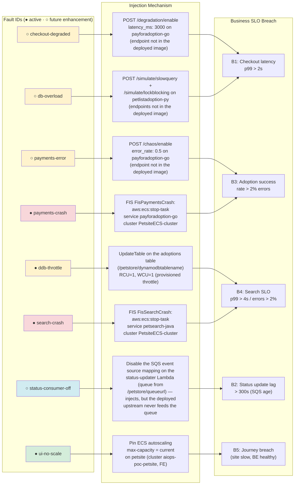

# Incident scenarios

This demo runs a small e-commerce shop — the AWS PetAdoptions sample app — and
then deliberately breaks it in ways a real business would care about: checkout
gets slow, adoptions start failing, search stops returning pets, pet-status
updates get stuck, or the whole site crawls under load. Each break is detected
by a **customer-facing "golden signal"** (a synthetic shopper journey and a few
business SLOs), which pages an **AWS DevOps Agent** to investigate and find the
root cause. All of the faults in the active catalog run on the deployment as-is;
a few more are on the roadmap and this page is honest about which is which. For
the big picture — the two agent "spaces," how they talk, and the overall
architecture — see the [README](../README.md) and
[architecture.md](architecture.md).

The faults keep the **B1–B5** numbering, one number per business symptom a
customer would notice. **Three of the five are active today** (B3 adoptions
failing, B4 search degraded, B5 site slow under load), and they run on
AWS-native mechanisms — FIS experiments, a DynamoDB capacity change, and a
config toggle. **B1 (slow checkout) and B2 (status updates stuck) are future
enhancements**: B1's two faults are endpoint-based and need a chaos-enabled
upstream image, and B2's detector and fault mechanism both work but the deployed
upstream never feeds the queue they watch (see
[Future enhancements](#future-enhancements)). Some active scenarios have two
different faults that produce the *same* symptom for *different* reasons — that
contrast is the interesting part, because it forces the agent to reason about the
mechanism instead of pattern-matching on the symptom.

## Scenario status at a glance

This is the source of truth for what actually works on this deployment today. All
faults below are AWS-native and inject out of the box.

| Scenario | What breaks (plain language) | Fault(s) | Injectable here? | Tested end-to-end? | How to run |
|---|---|---|---|---|---|
| **B3** | Adoptions fail at checkout | `payments-crash` | ✅ yes — FIS | ✅ yes | `inject.sh payments-crash --confirm` |
| **B4** | Search is degraded or empty | `ddb-throttle` / `search-crash` | ✅ both (`ddb-throttle` = DynamoDB capacity, `search-crash` = FIS) | ✅ both | `inject.sh ddb-throttle --confirm` · `inject.sh search-crash --confirm` (+ `loadgen/run.sh --paths search --duration 1500`) |
| **B5** | Whole site slow under load | `ui-no-scale` | ✅ yes — config toggle | ⚠️ partial | `inject.sh ui-no-scale --confirm` (+ two concurrent load generators) |

Legend: ✅ yes · ❌ no · ⚠️ partial.

Run any fault with `./chaos/scripts/inject.sh <fault> --confirm` to break it and
`./chaos/scripts/restore.sh <fault>` to heal it (restore is idempotent and never
gated). `--confirm` is required: every fault causes real customer-visible impact
on the deployment, so injection never happens on an unadorned command. Some
scenarios also need traffic — the per-scenario sections give the exact commands.

**On the roadmap.** Four more faults are documented as
[future enhancements](#future-enhancements). Three of them
(`checkout-degraded` and `db-overload` for B1, plus `payments-error` for B3)
rely on the upstream app's built-in chaos/simulator endpoints, which aren't in
the deployed images. The fourth, `status-consumer-off` (B2), injects cleanly and
its alarm is verified, but the deployed upstream never publishes the status
messages it needs, so the scenario can't fire end-to-end. All four sit outside
the active catalog for now.

### Fault injection map

This map shows every fault ID, the exact mechanism that injects it, and which
business SLO it breaches — active faults are marked ●, future enhancements ○.



## How detection works (the short version)

Detection is built on signals the app already emits — no app-code changes. A
one-minute synthetic **shopper-journey canary** walks the site (home → search →
adoption list → checkout) and a handful of **business SLO alarms** watch queue
age, error rates and latency. The rule is: **only customer-facing signals page a
human.** When the canary or a business SLO breaks, it pages the **app-team**
DevOps Agent space. The many raw infrastructure alarms (CPU, memory, task count)
are kept as *evidence* the agent correlates during an investigation — they don't
page — with one deliberate exception in B3 (see below).

The canary checks page **content**, not just HTTP status, on the search and
checkout steps. That matters because petsite tends to swallow a broken backend
into a friendly "200 OK" error page; a status-only check would sail right past a
real outage. There's one dual-path exception: in B3 a single backend
task-count alarm also pages the **platform** space so it can investigate the
infrastructure side in parallel.

For the full 15-alarm inventory (names, thresholds, which ones page and where),
see the [alarm inventory in deployment.md](deployment.md#alarm-inventory). For
the detailed, dated run-logs behind every "tested" verdict above, see the
[deployment.md run-log](deployment.md#run-log).

---

## The active scenarios

There are three active scenarios (B3–B5). Each section follows the same shape:
what the customer feels, what's actually broken, how to run it, what should
happen, and its tested status. B1 (slow checkout) and B2 (status updates stuck)
are [future enhancements](#future-enhancements).

### B3 — Adoptions failing

**What the customer experiences.** Adoptions don't go through — the shopper
reaches checkout and it fails.

**What's actually broken.** `payments-crash` — the payments service is **gone**
(all its tasks stopped via an AWS FIS experiment). It emits nothing: no traces,
no logs, no metrics. Absence of signal *is* the signal.

> A companion fault, `payments-error` (the service stays **up and returns
> errors**, so it still emits traces and error metrics), is on the roadmap as a
> [future enhancement](#future-enhancements) — it needs an upstream chaos
> endpoint that isn't in the deployed images. The error-vs-crash contrast it
> would add is described there.

**How to run it.** `./chaos/scripts/inject.sh payments-crash --confirm`, then
`./chaos/scripts/restore.sh payments-crash`. Note two operational details from
testing: the fault needs a fast (≤20 s) re-kill cadence to stay customer-visible
(ECS restarts tasks quickly), and restore usually needs a forced ECS deployment
to clear the service's start-failure backoff — restore handles the FIS side, and
you budget `aws ecs update-service --force-new-deployment` for the rest.

**What should happen — the dual path.** This is the one scenario that lights up
**both** agent spaces from a single fault. The customer-facing golden signal
(shopper-journey success) pages the **app-team** space; a beat later the backend
task-count alarm pages the **platform** space. In testing, the platform space —
which can see backend telemetry — correctly named the FIS experiment as the root
cause, while the app-team space, confined to the frontend account, correctly
ruled out the web tier but went blind at the account boundary. The teaching point
is error-vs-crash: a service returning errors still tells you what's wrong; a
crashed one goes silent, and a ratio-based error alarm can even go blind during a
total outage because it loses its denominator.

**Status.** `payments-crash` ✅ tested end-to-end (multiple runs). See the
[deployment.md run-log](deployment.md#run-log) for the detailed measurements.
(`payments-error` is a [future enhancement](#future-enhancements).)

### B4 — Search degraded

**What the customer experiences.** Pet search is slow or returns nothing, so
shoppers can't find pets to adopt.

**What's actually broken.** Two faults that look identical to the customer but
opposite to the operator:
- `ddb-throttle` — a **grey failure**. Search's DynamoDB table is throttled down
  to a tiny capacity, so reads stall. The search service itself stays perfectly
  healthy — normal CPU, normal memory, all tasks running — so *every*
  infrastructure alarm stays green while customers can't search. Only the
  customer-facing golden signal catches it. This is the strongest
  golden-signal argument in the demo: the infra dashboards are not just unhelpful
  here, they're actively misleading.
- `search-crash` — a **hard failure**. The search service is stopped outright
  (via FIS), so the infrastructure *does* see it (its task-count alarm goes red).

**How to run it.** Inject the fault, then drive search traffic:
```bash
./chaos/scripts/inject.sh ddb-throttle --confirm   # or: search-crash
./loadgen/run.sh --paths search --duration 1500    # ~12 req/s; 900 s is enough for search-crash
./chaos/scripts/restore.sh ddb-throttle            # or: search-crash
```
Important: use `--paths search`, **not** a high `--rate`, give it a real
`--duration` (the 60 s default ends before the table's ~300 s burst-credit bank
drains, so you would see zero throttles), and inject *before* starting load (a
full-capacity table absorbs the traffic with no throttles). A
heavy generic load run is itself disruptive and pollutes attribution. Like B3,
`search-crash` restore usually needs a forced ECS deployment; `ddb-throttle`
restore is clean (it kills no tasks).

**What should happen.** Both faults page the **app-team** space via the golden
signal (search has no platform dual-path). Under `ddb-throttle` the customer
journey fails while all backend infra alarms stay green — that green-while-broken
contrast is the whole point. Under `search-crash` the infra task-count alarm also
trips (evidence-only), because the service really is gone. One caveat worth
knowing: the search step only reliably detects a hard crash because the canary
was given a **content check** — petsite returns a fast "200 OK, search
unavailable" page on a crash, and a status-only check missed it entirely until
the content check was added.

**Status.** ✅ Both tested end-to-end. `ddb-throttle` proved detection, the
grey-failure claim (zero infra-alarm transitions while customers were impacted)
and a correct root-cause hypothesis on a clean run. `search-crash` proved the
detection gap was real and then closed by the content check. Full detail in the
[deployment.md run-log](deployment.md#run-log).

### B5 — Site slow under load

**What the customer experiences.** The whole site crawls under traffic. Pages
take tens of seconds and some requests fail outright. The backend is fine.

**What's actually broken.** `ui-no-scale` pins petsite's autoscaling so it can't
scale out under load. When traffic arrives, the fixed number of tasks saturate.

**How to run it.** `./chaos/scripts/inject.sh ui-no-scale --confirm`, then apply
load — use **two** concurrent load generators (a single one leaves saturation
intermittent), then `./chaos/scripts/restore.sh ui-no-scale`. This is the only
fault that targets the **frontend** account.

**What should happen — the no-delegation control case.** The fault lives entirely
inside the app-team's own domain (frontend ECS it can see directly). A correct
responder diagnoses it locally — autoscaling pinned, tasks healthy but saturated
— and does **not** delegate to the platform space. B5 is the negative control for
the whole demo: it proves the agents *discriminate* rather than reflexively
escalating everything to the backend.

**Status.** ⚠️ Partial. The alarm → webhook → investigation chain is proven, and
the fault genuinely saturates petsite and fires the golden alarms on real load.
What hasn't been completed is a single load-driven run all the way through to a
local-only diagnosis — so the "no delegation" behaviour is consistent with what
was observed but hasn't been positively demonstrated. See the
[deployment.md run-log](deployment.md#run-log).

---

## Future enhancements

Four more faults are designed and wired into the tooling but deferred as a
roadmap item. Each is blocked on upstream behaviour the deployed images don't
have, and each would add a teaching contrast the active catalog can't yet show:

- **B1 — Slow checkout** (`checkout-degraded` and `db-overload`). Both make
  checkout slow with nothing erroring, but for different reasons that need
  different fixes:
  - `checkout-degraded` — an artificial delay injected *inside* the payments
    service. The database is calm; the time is burned in the service.
  - `db-overload` — contention one hop further down: a *different* service holds
    Aurora locks and payments transactions queue behind them on the shared
    database.

  The teaching point is **app-delay vs DB-contention discrimination**: both show
  "payments is slow," but only `db-overload` shows Aurora lock waits, so the
  agent has to look one level down. The shopper-journey duration alarm would page
  the **app-team** space; the backend checkout-latency SLO would breach as
  evidence.
- **B2 — Status updates stuck** (`status-consumer-off`). Checkout succeeds and
  feels fast, but an adopted pet keeps showing its old status: the consumer that
  drains the pet-status update queue is disabled, and because the path is
  asynchronous (checkout → queue → status updater) no golden signal can see it.
  The teaching point is **sync-vs-async**: the only detector is the queue-age
  business SLO, so an agent that assumes "backend problem ⇒ checkout must be
  affected" is wrong here.

  Both halves of the scenario are built and verified. The detector works: the
  `aiops-poc-be-slo-statusupdate-lag` alarm's queue-name dimension was fixed to
  derive from the SSM `/petstore/queueurl` value at deploy time (it previously
  hardcoded the upstream *logical* queue name and matched no metric), it now
  resolves to the live CloudFormation-generated queue, and its SNS action is
  wired. The fault mechanism works too: disabling and re-enabling the SQS
  event-source mapping by queue ARN is reliable and fully reversible. What's
  missing is upstream traffic — the deployed upstream's adoption path never
  publishes SQS status messages, so the queue never ages and the alarm can never
  fire. Same category as B1: the blocker is upstream behaviour absent from the
  deployed images, not our tooling. `trigger-alarm.sh` can still force the
  `statusupdate-lag` alarm to demo B2's trigger chain.
- **B3 — Adoptions failing** (`payments-error`). The payments service stays
  **up and returns errors**, so it keeps emitting traces and error metrics —
  there's a live process to interrogate. Paired with the active `payments-crash`
  (service **gone**, emits nothing), it would demonstrate the
  **error-vs-crash contrast**: a service returning errors still tells you what's
  wrong, while a crashed one goes silent (and a ratio-based error alarm can even
  go blind during a total outage because it loses its denominator).

**Why they're deferred.** Three of them (`checkout-degraded`, `db-overload`,
`payments-error`) rely on the upstream PetAdoptions app's built-in
chaos/degradation/simulator HTTP endpoints (`/degradation/*` and `/chaos/*` on
payforadoption, `/simulate/*` on petlistadoption). Those endpoints are **not
present in the container images this deployment runs** — an in-VPC probe
confirmed they return HTTP 404, and petlistadoption's OpenAPI lists only
`/api/adoptionlist/`, `/health/status` and `/metrics`. Enabling them would mean
forking and rebuilding two upstream microservices, which we've deliberately kept
out of scope to preserve the project's **unforked-upstream fidelity rule**. The
fault definitions and injection logic are already in
`chaos/scripts/inject.sh`; until a chaos-enabled image is available, the script
fails fast with a clear message pointing here. The fourth,
`status-consumer-off`, is blocked the same way but one layer up: the fault and
its alarm are both live and verified, and what's absent from the deployed images
is the upstream adoption path publishing SQS status messages. In all four cases
the path forward is an upstream image change — no changes to the detection or
agent wiring are needed.

## Rehearsing the chain without a real fault

There's a deterministic demo lever, `./chaos/scripts/trigger-alarm.sh`, that
forces a paging alarm OK→ALARM (via the documented CloudWatch test API) to prove
the alarm → webhook → investigation chain on cue in front of an audience. It
injects no real fault, so the investigation finds nothing broken — use it as an
opener or fallback, and `inject.sh` for a realistic root-cause analysis.

## Where to go next

- [README](../README.md) — the big picture: the two agent spaces and how they connect.
- [architecture.md](architecture.md) — full architecture and diagrams.
- [deployment.md](deployment.md) — deployment steps, the
  [alarm inventory](deployment.md#alarm-inventory), the rehearsal procedures, and
  the dated [run-logs](deployment.md#run-log) behind every tested verdict here.
